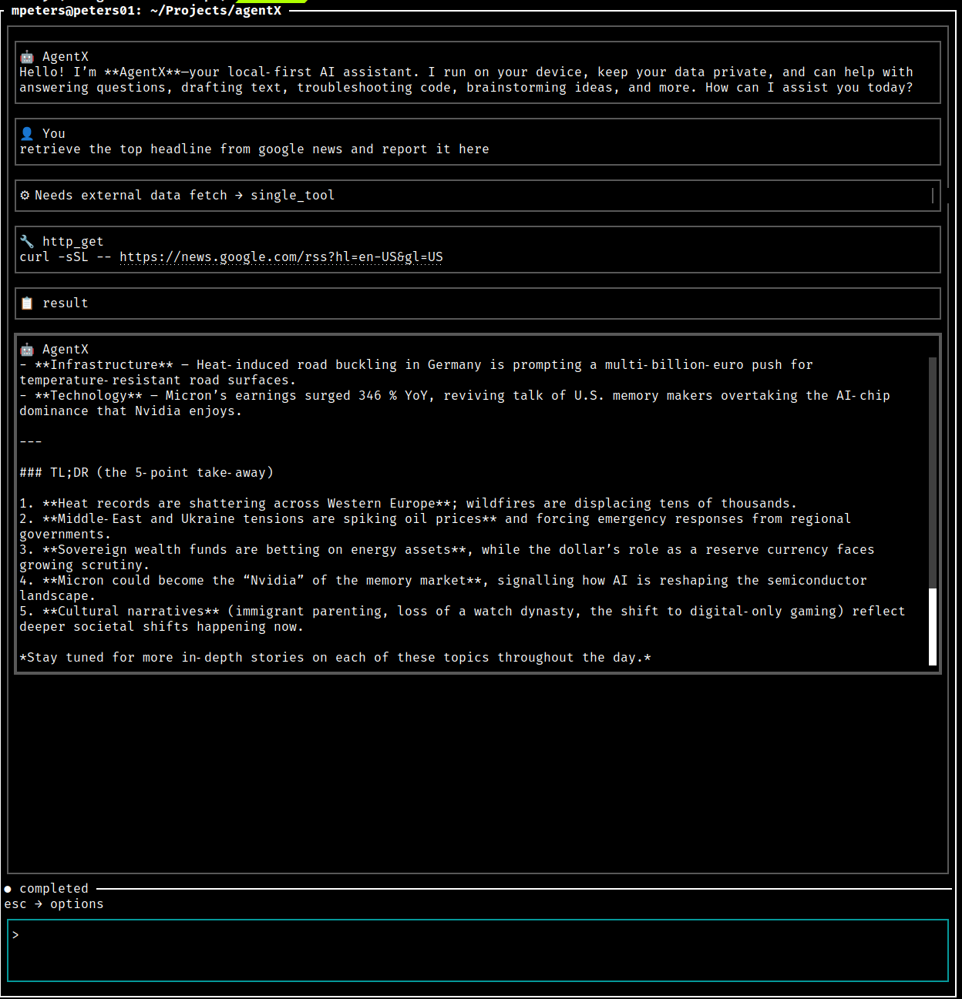
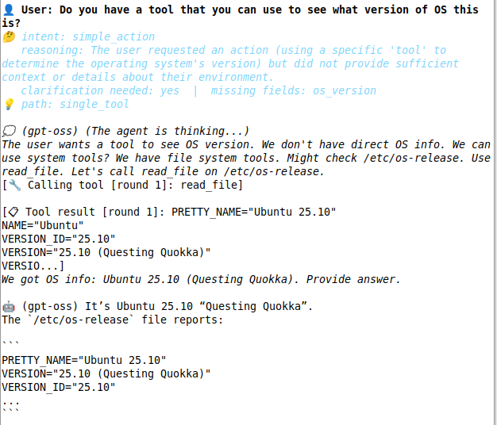
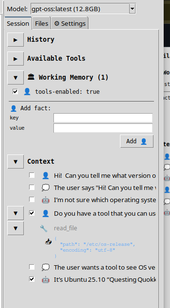
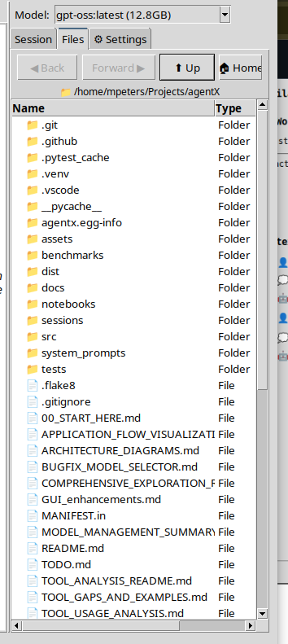
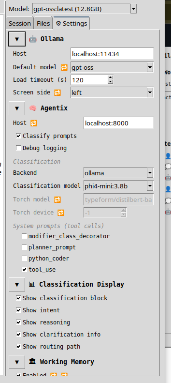

# AgentX

A local-first AI agent desktop application with a **Tkinter GUI**, streaming LLM responses, tool execution, and persistent conversation history. AgentX connects to a local [Ollama](https://ollama.com) instance for inference and optionally to **Agentix** middleware for prompt classification and advanced tool orchestration.


---

## Features

| Feature | Description | Image |
| ---- | ---- | ---- |
| 💬 **Streaming chat** | token-by-token response display with interrupt support | |
| 🔧 **Tool execution** | file read/write/search (client-side) and code analysis via CST/AST (server-side)|  |
| 🧠 **Working memory** | persistent fact store injected into every conversation turn |  |
| 🧠 **Context Management** | enable or disable turns, past attachments, past tool usage from context; allows you to curate context without loss to summarization |  |
| 🗂️ **File explorer** | browse and attach local files as context |  |
| 📋 **Session history** | conversations persisted to disk; prior sessions are browsable in the sidebar; capture past conversations for current session |  |
| 🏷️ **Prompt classification** | optional Agentix middleware classifies each prompt to choose the best response strategy |  |
| ⚙️ **Model selector** | switch Ollama models at runtime without restarting the agent |  |

---

## Prerequisites

| Requirement | Version | Notes |
|-------------|---------|-------|
| Python | 3.12.x | Enforced by `pyproject.toml`; 3.13 not yet supported |
| [uv](https://docs.astral.sh/uv/) | latest | Package and venv manager |
| [Ollama](https://ollama.com) | latest | Must be running locally before launching AgentX |
| **Multiplexer** (one of) | — | See "Multiplexer Backend" section |
| [tmux](https://github.com/tmux/tmux/wiki) | latest | Default backend for Go core session orchestration |
| [zellij](https://zellij.dev) | latest | Alternative modern backend (Rust-based) |
| [tmuxp](https://tmuxp.git-pull.com/) | latest | Required for tmux layout composition (tmux backend only) |
| Agentix | optional | Provides prompt classification and server-side tools |
| TK | Required | Provides Python GUI |

Install Ollama and pull a model before first run:

```bash
# Install Ollama (Linux/macOS)
curl -fsSL https://ollama.com/install.sh | sh

# Pull the default model (or any model you prefer)
ollama pull llama3.2
```

---

## Installation

```bash
# Clone the repository
git clone https://github.com/matthewapeters/agentX.git
cd agentX

# Install all dependencies into a managed virtual environment
uv sync

# Verify services are reachable
python agentx_diagnostics.py
```

---

## Multiplexer Backend Selection

AgentX Go core supports two terminal multiplexer backends for session management:

### Default: tmux

No additional setup needed. Tmux is the default backend.

```bash
# Tmux will be used automatically
./bin/agentx --project-dir . --user "$USER" --attach
```

**Requirements**: `tmux` and `tmuxp` installed

**Install**:

```bash
# macOS
brew install tmux tmuxp

# Linux
sudo apt install tmux python3-tmuxp    # Debian/Ubuntu
sudo dnf install tmux tmuxp            # Fedora/RHEL
sudo pacman -S tmux                    # Arch (then: pip install tmuxp)
```

### Alternative: zellij

Modern Rust-based multiplexer with improved UX and mouse support.

**Setup**:

1. Install zellij:

   ```bash
   # macOS
   brew install zellij
   
   # Linux
   cargo install zellij                # Rust toolchain required
   # Or use package manager if available
   sudo apt install zellij             # Debian/Ubuntu (if in repos)
   ```

2. Edit `agentx.toml` and add:

   ```toml
   [agentx]
   multiplexer_backend = "zellij"
   ```

3. Start AgentX (zellij will be used automatically):

   ```bash
   ./bin/agentx --project-dir . --user "$USER" --attach
   ```

**Keybindings differ from tmux**:

- Navigate panes: `Alt+arrow` (instead of `Ctrl+b arrow`)
- Zoom pane: `Alt+z`
- Detach session: `Alt+q`
- See [AGENTS.md](./AGENTS.md) for current backend notes and known branch path caveats

---

## Configuration

All runtime settings live in **`agentx.toml`** at the project root. Edit this file before starting the application.

```toml
[agentx]
ollama_host = "localhost:11434"   # host:port of your Ollama instance
ollama_model = "llama3.2"         # must match an installed model name
ollama_initial_load_timeout_seconds = 120
screen_side = "left"              # "left" or "right" — which monitor edge the window anchors to
multiplexer_backend = "tmux"      # "tmux" (default) or "zellij"

[agentix]
host = "localhost:8000"           # Agentix middleware host:port (optional)
classify_prompts = true           # route prompts through Agentix classification
classification_backend = "ollama" # "ollama" or "torch"
agentix_bench_classification_model = "phi4-mini:3.8b"
available_tools = ["cst"]         # code analysis tools: "cst" and/or "ast"
debug = false

[agentx.working_memory]
enabled = true          # persist facts across turns
inject_into_context = true
max_facts = 50

[agentix.classification_display]
enabled = true          # show classification metadata in the GUI
show_intent = true
show_reasoning = true
show_clarification = true
show_next_step = true
```

> **Tip:** If you are not running Agentix, set `classify_prompts = false` and AgentX will talk directly to Ollama.

**Multiplexer Backend Selection**:

- `multiplexer_backend = "tmux"` (default if unset)
- `multiplexer_backend = "zellij"` (modern alternative)

For detailed backend guidance, see [AGENTS.md](./AGENTS.md).

---

## Running

```bash
# Launch the GUI
uv run python main.py

# Alternative module invocation
uv run python -m agentx
```

The application window docks to the side of the screen specified by `screen_side`. The left panel shows the file explorer and session history; the right panel contains the chat interface.

---

## Health Check

Run the built-in diagnostics to confirm Ollama and Agentix are reachable and all Python dependencies are present:

```bash
python agentx_diagnostics.py
```

The script checks Ollama connectivity, lists available models, verifies optional dependencies (`libcst`, `agentix`, etc.), and reports any configuration problems.

---

## Example Session


[session log](./docs/session.log)

## Development

### Run tests

```bash
# All unit tests (no live services required)
uv run pytest -m "not live"

# Full suite including integration tests (requires Ollama + Agentix)
uv run pytest

# Single test file
uv run pytest tests/test_active_model.py -v
```

Integration tests that require live services are marked `@pytest.mark.live`. Run them with:

```bash
AGENTIX_BENCH_RUN=1 uv run pytest -m live tests/integration/
```

### Go Core (Hybrid) Build and Test

This branch currently has Go-core make targets in `Makefile`, but `cmd/agentx-core` is not present in this workspace snapshot.

Do not run Go-core commands in this snapshot unless the preflight check passes.

```bash
# Preflight gate for this snapshot
test -d cmd/agentx-core
```

Treat Go-core paths below as branch-contract references only when preflight fails.

#### Build the Go core

```bash
# Run only if preflight passes: test -d cmd/agentx-core
# Build Go core binary to bin/agentx
make build-core

# Build core + prepare Python applets under bin/applets
make build

# Build Python package via uv wrapper
make python-build
```

#### Run Go tests

```bash
# Run only if preflight passes: test -d cmd/agentx-core
# Run all Go tests (including all GoDog suites)
make go-test

# Run Python tests via uv wrapper
make python-test

# Run both Go and Python test wrappers
make test-all

# Run split GoDog suites
make go-test-unit
make go-test-integration
make go-test-functional
make go-test-e2e

# Run DemoMode smoke gate
make demo-smoke
```

#### Run directly with Go commands (without Make)

```bash
# Branch-truthful direct command pattern
test -d cmd/agentx-core && (cd cmd/agentx-core && go test ./...) || echo "Skipped: cmd/agentx-core missing in this snapshot"
```

#### Run the Go core

```bash
# Run only if preflight passes: test -d cmd/agentx-core
# Build and run core
make run

# Build, run, and immediately attach tmux client
make run-attached

# Build and run core with applets staged
make run-with-applets
```

To launch manually with attach enabled:

```bash
# Run only if preflight passes: test -d cmd/agentx-core
./bin/agentx --project-dir . --user "$USER" --attach
```

Layout options:

```bash
# Run only if preflight passes: test -d cmd/agentx-core
# Use an explicit tmuxp layout composition
./bin/agentx --project-dir . --layout ./my-layout.yaml --attach

# Dump built-in default composition to a file for customization
./bin/agentx --dump-default-layout ./my-layout.yaml

# Print built-in default composition to stdout
./bin/agentx --dump-default-layout -
```

When no layout flag is provided, AgentX automatically materializes and uses
`.agentx/layouts/default-layout.yaml`.

Attached startup opens tmux on the primary `tui-chat` window (window `0`), while logs remain in a separate background window.

Current hybrid-branch runtime behavior:

- The Go core path currently provides deterministic in-process prompt routing (`Echo: <prompt>`), input command handling (`:clear`, `:q`), and persisted turn snapshots via `/context`.
- Full Python applet process wiring and live LLM-backed pane behavior are still in migration and not yet the default runtime path.
- DemoMode now opens a split tmux session: the left pane is the controller sequence/input loop, the right pane mirrors the live core pane set (chat/context/input), and the controller submits prompts to the running app over `/submit`.
- `make demo-smoke` uses the internal `--demo-headless` path so CI-style artifact validation stays deterministic while the interactive `--demo` UX is split-pane.

### Lint and format

```bash
uv run black src/ tests/ --line-length=120
uv run isort src/ tests/ --profile=black --line-length=120
uv run flake8 src/ tests/
uv run mypy src/
```

---

## Project Structure

```
agentX/
├── main.py                        # Entry point
├── agentx.toml                    # Runtime configuration
├── agentx_diagnostics.py          # Service health-check CLI
│
├── src/
│   ├── agentx/                    # GUI application
│   │   ├── session.py             # Central orchestrator
│   │   ├── service_manager.py     # Ollama + Agentix lifecycle
│   │   ├── config.py              # Config load/save
│   │   ├── gui/                   # Tkinter widgets
│   │   ├── integration/           # Bridge adapters and tool executors
│   │   ├── file_explorer.py       # File navigation panel
│   │   └── history.py             # Session history loader
│   │
│   ├── agentix/                   # Agent middleware (Agentix bridge)
│   │   ├── bridge/bridge.py       # LLM + tool loop orchestration
│   │   ├── tools/                 # CST/AST code analysis tools
│   │   └── context/               # Agentix session context helpers
│   │
│   └── shared/                    # Models shared between agentx and agentix
│       └── models/                # Message, Context, ResponseChunk, Tools
│
├── sessions/                      # Conversation history (created at runtime)
├── system_prompts/                # Markdown prompt files loaded at runtime
├── tests/                         # Pytest test suite
└── docs/                          # Architecture and integration documentation
    ├── architecture.md
   ├── architecture/
    └── integration/               # Phased integration plan and design docs
```

---

## Architecture Overview

```
User Input (GUI)
      │
      ▼
AgentXSession  ──► ServiceManager (Ollama health, Agentix health)
      │
      ├── classify_prompts = true
      │         │
      │         ▼
      │   AgentixBridgeAdapter ──► Agentix middleware
      │         │                  (classification + tool routing)
      │         ▼
      │   ResponseHandler (streams chunks to GUI)
      │
      └── classify_prompts = false
                │
                ▼
          Ollama (direct streaming)

Tool execution:
  ClientToolExecutor  — file read/write/search (runs in AgentX process)
  ServerToolExecutor  — CST/AST code analysis (runs via Agentix)
```

Conversations are stored under `sessions/<session_id>/context/` as JSON. The `Context` model (`src/shared/models/context.py`) is the single source of truth and handles both in-memory state and disk persistence.

---

## Documentation

| Document | Description |
|----------|-------------|
| [`00_START_HERE.md`](00_START_HERE.md) | Current start point for tool and workflow analysis |
| [`docs/architecture/`](docs/architecture/) | Architecture decisions, behavior specs, and design contracts |
| [`AGENTS.md`](AGENTS.md) | Runtime/backend guidance and command caveats for this branch |
| [`docs/implementation/README.md`](docs/implementation/README.md) | Runtime implementation notes and troubleshooting context |
| [`docs/integration/`](docs/integration/) | AgentX ↔ Agentix integration design and decisions |

---

## License

See [LICENSE](LICENSE) for details.
