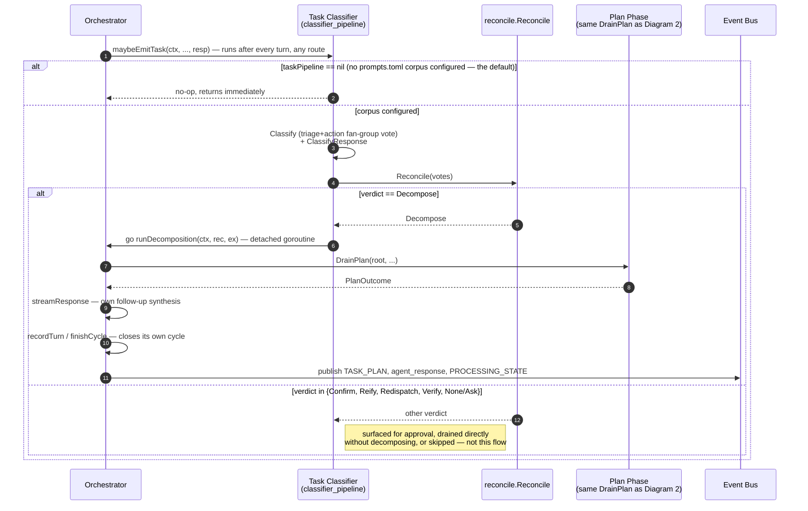

# AgentX Sequence Diagrams: Prompt → Decomposition → Execution → Resolution

These diagrams trace what the code on `bubbletea` actually does, end to end, for a
single user turn — from the moment a prompt is submitted in the chat surface to the
moment the user sees a resolved answer. They complement the box-and-arrow diagrams in
`ARCHITECTURE_DIAGRAMS.md` (topology, policy, persistence) with the call-by-call
*sequence* of who talks to whom.

**Method.** Every arrow below was verified against the `.go` source (file:line noted
in each diagram's "Key call sites" table), not against design docs or ADRs describing
future work. Where a function exists but is not reachable from `cmd/agentx/main.go`,
it is called out explicitly rather than drawn as live. Two such caveats surfaced and
are worth knowing before reading the diagrams:

- `internal/runtime/scheduler/node.go`'s `NewStep`/`NewTask` wrapper types are
  defined and unit-tested but **not used** by the scheduler's actual dispatch loop,
  which switches on `task.Record.Kind` directly (`scheduler.go:219`).
- `POST /prompt` (`internal/transport/http/write.go:57`) is fully wired
  server-side, but no shipped surface client calls it — the bundled chat surface
  reaches `Orchestrator.Submit` via a direct in-process closure instead
  (`internal/app/app.go:192`). The HTTP path only exists today for external
  surfaces/tests.

**Scope.** All diagrams assume the default launch: `agentx` boots the server and the
chat surface together, in one process (`internal/app/app.go:154 RunChat`). Diagram 4
shows where a second, separate surface process would plug in over HTTP/SSE instead.

**How to view.** Open this file in VS Code with a Mermaid preview extension (e.g.
"Markdown Preview Mermaid Support") and use the Markdown preview pane, or view it on
GitHub/GitLab, which render ```mermaid fences natively.

---

## Diagram 1 — Turn Overview: Classify → Route → Respond

This is the spine every prompt goes through. The two heavy branches
(`invoke_planner`'s decomposition and any tool execution) are black-boxed out to
Diagrams 2 and 3 so this stays readable.

```mermaid
sequenceDiagram
    autonumber
    actor User
    participant Chat as Chat Surface<br/>(surfaces/chat)
    participant Orc as Orchestrator<br/>(runtime)
    participant Clf as Classifier<br/>(classify)
    participant LLM as Ollama Model
    participant Plan as Plan Phase<br/>[Diagram 2]
    participant Tool as Tool Phase<br/>[Diagram 3]
    participant Bus as Event Bus<br/>(state.Bus)

    User->>Chat: type prompt, submit
    Chat->>Orc: Submit(ctx, text)
    activate Orc
    Orc->>Orc: runPrompt(): setProcessing(PhaseClassify)
    Orc->>Bus: publish USER_PROMPT

    Orc->>Clf: Classify(ctx, text)
    activate Clf
    loop up to ClassificationRetries+1 attempts
        Clf->>LLM: chat completion (classification prompt)
        LLM-->>Clf: reply
        Clf->>Clf: Parse(reply) — tolerant JSON extraction
    end
    Clf-->>Orc: Verdict{Route, Rationale}<br/>(falls back to respond_directly on exhaustion/cancel)
    deactivate Clf
    Orc->>Bus: publish CLASSIFICATION

    alt route == single_tool AND toolsReady()
        Orc->>Tool: runToolPhase(ctx, text)
        Tool-->>Orc: handled, toolContext
    else route == invoke_planner AND planReady()
        Orc->>Plan: runPlanPhase(ctx, text, rootID)
        Plan-->>Orc: planCtx, handled
    else respond_directly, or gate not ready
        Note right of Orc: no decomposition —<br/>falls straight through to a plain answer
    end

    Orc->>LLM: streamResponse(msgs, grounded in tool/plan context if handled)
    LLM-->>Orc: agent_delta* (streamed), then final agent_response
    Orc->>Bus: publish agent_delta*, agent_response

    opt response states an unfinished intent ("Let me examine the source...")
        Orc->>Orc: continuation.Detect(resp) → verb, sentence
        alt verb is deny-listed
            Note right of Orc: skip silently, keep original response
        else verb allow-listed, or user approves when asked
            Orc->>Plan: runPlanPhase(ctx, sentence, rootID+"-cont")<br/>(single bounded round — never recurses again)
            Plan-->>Orc: extraCtx, handled
            Orc->>LLM: streamResponse (re-synthesize, combined findings)
            LLM-->>Orc: newResp
        end
    end

    Orc->>Orc: recordTurn(...); finishCycle(err)
    Orc->>Bus: publish PROCESSING_STATE (Completed | Failed)
    deactivate Orc
    Bus-->>Chat: event fan-out [Diagram 4]
    Chat-->>User: render streamed answer + plan/tool widgets
```

> A second, independent decomposition trigger exists outside this diagram: after
> **any** answer (including `respond_directly`), `maybeEmitTask` can retroactively
> decide the response described a multi-step action and background-launch the same
> Plan Phase machinery. It's gated on an optional `prompts.toml` corpus and is inert
> by default. See **Diagram 5**.

### Key call sites

| Step | File:line | Function |
|---|---|---|
| Submit | `internal/surfaces/chat/chat.go:467`, `internal/app/app.go:192` | `submitCmd` → `bridge.Submit` → `orc.Submit` (in-process) |
| Entry | `internal/runtime/orchestrator.go:400` | `Orchestrator.Submit` |
| Dispatcher | `internal/runtime/orchestrator.go:425` | `runPrompt` |
| Classify | `internal/classify/classify.go:104` | `Classifier.Classify` (retry loop at `:106`) |
| Route table | `internal/classify/classify.go:22-29` | `respond_directly` \| `single_tool` \| `invoke_planner` |
| Branch | `internal/runtime/orchestrator.go:455-511` | route dispatch |
| Tool phase gate | `internal/runtime/plan_cycle.go:18` (`planReady`), `orchestrator.go` (`toolsReady`) | readiness checks |
| Answer synthesis | `internal/runtime/orchestrator.go:484-499` | `streamResponse` |
| Continuation | `internal/runtime/continuation.go:89` | `maybeContinuePlan` |
| Turn close | `internal/runtime/tool_cycle.go:209` | `finishCycle` |

---

## Diagram 2 — Plan Phase: Decomposition + Scheduler Drain

This is what `invoke_planner` actually does: turn one goal into a dependency graph,
recursively break down anything too coarse to run directly, and execute the leaves.
Tool leaf execution itself is black-boxed to Diagram 3.

```mermaid
sequenceDiagram
    autonumber
    participant Orc as Orchestrator
    participant Drain as decompose.DrainPlan
    participant Sched as Scheduler
    participant Dec as Decomposer<br/>(LLMPlanner)
    participant LLM as Ollama Model
    participant Exec as Executor<br/>[Diagram 3]
    participant Bus as Event Bus

    Orc->>Drain: DrainPlan(root, decomposer, cappingExec,<br/>slots, maxDepth, observer)
    activate Drain
    Drain->>Drain: seed task.Graph with root node (Kind=Step)
    Drain->>Sched: New(graph, decomposer, executor, slots, maxDepth)
    Drain->>Sched: Run(ctx)
    activate Sched

    loop dispatch loop — until graph drained or stalled
        Sched->>Sched: dispatch every Ready() node,<br/>up to `slots` concurrent workers

        alt node.Kind == Step (too coarse to run directly)
            Sched->>Dec: Decompose(ctx, rec)
            activate Dec
            Dec->>Dec: fork isolated, read-restricted planning branch
            Dec->>LLM: LLMPlanner.Plan(goal, context)<br/>schema-constrained JSON, ≤5 child nodes
            LLM-->>Dec: candidate children
            opt a child goal echoes the parent's (SimilarGoals guard)
                Dec->>LLM: retry once, violation named in prompt
                LLM-->>Dec: revised children
            end
            Dec-->>Sched: branch.Result{children} OR ErrNoProgress
            deactivate Dec
            alt guard still failing after the one retry
                Sched->>Sched: demote Step → Task, execute as-is<br/>(anti-spiral fallback, no further recursion)
                Sched->>Exec: Execute(ctx, rec)
            else children returned
                Sched->>Sched: applyDecompose — add children to graph,<br/>parent becomes a join (Deps = children)
                Sched->>Bus: publish TASK_NODE "decomposed"
            end
        else node.Kind == Task (leaf, resolvable now)
            Sched->>Exec: Execute(ctx, rec)
            Exec-->>Sched: Outcome{Status, Result}
            Sched->>Sched: setStatus (Done|Failed|Denied);<br/>capturingExec records findings for synthesis
            Sched->>Bus: publish TASK_NODE "completed"
        end
    end

    Sched-->>Drain: PlanOutcome{nodes} (or ErrStalled / ctx.Err)
    deactivate Sched
    Drain-->>Orc: PlanOutcome, derr
    deactivate Drain

    Orc->>Orc: publishPlan — tally failed/denied/abstained/neverRan
    Orc->>Bus: publish TASK_PLAN "ended"
    Orc->>Orc: planContext(steps) → grounding text<br/>(empty ⇒ handled=false, caller answers ungrounded)
```

Depth is bounded (`decompose.DefaultMaxDepth = 3`): a `Step` that recurses past that
depth is not retried further — it degrades to an abstain/clarify outcome rather than
looping.

### Key call sites

| Step | File:line | Function |
|---|---|---|
| Entry | `internal/runtime/plan_cycle.go:183` | `runPlanPhase` |
| Drain | `internal/runtime/decompose/drain.go:34` | `DrainPlan` |
| Scheduler loop | `internal/runtime/scheduler/scheduler.go:138` | `Scheduler.Run` |
| Node dispatch | `internal/runtime/scheduler/scheduler.go:219` | `work` (switches on `rec.Kind`) |
| Decompose | `internal/runtime/decompose/decompose.go:59` | `Decomposer.Decompose` |
| LLM planning call | `internal/prompting/planner/planner.go` (via `decompose/live.go:37`) | `LLMPlanner.Plan` |
| Echo guard | `internal/runtime/decompose/guard.go:75` | `SimilarGoals` |
| Apply children | `internal/runtime/scheduler/scheduler.go:270` | `applyDecompose` |
| Execute leaf | `internal/runtime/scheduler/scheduler.go:255` | `execute` → `Executor.Execute` |
| Status mapping | `internal/runtime/scheduler/scheduler.go:304` | `setStatus` |
| Findings capture | `internal/runtime/plan_cycle.go:61` | `capturingExec.Execute` |
| Terminal summary | `internal/runtime/plan_cycle.go:225,232` | `publishPlan`, `planSummary` |

---

## Diagram 3 — Tool Execution Detail (`Executor.Execute`)

Shared machinery: both a plan's leaf `Task` nodes (Diagram 2) and the `single_tool`
route's one-shot tool call go through this exact same function.

```mermaid
sequenceDiagram
    autonumber
    participant Caller as Scheduler leaf dispatch<br/>(or single_tool phase)
    participant Exec as Executor
    participant Prop as Proposer
    participant LLM as Ollama Model
    participant Pol as Policy
    participant Gate as Approval Gate<br/>(decision.go)
    participant Chat as Chat Surface
    actor User
    participant Run as tools.Executor.Run
    participant Ver as FSVerifier
    participant Bus as Event Bus

    Caller->>Exec: Execute(ctx, rec)
    activate Exec
    alt rec already carries a resolved tool call
        Exec->>Exec: use resolvedProposal(rec.Params)
    else no resolved proposal yet
        Exec->>Prop: Propose(ctx, goal)
        activate Prop
        loop up to `retries` attempts
            Prop->>LLM: propose-a-tool call
            LLM-->>Prop: reply
            Prop->>Prop: parse {tool, args} JSON
        end
        Prop-->>Exec: {tool, args} (or "no tool")
        deactivate Prop
    end

    Exec->>Pol: Evaluate(descriptor, args)
    alt blacklist match
        Pol-->>Exec: Deny
        Exec-->>Caller: Outcome{Denied}
    else already approved (session/global whitelist)
        Pol-->>Exec: Allow
    else descriptor.RequiresApproval OR path escapes working-dir root
        Pol-->>Exec: NeedsApproval
        Exec->>Gate: RequestDecision(...)
        activate Gate
        Gate->>Bus: publish approval_request;<br/>PROCESSING_STATE=awaiting_input
        Bus-->>Chat: approval_request event
        Chat->>User: swap in approval panel (3rd panel)
        User->>Chat: pick option
        Chat->>Gate: Resolve(decision)
        Gate-->>Exec: decision
        deactivate Gate
        alt user denies
            Exec-->>Caller: Outcome{Denied}
        end
    end

    Exec->>Run: Run(tool, args)
    Run-->>Exec: result (possibly Truncated)
    opt result truncated and a size-decision callback is wired
        Exec->>Gate: RequestDecision (accept preview / rerun wider / decline)
        Gate-->>Exec: decision
    end

    Exec->>Ver: Verify(effect)
    alt verification fails
        Ver-->>Exec: Phantom
        Exec-->>Caller: Outcome{Failed/Phantom}
    else verified
        Ver-->>Exec: ok
        Exec-->>Caller: Outcome{Executed, Result}
    end
    Exec->>Bus: publish tool_call / tool_result
    deactivate Exec
```

### Key call sites

| Step | File:line | Function |
|---|---|---|
| Entry | `internal/executor/executor.go:247` | `Executor.Execute` |
| Proposal fallback | `internal/tools/proposal.go:55,59-73` | `Proposer.Propose` (retry loop) |
| Policy | `internal/tools/policy.go:236` | `Policy.Evaluate` |
| Confinement check | `internal/executor/executor.go:193` | `escapesRoot` |
| Approval | `internal/runtime/approval.go:45`, `decision.go:42` | `RequestApproval` → `RequestDecision` (FIFO gate) |
| Run tool | `internal/tools/executor.go:63` | `Executor.Run` |
| Verify | `internal/executor/verify.go:28` | `FSVerifier.Verify` |
| Status mapping (caller side) | `internal/runtime/scheduler/scheduler.go:257-264` | `Executed→Done`, `Denied/NeedsApproval→Denied`, else `Failed` |

---

## Diagram 4 — Event Delivery: Bus → Surfaces

How a published event actually reaches pixels. The bundled chat surface never goes
over HTTP; only independently launched surfaces do.

```mermaid
sequenceDiagram
    autonumber
    participant Orc as Orchestrator
    participant Bus as Event Bus (state.Bus)
    participant ChatSurf as Bundled Chat Surface
    participant HTTPServer as transport/http.Server
    participant ExtSurf as External Surface<br/>(e.g. context-visualizer, separate process)
    actor User

    Orc->>Bus: Publish(event) — stamps monotonic Ordinal

    par bundled chat surface (in-process, no HTTP hop)
        Bus->>ChatSurf: fan out on Subscribe() channel
        ChatSurf->>ChatSurf: listenEvents() → EventMsg →<br/>Model.Update → output.Apply(ev)
        alt ContentType == task_plan
            ChatSurf->>ChatSurf: applyPlanEvent — create/update/finalize plan widget
        else ContentType == task_node
            ChatSurf->>ChatSurf: applyNodeEvent — mutate node state, spinner
        else ContentType in {tool_call, tool_result} tagged with task_id
            ChatSurf->>ChatSurf: applyTaskToolEvent — nest under owning plan node
        else other content types
            ChatSurf->>ChatSurf: default rendering (agent_response, thinking, ...)
        end
        ChatSurf-->>User: render updated transcript
    and external surfaces (separate processes, optional, attach over HTTP/SSE)
        Bus->>HTTPServer: same event
        HTTPServer->>ExtSurf: SSE frame:<br/>"event: &lt;content_type&gt;\ndata: &lt;json&gt;\n\n"
        ExtSurf->>ExtSurf: Apply(ev) via SurfaceModel interface
    end
```

### Key call sites

| Step | File:line | Function |
|---|---|---|
| Publish | `internal/runtime/orchestrator.go:1069,1078` | `publish` → `publishEv` |
| Bus fan-out | `internal/state/bus.go:46` | `Bus.Publish` |
| Bundled subscribe | `internal/app/app.go:176,213` | `orc.Bus().Subscribe()` → `Bridge.Events` |
| Chat apply | `internal/surfaces/chat/chat.go:476`, `internal/surfaces/output/output.go:433` | `listenEvents`, `Model.Apply` |
| Plan/node rendering | `internal/surfaces/output/plan.go:69,123,610,228` | `applyPlanEvent`, `applyNodeEvent`, `applyTaskToolEvent`, `renderPlan` |
| External SSE endpoint | `internal/transport/http/server.go:178,246,274` | `handleEvents`, `historyThrough`, `writeEvent` |
| External client apply | `internal/surfaces/client/client.go:73,83,38` | `NewHost`, `Update`, `SurfaceModel.Apply` |

---

## Diagram 5 — Background Retroactive Decomposition (off by default)

A second, entirely separate trigger for the same Plan Phase machinery, run *after*
any answer — including a plain `respond_directly` one — in case the response itself
narrated a multi-step action that should have been investigated. It is inert unless
an operator configures a prompt corpus.



### Key call sites

| Step | File:line | Function |
|---|---|---|
| Trigger | `internal/runtime/orchestrator.go:509` | `runPrompt` fallthrough → `maybeEmitTask` |
| Gate | `internal/runtime/classifier_pipeline.go:65-77,227-229` | `taskPipeline` built only if `Settings.PromptCorpus` set |
| Classify + reconcile | `internal/runtime/classifier_pipeline.go:218,261-292` | `maybeEmitTask`, `reconcile.Reconcile` branches |
| Background drain | `internal/runtime/classifier_pipeline.go:284,325,330` | `go runDecomposition` → `DrainPlan` |

---

## Cross-diagram decision-point summary

| Site (Diagram) | Condition | Outcome A | Outcome B |
|---|---|---|---|
| 1 | classifier JSON parses & route valid | return verdict | retry, then fallback `respond_directly` |
| 1 | route × readiness gate | `single_tool`+ready → Tool Phase; `invoke_planner`+ready → Plan Phase | else plain answer |
| 1 | response states unfinished intent | verb denied/unknown+declined → keep answer | verb allowed → one bounded continuation round |
| 2 | node.Kind | `Step` → decompose | `Task` → execute |
| 2 | echo-guard after 1 retry | still failing → demote to Task, execute directly | children valid → recurse |
| 2 | `planContext` empty after drain | falls through to an *ungrounded* answer | grounded synthesis with findings |
| 3 | policy verdict | `Deny`/denied approval → `Outcome{Denied}`, tool never runs | `Allow` → runs |
| 3 | `Verify` after running | fails → `Phantom`, never reported as success | ok → `Executed` |
| 5 | `PromptCorpus` configured | no-op (default) | classifier+reconcile may background-trigger Diagram 2 |

## Loop / iteration points, at a glance

1. Classification retry (Diagram 1) — bounded by `ClassificationRetries+1`.
2. Scheduler dispatch loop (Diagram 2) — runs until the DAG is drained or stalled;
   every node dispatches at most once, so it terminates structurally.
3. Decomposition echo-guard retry (Diagram 2) — exactly one retry, then gives up.
4. Recursive decomposition depth bound (Diagram 2) — capped at `DefaultMaxDepth = 3`.
5. Tool-proposal retry (Diagram 3) — bounded by a fixed `retries` count.
6. Interactive decision gate wait (Diagram 3) — blocks on a per-request channel,
   FIFO-serialized against any other concurrent decision request.
7. Continuation round (Diagram 1) — explicitly single-bounded, cannot chain.
