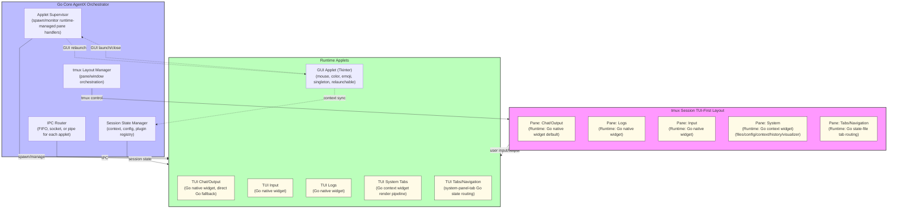

---

**To view this diagram in VS Code:**

- Install a Mermaid extension such as "Markdown Preview Mermaid Support" or "vscode-markdown-mermaid".
- Open this file and use the preview feature (usually right-click → "Open Preview" or use the command palette).

---

## Applet Contracts

Full UX/architecture contracts for each runtime applet — including ownership
boundaries, navigation models, phased implementation plans, and test evidence
targets — are in [`docs/architecture/applets/`](applets/README.md).

The **Output applet** (`chat/output`) UX contract, interactive navigation
design, and phased implementation plan are the canonical source of truth at
[`docs/architecture/applets/output_applet.md`](applets/output_applet.md).
Key design decisions for the Output applet:

- Core owns conversation data and tmux pane geometry; the applet owns
  pane-local view state (focus position, per-turn expand/compact flag).
- Default behavior: latest-first, focus-expands — newest turn auto-expanded,
  older turns compacted to a single summary line.
- Navigation: `j/k`/arrows (turn focus), `h/l` (hierarchy/collapse), Enter/Space
  (toggle), PgUp/PgDn (scroll), Home/End (oldest/newest), `?` (help), `q` (quit).
