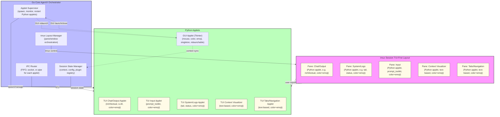

---

**To view this diagram in VS Code:**

- Install a Mermaid extension such as "Markdown Preview Mermaid Support" or "vscode-markdown-mermaid".
- Open this file and use the preview feature (usually right-click → "Open Preview" or use the command palette).
