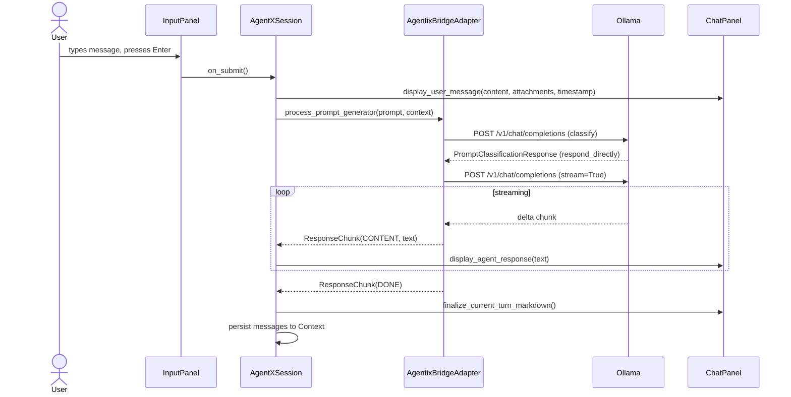
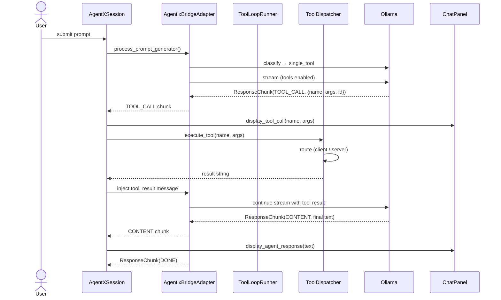
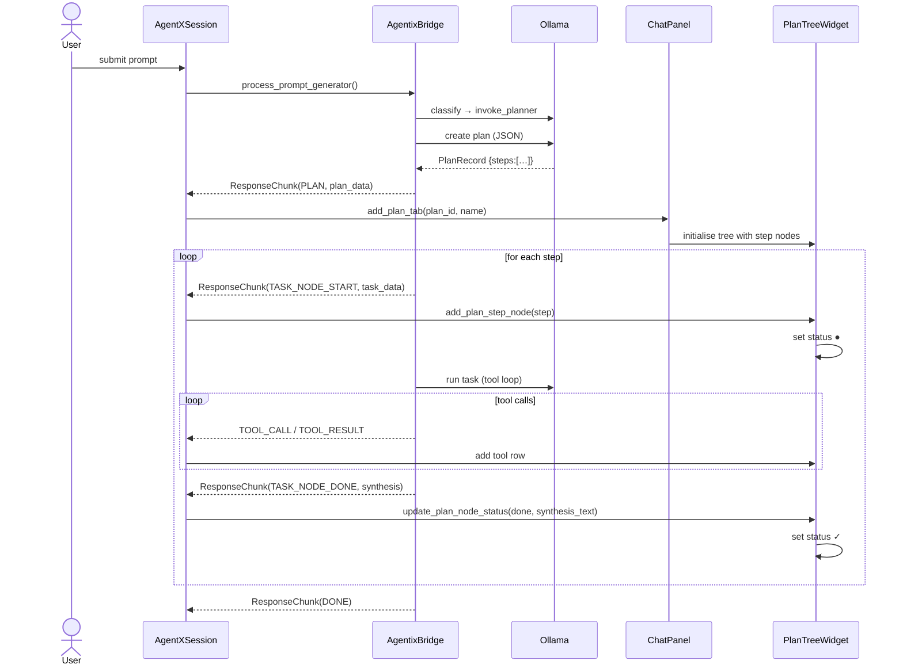
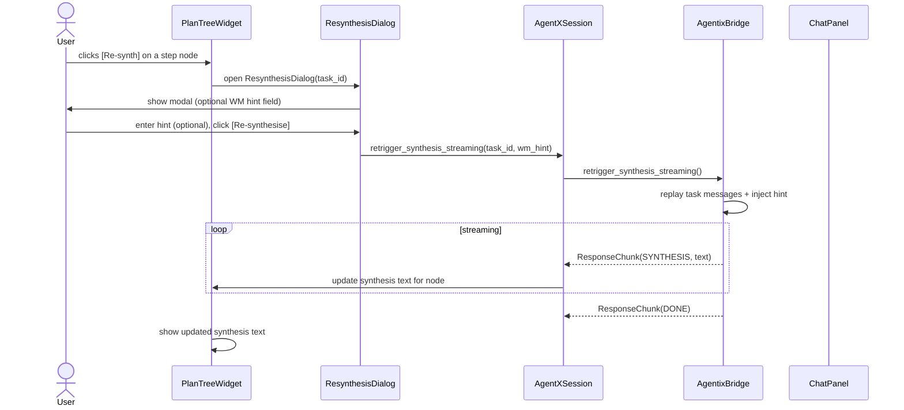
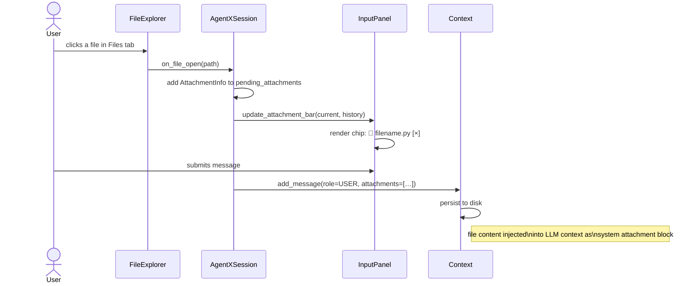
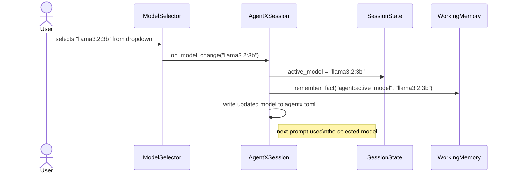
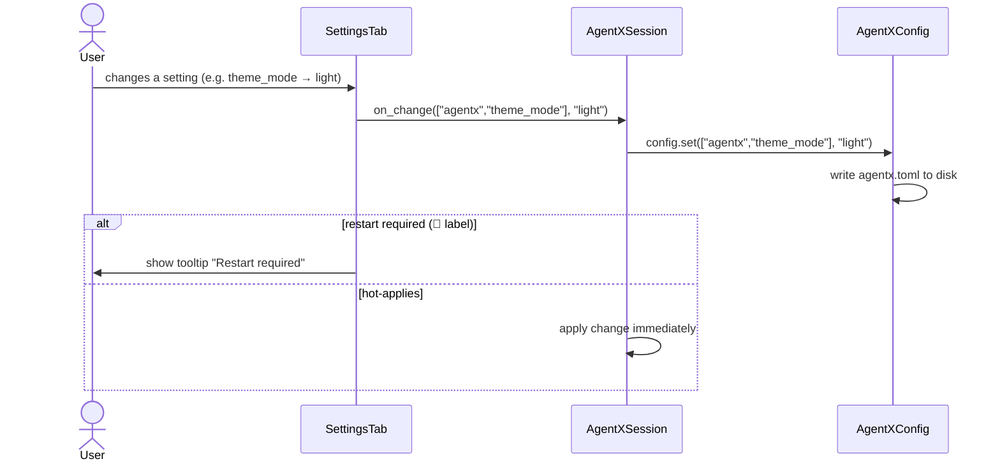
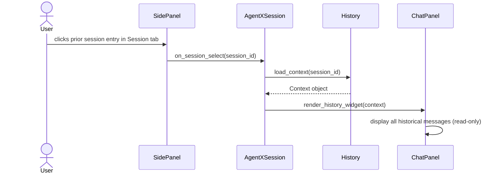
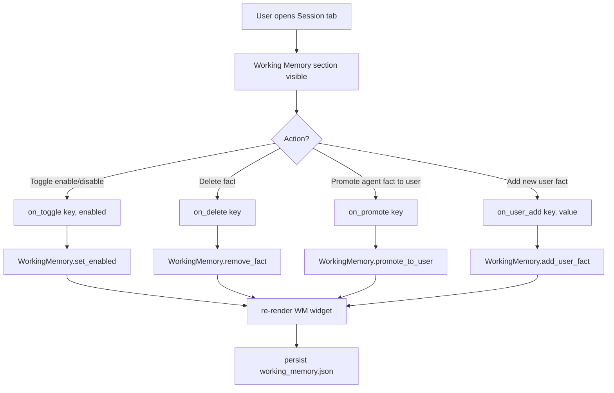

# AgentX — User Flows

Version: 2026-04-19

Each section contains a Mermaid sequence or flowchart diagram documenting how
user actions map to system behaviour.

---

## UF-01: Basic Chat (Direct Response)

**Trigger**: User types a message and presses `Enter` (or clicks `Send`).



**Key affordances**:

- `Stop` button visible during streaming; clicking it sets `_is_streaming` to False and stops the generator.
- Response appears word-by-word (real-time streaming).
- Markdown is rendered after streaming completes.

---

## UF-02: Tool Execution (Single Tool)

**Trigger**: User asks something that requires a file or code tool.



**Key affordances**:

- Tool call row appears in chat as `🔧 tool_name  args…` with a collapse/expand button.
- Tool result is shown inline (collapsed by default).
- Multiple tool calls in a single round are executed in parallel (`ThreadPoolExecutor`).

---

## UF-03: Hierarchical Task Execution (Planner)

**Trigger**: User asks a complex multi-step task.



**Key affordances**:

- Each plan step has a live status icon (○●✓✗?).
- Tool call rows under each step expand/collapse inline.
- Synthesis text visible below each completed step.
- `[Re-synth]` button per step → see UF-04.
- `[Export]` button → exports tree to `task_tree_export.md`.

---

## UF-04: Re-synthesis

**Trigger**: User clicks `[Re-synth]` on a completed plan step.



---

## UF-05: File Attachment

**Trigger**: User clicks a file in the `FileExplorer` or drags one to the input area.



**Attachment bar affordances**:

- Current-turn attachments shown as chips with `[×]` remove button.
- History attachments shown greyed (cannot be removed; already in context).
- `[✕ clear all]` removes all current-turn attachments.

---

## UF-06: Model Switch

**Trigger**: User selects a different model from the toolbar dropdown.



---

## UF-07: Settings Change

**Trigger**: User edits a value in the Settings tab.



---

## UF-08: Session History Navigation

**Trigger**: User clicks on a prior session in the `Session` tab.



---

## UF-09: Working Memory Management

**Trigger**: User interacts with a fact in the Working Memory panel.



---

## UF-10: Interrupt Streaming

**Trigger**: User clicks `Stop` while the LLM is streaming.

```mermaid
sequenceDiagram
    actor User
    participant InputPanel
    participant Session as AgentXSession
    participant Controller as StreamingController

    User->>InputPanel: clicks Stop button
    InputPanel->>Session: on_interrupt()
    Session->>Controller: interrupt()
    Controller->>Controller: _interrupt_flag = True
    Controller->>Controller: _is_streaming.clear()
    Note right of Controller: generator yields nothing\non next iteration;\nstream terminates gracefully
    Session->>Chat: display partial response (up to interrupt point)
    Session->>Session: persist partial message to Context
```
