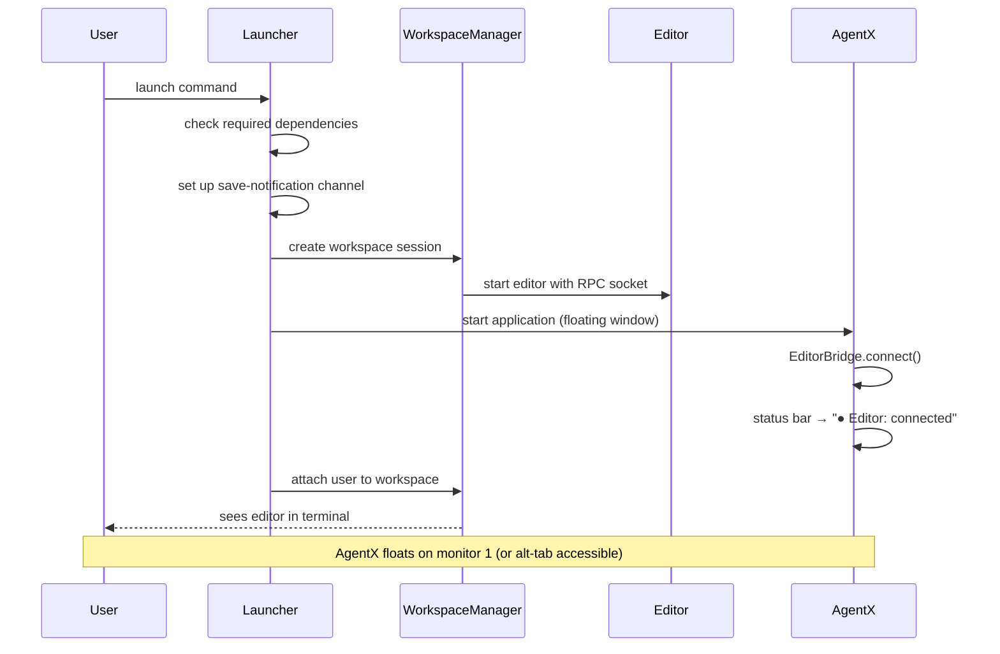
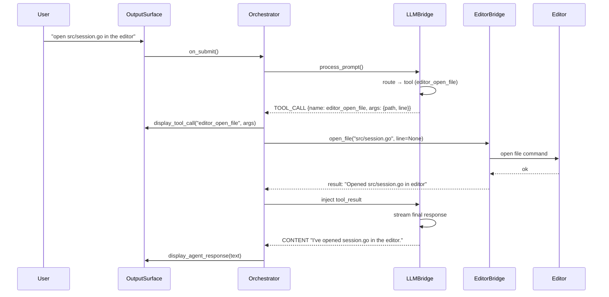
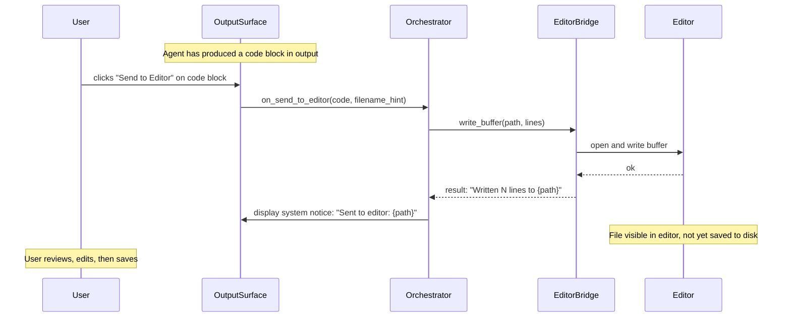
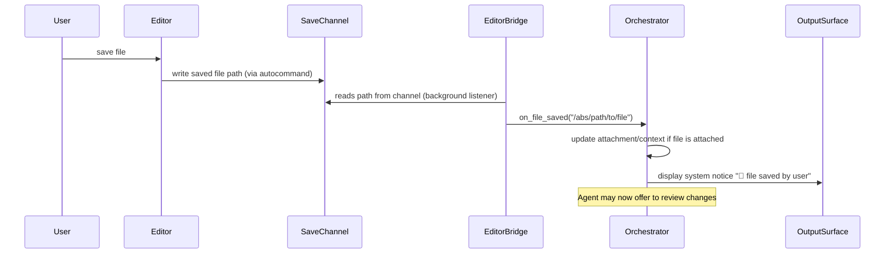
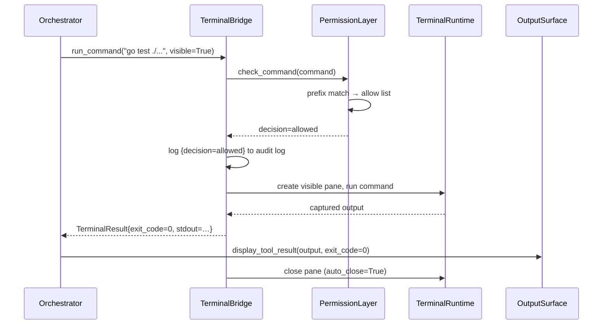
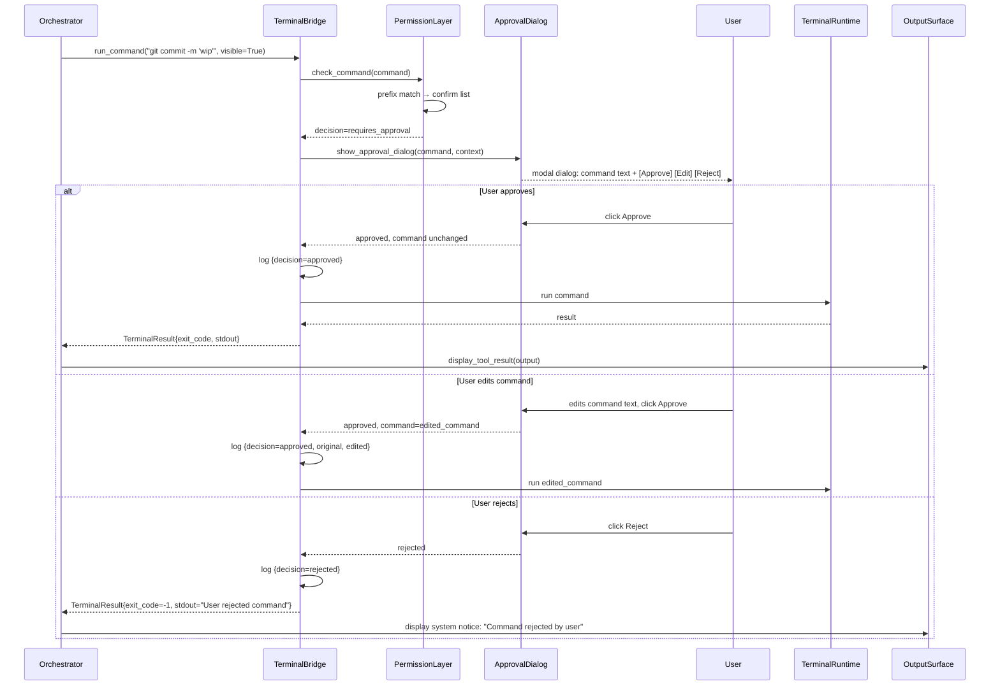
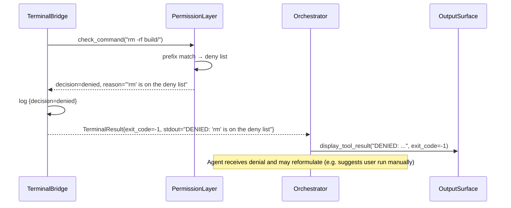
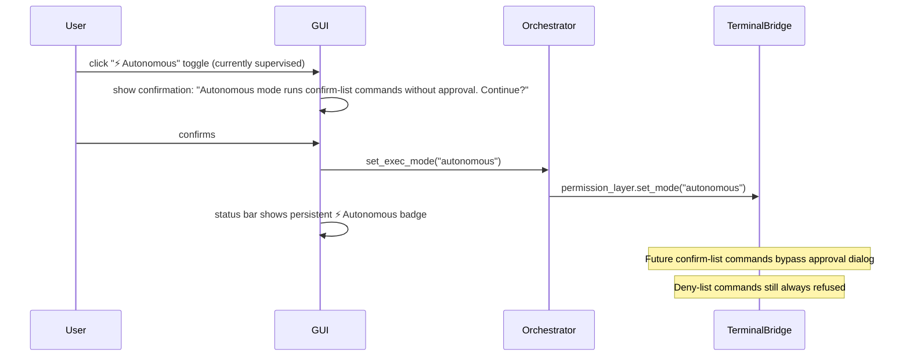
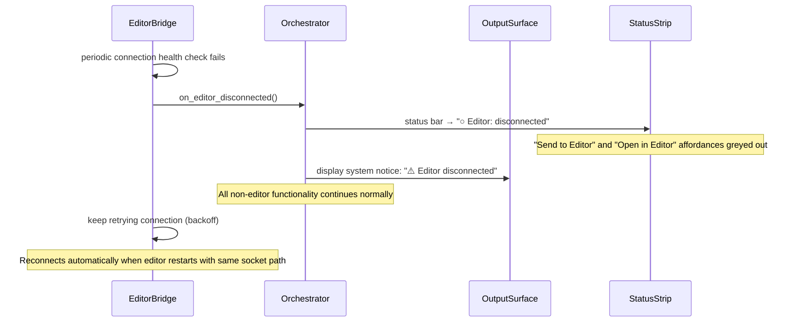
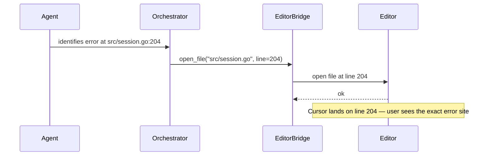

# AgentX — Vibe Coding: Editor Integration

_Last updated: 2026-06-25_

> **"Vibe coding"**: a mode of collaborative software development where the AI agent
> and the human developer co-author code in the same editor at the same time, each
> contributing fluidly without breaking the other's flow.

> **Implementation note**: Implementation contracts for editor and terminal integration are
> defined in `docs/implementation/`. This document specifies user-visible behavior only.

---

## Table of Contents

1. [Concept and Goals](#1-concept-and-goals)
2. [User Flows](#2-user-flows)
3. [Panel Specifications](#3-panel-specifications)
   - [PD-14: Editor Integration affordances](#pd-14-editor-integration-affordances)
   - [PD-15: Terminal Integration affordances](#pd-15-terminal-integration-affordances)
4. [Error and Degradation Handling](#4-error-and-degradation-handling)
5. [Test Scenarios](#5-test-scenarios)
6. [Open Design Questions](#6-open-design-questions)

---

## 1. Concept and Goals

### Goals

| Goal | Description |
|------|-------------|
| **Bidirectional editing** | Both agent and user can modify files in the shared editor instance |
| **Zero new UI paradigm** | User keeps their existing editor workflow; AgentX adds affordances without breaking it |
| **Monitor-friendly** | AgentX interface on monitor 1; editor terminal full-screen on monitor 2 |
| **Graceful degradation** | If the editor is not connected, all vibe-coding affordances grey out; rest of AgentX is unaffected |
| **Agent terminal control** | Agent can open, run commands in, capture output from, and close terminal panes |

### Non-Goals

- Replacing the external editor with an embedded editor widget
- Supporting editors other than neovim in this design (vim classic is a stretch goal)
- Implementing LSP, treesitter, or plugin management (user owns their editor config)

---

## 2. User Flows

### UF-VC-01: Launch Vibe Coding Session

**Trigger**: User runs the vibe-coding launch command from the project directory.



---

### UF-VC-02: Agent Opens File in Editor

**Trigger**: User asks "open src/session.go in the editor".



---

### UF-VC-03: Agent Writes Code to Editor Buffer

**Trigger**: Agent generates a code block and user clicks "Send to Editor" (or agent
decides to write directly to a buffer as part of a plan step).



---

### UF-VC-04: User Saves File — AgentX Detects Change

**Trigger**: User saves a file in the editor.



---

### UF-VC-05: User Opens File via FileBrowser "Open in Editor"

**Trigger**: User right-clicks a file in the FileBrowser panel.

```mermaid
sequenceDiagram
    participant User
    participant FileBrowser
    participant Orchestrator
    participant EditorBridge
    participant Editor

    User->>FileBrowser: right-click on file entry
    FileBrowser->>FileBrowser: show context menu
    Note over FileBrowser: "Open in Editor" visible only when EditorBridge is connected
    User->>FileBrowser: click "Open in Editor"
    FileBrowser->>Orchestrator: open_in_editor(path)
    Orchestrator->>EditorBridge: open_file(path)
    EditorBridge->>Editor: open file command
    Editor-->>EditorBridge: ok
    EditorBridge-->>Orchestrator: ok
    Note over Editor: File appears in editor; no visual change needed in FileBrowser
```

---

### UF-VC-06: Agent Runs Allowed Command (supervised mode)

**Trigger**: Agent plan step calls `terminal_run` with a command matching the allow-list.



---

### UF-VC-06b: Agent Requests Confirmation-Required Command (supervised mode)

**Trigger**: Agent calls `terminal_run` with a command matching the confirm list.



---

### UF-VC-06c: Agent Requests Denied Command

**Trigger**: Agent calls `terminal_run` with a command matching the deny list.



---

### UF-VC-06d: User Toggles Execution Mode

**Trigger**: User clicks the execution mode toggle in the status bar or SettingsSurface.



---

### UF-VC-07: Editor Disconnects / Not Running

**Trigger**: Editor connection drops (editor crashed, user quit editor, session not started with launcher).



---

### UF-VC-08: Agent Jumps to Error Location in Editor

**Trigger**: Agent identifies an error with a file:line reference and offers to navigate.



---

## 3. Panel Specifications

### PD-14: Editor Integration affordances

**New affordances added to existing panels** (not a standalone panel).

#### PD-14-AF-001: Editor Status Bar Strip

**Location**: Bottom of InputSurface, above the user text input.
**Component**: Thin status strip.

| State | Visual | Colour |
|-------|--------|--------|
| Connected | `● Editor: connected  <editor identifier>` + `[⏻ Disconnect]` button | Green dot |
| Disconnected | `○ Editor: disconnected` + `[Connect]` button | Grey dot |
| Connecting | `◌ Editor: connecting…` | Yellow dot |

**Interactions**:

| Control | Action |
|---------|--------|
| `[⏻ Disconnect]` | Disconnect from editor |
| `[Connect]` | Attempt reconnect to editor |
| Status label | Read-only display |

---

#### PD-14-AF-002: "Open in Editor" — FileBrowser Context Menu

**Location**: Right-click context menu on file entries in FileBrowser.
**Visibility**: Menu item visible only when EditorBridge is connected.

| Control | Action | Condition |
|---------|--------|-----------|
| `Open in Editor` | Open path in editor | EditorBridge connected |
| `Open in Editor (line N)` | Open path at line N in editor | EditorBridge connected + line known |

---

#### PD-14-AF-003: "Send to Editor" — Code Block Button

**Location**: Toolbar of each code block in OutputSurface output entries.
**Visibility**: Button always rendered; **disabled** (greyed) when EditorBridge is not connected.

| Control | Action | Notes |
|---------|--------|-------|
| `[→ Editor]` | Send code block to editor buffer | filename hint derived from fence language marker or None |

---

#### PD-14-AF-004: Line Navigation from Error Display

**Location**: Tool result entries that contain `file:line` patterns.
**Rendering**: `file.go:204` rendered as a clickable link.

| Control | Action |
|---------|--------|
| Click `file.go:204` link | Open file at line 204 in editor |

---

#### PD-14-AF-005: File-Saved Notification

**Location**: OutputSurface — displayed as a system notice entry (no role icon, light styling).
**Trigger**: File-saved notification from EditorBridge fires.

| Notification | Content |
|-------------|---------|
| System notice | `📁 <filename> saved` |
| Offered action | "Review changes?" → inserts "Show me what changed in <filename>" into user input |

---

#### PD-14-AF-008: Recover Editor Command

**Location**: Launcher `recover-editor` command.
**Purpose**: Restore editor surface after accidental exit without restarting the entire session.

| Step | Action |
|------|--------|
| 1 | Validate workspace session exists |
| 2 | Recreate editor surface if missing |
| 3 | Ensure file-save notification autocommand remains installed |
| 4 | Relaunch editor with RPC socket |
| 5 | Print operator hint for switching to editor surface |

**Error path**: If workspace session is missing, command fails with clear message and start hint.

---

### PD-15: Terminal Integration affordances

**New affordances for agent-controlled terminal execution.**

#### PD-15-AF-001: Terminal Visibility Preference

**Location**: SettingsSurface, section "Terminal Execution".

| Setting | Type | Default | Description |
|---------|------|---------|-------------|
| `terminal_visible` | `bool` | `true` | Agent terminal panes open visibly in the agent workspace surface |
| `terminal_auto_close` | `bool` | `true` | Close ephemeral pane when command completes |
| `terminal_timeout_sec` | `int` | `60` | Max seconds to wait for command exit |

---

#### PD-15-AF-002: Terminal Output in Chat

**Location**: OutputSurface — tool result entries from terminal tool calls.
**Content**: Captured stdout/stderr (truncated to last 200 lines if long), exit code badge.

| Exit Code | Badge Colour |
|-----------|-------------|
| 0 | Green `✓` |
| Non-zero | Red `✗ (exit N)` |
| -1 (denied/rejected/timeout) | Orange `⚠ denied` / `⚠ rejected` / `⚠ timed out` |

---

#### PD-15-AF-003: Active Terminal Pane Indicator

**Location**: InputSurface status bar (right side, beside Editor status).

| State | Visual |
|-------|--------|
| No active panes | (hidden) |
| N panes running | `⬛ N terminal(s) running` |
| Autonomous mode active | `⚡ Autonomous  ⬛ N terminal(s) running` |

---

#### PD-15-AF-004: Kill Terminal Pane Action

**Location**: Tool call entry in OutputSurface for terminal tool calls.
**Affordance**: `[✗ Kill]` button visible while pane is running; disappears on completion.

| Control | Action |
|---------|--------|
| `[✗ Kill]` | Terminate the running terminal pane |

---

#### PD-15-AF-005: Execution Mode Toggle

**Location**: SettingsSurface, section "Terminal Execution" + mirrored in InputSurface status bar.

| State | Visual | Behaviour |
|-------|--------|----------|
| `supervised` | No badge (default) | Confirm-list commands show approval dialog |
| `autonomous` | Persistent orange `⚡ Autonomous` badge | Confirm-list commands run without dialog |

**Switching to `autonomous`** requires a one-click confirmation prompt:
> _"Autonomous mode will execute git commits, installs, and other state-changing commands
> without asking. Continue?"_

**Switching back to `supervised`** requires no confirmation.

---

#### PD-15-AF-006: Command Approval Dialog

**Location**: Modal dialog, centred over the AgentX interface.
**Trigger**: PermissionLayer fires when exec_mode=`supervised` and command matches the `confirm` list.

```
┌──────────────────────────────────────────────────────────────┐
│  ⚠  AgentX wants to run a command                           │
├──────────────────────────────────────────────────────────────┤
│                                                              │
│  Command:                                                    │
│  ┌────────────────────────────────────────────────────────┐  │
│  │  git commit -m 'Add editor integration'                │  │  ← editable text
│  └────────────────────────────────────────────────────────┘  │
│                                                              │
│  Context: (reason the agent wants to run this)              │
│  "Committing completed step 3 of the plan"                  │
│                                                              │
│  [ Approve ]   [ Edit & Approve ]   [ Reject ]              │
└──────────────────────────────────────────────────────────────┘
```

| Control | Action | Keyboard |
|---------|--------|----------|
| `Approve` | Execute as-shown | `Enter` |
| `Edit & Approve` | Unlock text field for editing, then confirm | — |
| `Reject` | Return denial to agent | `Escape` |

---

#### PD-15-AF-007: Command Allow/Deny List Editor

**Location**: SettingsSurface, section "Terminal Execution" → "Edit Permission Lists".

**Layout**: Three side-by-side text inputs labelled **Allow**, **Confirm**, **Deny**.
One entry per line (prefix string). Changes saved to config on `[Save]`.

| Control | Action |
|---------|--------|
| `[Save]` | Writes lists to config, reloads PermissionLayer |
| `[Reset to Defaults]` | Restores factory allow/confirm/deny lists |
| `[?]` | Opens inline help explaining prefix-match semantics |

---

#### PD-15-AF-008: Graceful Session Shutdown Command

**Location**: Launcher `stop` command.
**Purpose**: Single deterministic shutdown path for the full vibe-coding session.

| Step | Action |
|------|--------|
| 1 | Detect active workspace session |
| 2 | Send stop signal to AgentX runtime |
| 3 | Send stop signal to editor |
| 4 | Terminate workspace session |
| 5 | Remove stale connection artifacts if present |

**No-op behaviour**: If no session exists, command exits successfully with a friendly notice.

---

#### PD-15-AF-009: Dispatch Defaults from Config

**Location**: `terminal_run()` wrapper.
**Purpose**: Callers need not pass `visible`, `auto_close`, or `timeout_sec` explicitly; the wrapper reads those values from config when any are omitted.

| Parameter | Config key | Fallback |
|-----------|-----------|---------|
| `visible` | `terminal_visible` | `True` |
| `auto_close` | `terminal_auto_close` | `True` |
| `timeout_sec` | `terminal_timeout_sec` | `60` |

Explicit call-site values override the config. Invalid config values silently fall back to the defaults above.

---

#### PD-15-AF-010: Tool-Result Decision Badge

**Location**: `StreamingController` tool-result display.
**Purpose**: Every `terminal_run` tool-result row in the output panel includes a visual badge indicating the permission decision and exit code.

| Decision | Badge |
|----------|-------|
| `allowed` / `approved` | `✅ {decision} (exit {code})` |
| `denied` | `⛔ denied` |
| `rejected` / `path_violation` | `🚫 {decision}` |
| Unknown | `⚠ {decision}` |

When `stdout` is available in the result payload, the first 100 characters are shown as a preview in the tool-result row.

---

## 4. Error and Degradation Handling

| Scenario | Behaviour |
|----------|-----------|
| Editor not available at startup | Status bar shows "disconnected"; editor tools not registered with tool runtime |
| Editor disconnects mid-session | Health-check fires disconnect event; tools unregistered; status updates; retries with backoff |
| Agent writes to buffer while user is editing | Write proceeds; editor shows standard file-changed conflict UI — intentional expected editor behaviour |
| Terminal runtime not available | Tool not registered; agent falls back to in-process file tools |
| Terminal command times out | Result marked timed_out; pane closed if auto_close; exit_code=-1 |
| Save notification channel full / blocked | Save notification wrapped in silent error handler; blocks are non-fatal to editor |
| Command matches deny list | decision="denied", exit_code=-1, no pane created, reason returned to agent |
| Command matches neither allow nor confirm | Treated as confirmation-required; approval dialog shown in supervised mode |
| Path restriction violation | decision="path_violation", message names the offending path and the configured roots |
| User rejects command in dialog | decision="rejected"; agent receives the rejection message and may reformulate |
| Persistent agent shell not ready | TerminalBridge recreates it on next run_command call; logs warning |
| User terminates agent window | All active pane tracking entries marked dead; status bar updates; no crash |

---

## 5. Test Scenarios

> Full Gherkin use-cases live in the test files. Summaries here for traceability.

### Unit Tests (hermetic — all external services mocked)

| Scenario | Gherkin Summary |
|----------|-----------------|
| EditorBridge connects to editor socket | GIVEN a socket path WHEN connect() called THEN is_connected() is True |
| EditorBridge open_file sends correct command | GIVEN connected bridge WHEN open_file(path, line=42) THEN editor receives open-at-line command |
| EditorBridge write_buffer sets buffer content | GIVEN connected bridge WHEN write_buffer(path, lines) THEN buffer content equals lines |
| EditorBridge health-check fires disconnect on failure | GIVEN connected bridge WHEN ping fails THEN on_editor_disconnected called |
| TerminalBridge run_command (visible=True) creates visible pane | GIVEN terminal runtime available WHEN run_command(cmd, visible=True) THEN visible ephemeral pane created |
| TerminalBridge run_command (visible=False) uses background pane | GIVEN terminal runtime available WHEN run_command(cmd, visible=False) THEN command runs in background pane |
| TerminalBridge timeout kills pane | GIVEN command runs past timeout THEN pane killed, timed_out=True, exit_code=-1 |
| PermissionLayer allow-list match → decision=allowed | GIVEN allow=["pytest"] WHEN check_command("pytest tests/") THEN verdict=allowed |
| PermissionLayer confirm-list match → decision=requires_approval | GIVEN confirm=["git commit"] WHEN check_command("git commit -m 'x'") THEN verdict=requires_approval |
| PermissionLayer deny-list match → decision=denied | GIVEN deny=["rm "] WHEN check_command("rm -rf .") THEN verdict=denied |
| PermissionLayer unknown command → default to requires_approval | GIVEN no match WHEN check_command("foobar") THEN verdict=requires_approval |
| PermissionLayer path restriction — in-bounds path passes | GIVEN roots=["/project"] WHEN check_paths("cat /project/file.go") THEN True |
| PermissionLayer path restriction — out-of-bounds path blocked | GIVEN roots=["/project"] WHEN check_paths("cat /etc/passwd") THEN False, verdict=path_violation |
| PermissionLayer autonomous mode skips approval for confirm-list | GIVEN mode=autonomous WHEN check_command("git commit") THEN verdict=allowed |
| PermissionLayer deny-list still enforced in autonomous mode | GIVEN mode=autonomous WHEN check_command("rm -rf .") THEN verdict=denied |
| TerminalBridge.run_command writes audit log entry | GIVEN any command WHEN run_command called THEN audit log entry written |
| PD-15-AF-006 approval dialog shown for confirm-list command | GIVEN supervised mode WHEN confirm-list command dispatched THEN ApprovalDialog raised |
| PD-15-AF-006 approval dialog not shown in autonomous mode | GIVEN autonomous mode WHEN confirm-list command dispatched THEN no dialog, command runs |
| PD-15-AF-005 mode toggle requires confirmation to enter autonomous | GIVEN supervised WHEN user clicks autonomous toggle THEN confirmation prompt shown |
| PD-15-AF-003 status bar shows ⚡ badge in autonomous mode | GIVEN autonomous mode THEN status strip contains "Autonomous" |
| PD-14-AF-001 status bar shows connected state | GIVEN EditorBridge connected THEN status label text contains "connected" |
| PD-14-AF-001 status bar shows disconnected state | GIVEN EditorBridge disconnected THEN status label text contains "disconnected" |
| PD-14-AF-003 Send to Editor button disabled when disconnected | GIVEN disconnected WHEN code block rendered THEN button state is DISABLED |
| PD-14-AF-003 Send to Editor button enabled when connected | GIVEN connected WHEN code block rendered THEN button state is NORMAL |
| PD-15-AF-008 stop command gracefully tears down session | GIVEN running session WHEN stop command runs THEN AgentX and editor receive stop signals before session kill |
| PD-15-AF-008 stop command is safe when no session exists | GIVEN no session WHEN stop command runs THEN no-op success |
| PD-14-AF-008 recover-editor restores editing surface | GIVEN missing editor surface WHEN recover-editor runs THEN editor surface recreated and editor relaunched |
| PD-15-AF-009 terminal_run wrapper reads visible/auto_close/timeout from config | GIVEN config terminal_visible=False, terminal_auto_close=False, terminal_timeout_sec=17 WHEN terminal_run called without options THEN run_command receives those config values |
| PD-15-AF-010 decision badge appears in tool-result row | GIVEN terminal_run result with decision="approved", exit_code=0 WHEN tool result displayed THEN display contains "approved" and "exit 0" |

---

## 6. Open Design Questions

| ID | Question | Priority |
|----|----------|----------|
| OQ-01 | Should `write_buffer` save to disk automatically or leave it unsaved (user decides)? Current design: leave unsaved — user owns the save action. | Low |
| OQ-02 | Should `on_file_saved` offer to re-attach the saved file as a context attachment automatically? | Medium |
| OQ-03 | Should the launch command support loading the user's editor config? Current design: yes, editor uses user config with additional autocommands appended. | Resolved: yes |
| OQ-04 | Should `terminal_run` support interactive commands? Current design: no — `terminal_run` is for non-interactive commands only. | Low |
| OQ-05 | Clipboard integration: agent reads editor clipboard/register contents? | Future |
| OQ-06 | Should the audit log be visible in the AgentX interface (e.g. a new side-panel tab)? | Medium |
| OQ-07 | Should path restriction apply to editor write calls too? Current design: no, EditorBridge trusts the path. Should be added for consistency. | Medium |
| OQ-08 | Credential question — **Resolved**: Agent runs as the user. Safety is provided by the PermissionLayer which is user-configurable and toggleable. | Resolved |
| OQ-09 | Session shutdown consistency — **Resolved**: Launcher exposes first-class lifecycle commands (`stop`, `status`, `recover-editor`, `restart`) with deterministic behaviour and tests. | Resolved |
| OQ-10 | TUI mirror: surfacing the chat interface as an editor split — a `06_TUI_MIRROR.md` spec was referenced here historically but is not present in this repo. | Open |
