# AgentX — Vibe Coding: Neovim Integration

_Last updated: 2026-05-12 (v0.48.2 — reordered tmux windows for TUI-first attach flow)_

> **"Vibe coding"**: a mode of collaborative software development where the AI agent
> and the human developer co-author code in the same editor at the same time, each
> contributing fluidly without breaking the other's flow.

---

## Table of Contents

1. [Concept and Goals](#1-concept-and-goals)
2. [System Architecture](#2-system-architecture)
3. [Launch Architecture (`launch_vibe.sh`)](#3-launch-architecture)
4. [Execution Security Model](#4-execution-security-model)
5. [User Flows](#5-user-flows)
6. [Panel Specifications](#6-panel-specifications)
   - [PD-14: VimBridge GUI affordances](#pd-14-vimbridge-gui-affordances)
   - [PD-15: TerminalPane GUI affordances](#pd-15-terminalpane-gui-affordances)
7. [Neovim Integration Contract](#7-neovim-integration-contract)
8. [Agent Tool Schemas](#8-agent-tool-schemas)
9. [Error and Degradation Handling](#9-error-and-degradation-handling)
10. [Test Scenarios](#10-test-scenarios)
11. [Open Design Questions](#11-open-design-questions)

---

## 1. Concept and Goals

### Goals

| Goal | Description |
|------|-------------|
| **Bidirectional editing** | Both agent and user can modify files in the shared neovim instance |
| **Zero new UI paradigm** | User keeps their existing vim workflow; AgentX adds affordances without breaking it |
| **Monitor-friendly** | AgentX GUI on monitor 1; neovim terminal full-screen on monitor 2 |
| **Graceful degradation** | If neovim is not connected, all vibe-coding affordances grey out; rest of AgentX is unaffected |
| **Agent terminal control** | Agent can open, run commands in, capture output from, and close tmux panes |

### Non-Goals

- Replacing neovim with an embedded editor widget
- Supporting editors other than neovim in this design (vim classic is a stretch goal)
- Implementing LSP, treesitter, or plugin management (user owns their neovim config)

---

## 2. System Architecture

### Runtime Layout

```
┌─── Terminal (monitor 2, full-screen tmux) ──────────────────────────────┐
│                                                                          │
│  tmux session: agentx                                                   │
│                                                                          │
│  ┌── window 0: tui-chat (user-visible default, when enabled) ────────┐  │
│  │                                                                    │  │
│  │  pane 0.0 (always present when TUI is enabled)                    │  │
│  │  ┌──────────────────────────────────────────────────────────┐    │  │
│  │  │  nvim --listen /tmp/agentx_tui.nvim.sock                  │    │  │
│  │  │  (FIFO-backed TUI mirror input/output view)               │    │  │
│  │  └──────────────────────────────────────────────────────────┘    │  │
│  │                                                                    │  │
│  │  NOTE: This is the default attached window for prompt iteration.   │  │
│  └────────────────────────────────────────────────────────────────────┘  │
│                                                                          │
│  ┌── window 1: editor (primary neovim editing surface) ──────────────┐  │
│  │                                                                    │  │
│  │  pane 1.0 (always present)                                        │  │
│  │  ┌──────────────────────────────────────────────────────────┐    │  │
│  │  │  nvim --listen /tmp/agentx.nvim.sock                     │    │  │
│  │  │  (user + agent shared editing surface)                   │    │  │
│  │  └──────────────────────────────────────────────────────────┘    │  │
│  └────────────────────────────────────────────────────────────────────┘  │
│                                                                          │
│  ┌── window 2: agent-bg (agent-controlled terminal panes) ───────────┐  │
│  │                                                                    │  │
│  │  pane 2.0 (persistent — agent shell, always present)             │  │
│  │  ┌──────────────────────────────────────────────────────────┐    │  │
│  │  │  bash  (base shell, sourced venv, cwd = project_dir)     │    │  │
│  │  │  commands run here when visible=False                    │    │  │
│  │  └──────────────────────────────────────────────────────────┘    │  │
│  │                                                                    │  │
│  │  pane 1.1  (ephemeral — created per visible=True command)        │  │
│  │  ┌──────────────────────────────────────────────────────────┐    │  │
│  │  │  python -m pytest tests/  [running…]                     │    │  │
│  │  └──────────────────────────────────────────────────────────┘    │  │
│  │                                                                    │  │
│  │  pane 1.2  (ephemeral — auto-closed after completion)            │  │
│  │  ┌──────────────────────────────────────────────────────────┐    │  │
│  │  │  git diff HEAD  [done, exit 0]                           │    │  │
│  │  └──────────────────────────────────────────────────────────┘    │  │
│  └────────────────────────────────────────────────────────────────────┘  │
│                                                                          │
│  tmux key: Ctrl+B, 0  ← window 0 (tui-chat, default attached view)      │
│            Ctrl+B, 1  ← window 1 (editor neovim)                         │
│            Ctrl+B, 2  ← window 2 (agent terminals — observe/intervene)   │
│            Ctrl+B, 3  ← window 3 (agentx runtime logs)                   │
└──────────────────────────────────────────────────────────────────────────┘

┌─── window 3: agentx-log (AgentX runtime process) ──────────────────────┐
│                                                                          │
│  pane 3.0 (persistent — AgentX process, stdout/stderr captured here)   │
│  ┌──────────────────────────────────────────────────────────────────┐  │
│  │  python -m agentx  (GUI process — Tkinter opens separate window) │  │
│  │  [2026-05-08 14:32] INFO  OllamaService: connected               │  │
│  │  [2026-05-08 14:32] INFO  VimBridge: socket ready                │  │
│  │  ...                                                             │  │
│  └──────────────────────────────────────────────────────────────────┘  │
│                                                                          │
│  This window is never shown on attach — user switches to it explicitly  │
│  with Ctrl+B, 3 when they need to inspect AgentX runtime output.        │
└──────────────────────────────────────────────────────────────────────────┘

┌─── AgentX GUI (monitor 1, Tkinter floating window) ──────────────┐
│  ┌──────────────────────────────┬───────────────────────────┐    │
│  │  Chat / Plan tabs            │  Session / Files /         │    │
│  │                              │  Settings tabs             │    │
│  │  [🔧 Send to Editor] buttons │                            │    │
│  │  on code blocks              │  [📂 Open in Editor]       │    │
│  │                              │  on file entries           │    │
│  ├──────────────────────────────┴───────────────────────────┤    │
│  │  [● Editor: connected  nvim@/tmp/agentx.nvim.sock] [⏻]   │    │
│  ├─────────────────────────────────────────────────────────-┤    │
│  │  User input                                               │    │
│  └──────────────────────────────────────────────────────────┘    │
└──────────────────────────────────────────────────────────────────┘
```

### Component Map

```
launch_vibe.sh
  │
  ├── mkfifo /tmp/agentx_saves.fifo          File-save notification pipe
  ├── drops .nvimrc.agentx                   BufWritePost autocommand
    ├── tmux new-session "agentx"
    │     ├── window 0: pane 0.0 — optional TUI mirror (when `[tui].enable=true`)
    │     ├── window 1: pane 1.0 — nvim --listen /tmp/agentx.nvim.sock
    │     ├── window 2: pane 2.0 — persistent agent shell (venv activated)
    │     └── window 3: pane 3.0 — python -m agentx (runtime logs land here, GUI opens separately)
  │
AgentX (src/agentx/)
  │
  ├── integration/
  │     ├── vim_bridge.py        VimBridge — pynvim RPC adapter
  │     └── terminal_bridge.py   TerminalBridge — tmux pane manager + permission layer
  │
  ├── gui/
  │     ├── chat_panel.py        + "Send to Editor" button on code blocks  [PD-14-AF-003]
  │     │                        + command approval dialog                  [PD-15-AF-006]
  │     ├── file_explorer.py     + "Open in Editor" context menu entry     [PD-14-AF-002]
  │     ├── input_panel.py       + Editor + terminal status bar strip      [PD-14-AF-001, PD-15-AF-003]
  │     └── settings_tab.py      + execution mode toggle                   [PD-15-AF-005]
  │                              + command allow/deny list editor           [PD-15-AF-007]
  │
  └── session.py                 wires VimBridge + TerminalBridge into tool loop
```

### Window 2 Pane Lifecycle

```
launch_vibe.sh creates window 2 with pane 2.0 (persistent agent shell)

For each terminal_run(cmd, visible=True) call:
    tmux new-window -t agentx:2  (or split-pane within window 2)
  → ephemeral pane runs command
  → TerminalBridge polls for exit
  → if auto_close: tmux kill-pane
  → else: pane stays, marked [done]

For each terminal_run(cmd, visible=False) call:
    tmux send-keys -t agentx:2.0 "<command>" Enter
  → command runs in persistent pane 1.0
  → output captured via tmux capture-pane
  → pane 1.0 returns to idle shell prompt

User navigation:
    Ctrl+B, 0          — switch to TUI mirror (default attached view when enabled)
    Ctrl+B, 1          — switch to neovim editor
    Ctrl+B, 2          — switch to agent window to observe running commands
    Ctrl+B, 3          — switch to agentx-log to inspect AgentX runtime output
    Ctrl+B, &          — kill window 2 (emergency stop all agent terminals)
```

---

## 3. Launch Architecture

### `launch_vibe.sh` Behaviour

```bash
launch_vibe.sh [start] [project_dir]
launch_vibe.sh stop
launch_vibe.sh status
launch_vibe.sh recover-editor [project_dir]
launch_vibe.sh restart [project_dir]
```

**Steps performed (in order):**

1. Parse lifecycle command (`start` default; `stop`, `status`, `recover-editor`, `restart`).
2. Verify dependencies for command scope:
    - `start`/`restart`: `tmux`, `nvim`, and `python`
    - `stop`/`status`: `tmux`
    - `recover-editor`: `tmux`, `nvim`
3. Resolve `project_dir` (default: `$PWD`).
4. For `start`, check if a tmux session named `agentx` already exists; if so, prompt user to reattach, recreate, or stop.
5. Create the save-notification pipe:

   ```bash
   [ -p /tmp/agentx_saves.fifo ] || mkfifo /tmp/agentx_saves.fifo
   ```

6. Write `.nvimrc.agentx` into `project_dir`:

   ```vim
   " AgentX vibe-coding autocommands — auto-generated, do not edit manually
   augroup agentx_vibe
     autocmd!
     autocmd BufWritePost * silent! call writefile([expand('%:p')], '/tmp/agentx_saves.fifo', 'a')
   augroup END
   ```

7. Create tmux session (detached):

   ```bash
    # when TUI enabled
    tmux new-session -d -s agentx -n tui-chat -c "$project_dir"
    tmux new-window -t agentx:1 -n editor -d -c "$project_dir"

    # when TUI disabled
    tmux new-session -d -s agentx -n editor -c "$project_dir"
   ```

8. Launch neovim in the editor pane:

   ```bash
    tmux send-keys -t agentx:1.0 \
     "nvim --listen /tmp/agentx.nvim.sock --cmd 'source .nvimrc.agentx'" Enter
   ```

9. Launch AgentX runtime process in `window 3: agentx-log` (or `window 2` when TUI is disabled) with an exit hook that
     tears down the tmux session when the GUI process exits:

   ```bash
    tmux new-window -t agentx:3 -n agentx-log -d -c "$project_dir"
    tmux send-keys -t agentx:3 \
         "AGENTX_NVIM_SOCKET=/tmp/agentx_agentx.nvim.sock AGENTX_SAVES_FIFO=/tmp/agentx_agentx.saves.fifo AGENTX_TMUX_SESSION=agentx python -m agentx; tmux kill-session -t agentx" Enter
   ```

10. Attach tmux session (user sees TUI when enabled, editor otherwise):

   ```bash
   tmux attach -t agentx
   ```

### Session Lifecycle Commands

| Command | Behaviour |
|---------|-----------|
| `launch_vibe.sh start [project_dir]` | Creates/attaches session and launches editor + AgentX runtime |
| `launch_vibe.sh stop` | Gracefully stops AgentX + neovim and kills tmux session |
| `launch_vibe.sh status` | Prints session/socket/FIFO/windows status |
| `launch_vibe.sh recover-editor [project_dir]` | Recreates window 0 editor and relaunches neovim in pane 0.0 |
| `launch_vibe.sh restart [project_dir]` | `stop` + `start` with one command |

### Shutdown / Recovery Permutations (Explicit)

| Permutation | Detection | Expected Behaviour | Recovery Path |
|------------|-----------|--------------------|---------------|
| User closes AgentX GUI only | `window 2` command exits | tmux session is torn down automatically by launcher exit hook | Relaunch with `launch_vibe.sh start` |
| User exits neovim (`:qa`) but keeps tmux session | missing socket and/or dead pane `0.0` command | Session remains active but editor disconnected | `launch_vibe.sh recover-editor` |
| User kills window 0 accidentally | `window 0` missing from tmux | Agent runtime may continue; editor unavailable | `launch_vibe.sh recover-editor` recreates window 0 + relaunches nvim |
| User detaches tmux (`Ctrl+B, D`) | session still exists | Nothing stops; background continues | `tmux attach -t agentx` or `launch_vibe.sh start` + reattach choice |
| User wants deterministic full shutdown | explicit command | Graceful Ctrl+C + `:qa!`, then `tmux kill-session` | `launch_vibe.sh stop` |
| Session gets wedged / partial failure | mixed dead/missing windows | One-command reset | `launch_vibe.sh restart` |

### Environment Variables Read by AgentX at Startup

| Variable | Default | Purpose |
|----------|---------|---------|
| `AGENTX_NVIM_SOCKET` | `/tmp/agentx_<SESSION_ID>.nvim.sock` | pynvim RPC connection path (scoped by session to prevent collisions) |
| `AGENTX_SAVES_FIFO` | `/tmp/agentx_<SESSION_ID>.saves.fifo` | Named pipe for save notifications (scoped by session to prevent collisions) |
| `AGENTX_TMUX_SESSION` | `agentx` | tmux session name; used as `<SESSION_ID>` for socket/FIFO scoping |
| `AGENTX_TERMINAL_VISIBLE` | `true` | Default: show new agent terminal panes in window 1 |
| `AGENTX_EXEC_MODE` | `supervised` | Execution mode: `supervised` or `autonomous` (see §4) |
| `AGENTX_PROJECT_ROOTS` | `$PWD` | Colon-separated list of paths agent may read/write/execute within |
| `AGENTX_SOCKET_WAIT_LOOPS` | `10` | Number of socket polling loops during startup/editor recovery |
| `AGENTX_SOCKET_WAIT_SEC` | `0.5` | Seconds per socket polling loop |

#### Multi-Session Collision Prevention

When running multiple simultaneous or sequential vibe-coding sessions, each session automatically scopes its socket and FIFO paths using the tmux session name as a session ID. This prevents collisions:

```bash
# Session A (default session name)
./launch_vibe.sh start /path/to/project-a
# Uses: /tmp/agentx_agentx.nvim.sock, /tmp/agentx_agentx.saves.fifo

# Session B (custom session name)
AGENTX_TMUX_SESSION=agentx-user2 ./launch_vibe.sh start /path/to/project-b
# Uses: /tmp/agentx_agentx-user2.nvim.sock, /tmp/agentx_agentx-user2.saves.fifo
```

On startup, `launch_vibe.sh` detects and removes stale socket and FIFO files to recover from incomplete prior shutdowns. This ensures reliable multi-session coexistence.

---

## 4. Execution Security Model

### 4.1 The Credential Question

Agent terminal commands run in tmux panes that **inherit the launching user's shell
environment** — the same `$PATH`, `$HOME`, virtualenv, SSH keys, and file permissions
that the user has. This is the simplest model and the one users will expect, since it
mirrors running a command manually.

**A dedicated `agentx` system user is explicitly rejected** for the following reasons:

| Concern | Dedicated system user | Permission layer (chosen approach) |
|---------|-----------------------|------------------------------------|
| Setup friction | High — requires `useradd`, chown, sudo config | Zero — ships in `agentx.toml` |
| Portability | Linux-only; breaks on macOS, WSL variants | Cross-platform |
| Venv/toolchain access | Complex — must grant access to user's venv | Inherited naturally |
| Effectiveness | Partial — attacker with agent access can still read project files | Same, but more honest about the threat model |
| User toggleability | Requires sudo to change | Single settings toggle |

The honest threat model is: **AgentX has the same blast radius as the user running
commands in their own terminal.** The permission layer does not change this; it
reduces the probability of accidental or unintended destructive actions.

---

### 4.2 Execution Modes

Two modes, user-selectable at any time (PD-15-AF-005):

#### `supervised` (default)

Before executing any command in the **Confirmation-Required** list, `TerminalBridge`
pauses and displays a command approval dialog (PD-15-AF-006) in the AgentX GUI.
The user sees the exact command string and chooses Approve / Reject / Edit.

Commands in the **Allow** list run without confirmation.
Commands in the **Deny** list are refused immediately with an explanation to the agent.

#### `autonomous`

All commands in the Allow list run without confirmation.
Commands in the Confirmation-Required list also run without confirmation.
Commands in the Deny list are still refused.

The status bar shows a persistent `⚡ Autonomous` badge when this mode is active,
so the user always knows they are in a less-supervised state.

---

### 4.3 Command Permission Lists

Stored in `agentx.toml` under `[terminal]`. Editable via Settings tab (PD-15-AF-007).

```toml
[terminal]
exec_mode = "supervised"             # "supervised" | "autonomous"
terminal_visible = true
terminal_auto_close = true
terminal_timeout_sec = 60
project_roots = ["."]

# Commands (or prefixes) the agent may run freely in both modes.
allow = [
    "python -m pytest",
    "python -m mypy",
    "black ",
    "isort ",
    "flake8 ",
    "git diff",
    "git log",
    "git status",
    "git show",
    "cat ",
    "ls ",
    "find ",
    "grep ",
]

# Commands that require user approval in supervised mode (run freely in autonomous).
confirm = [
    "git commit",
    "git push",
    "git checkout",
    "git reset",
    "pip install",
    "uv add",
    "uv sync",
    "mv ",
    "cp ",
    "mkdir ",
    "touch ",
    "chmod ",
]

# Commands that are always refused regardless of mode.
deny = [
    "rm ",
    "rmdir ",
    "sudo ",
    "su ",
    "curl ",
    "wget ",
    "ssh ",
    "scp ",
    "docker ",
    "systemctl ",
    "shutdown",
    "reboot",
    "mkfs",
    "dd ",
]
```

**Matching rule**: a command is matched against each list entry as a **prefix** (case-sensitive).
The first matching list wins, checked in order: `deny` → `allow` → `confirm`.
If a command matches none of the three lists, it is treated as **confirmation-required**
(i.e. it falls through to the `confirm` behaviour).

> **Design intent**: the deny list protects against clearly destructive or
> out-of-scope actions. The confirm list handles commands that change state but
> are legitimate in a coding workflow. The allow list covers pure read/analysis
> commands where interrupting the agent for confirmation adds no safety value.

---

### 4.4 Path Restriction

`TerminalBridge` enforces that any path argument appearing in a command is within
one of the configured `project_roots`. Path checking is best-effort (string prefix
after `realpath` expansion); it is a guardrail against obvious mistakes, not a
cryptographically secure sandbox.

If a path escapes `project_roots`, the command is refused with a clear message to
the agent explaining the restriction.

---

### 4.5 Audit Log

Every command dispatched through `TerminalBridge` is appended to
`sessions/<session_id>/terminal_audit.jsonl` with:

```json
{"ts": "2026-05-08T14:32:01Z", "mode": "supervised", "decision": "approved",
 "command": "python -m pytest tests/", "exit_code": 0, "pane_id": "agentx:1.1"}
```

Decision values: `allowed` (auto), `approved` (user confirmed), `rejected` (user
rejected), `denied` (deny-list match), `path_violation`.

---

## 5. User Flows

### UF-VC-01: Launch Vibe Coding Session

**Trigger**: User runs `./launch_vibe.sh` from the project directory.

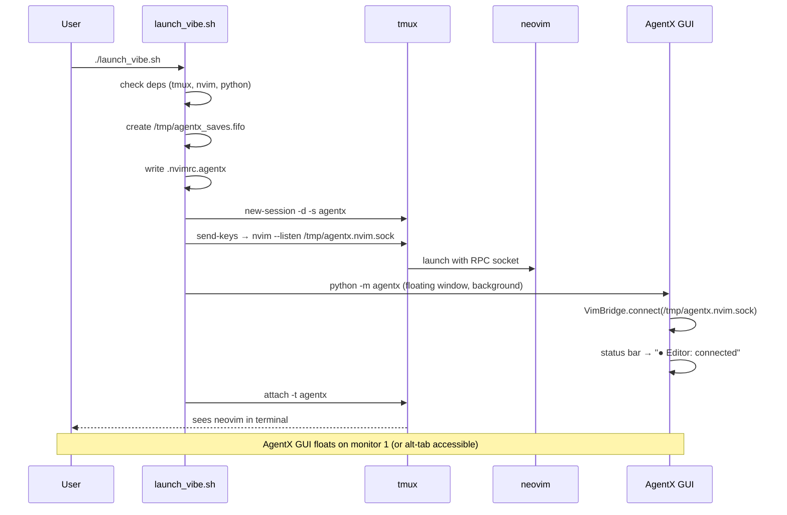

---

### UF-VC-02: Agent Opens File in Neovim

**Trigger**: User asks "open src/agentx/session.py in the editor".

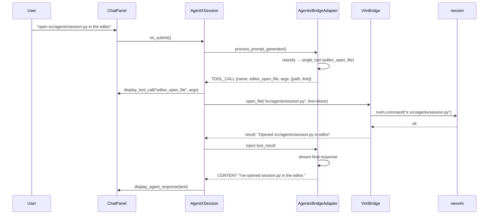

---

### UF-VC-03: Agent Writes Code to Neovim Buffer

**Trigger**: Agent generates a code block and user clicks "Send to Editor" (or agent
decides to write directly to a buffer as part of a plan step).

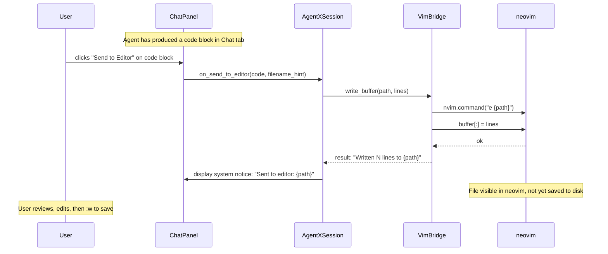

---

### UF-VC-04: User Saves File — AgentX Detects Change

**Trigger**: User presses `:w` in neovim after editing.

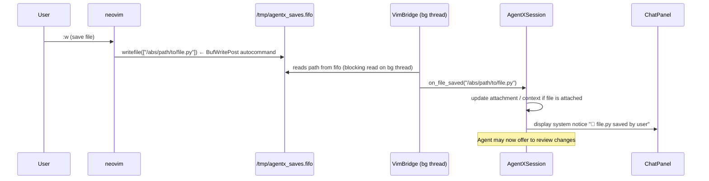

---

### UF-VC-05: User Opens File via FileExplorer "Open in Editor"

**Trigger**: User right-clicks a file in the FileExplorer panel.

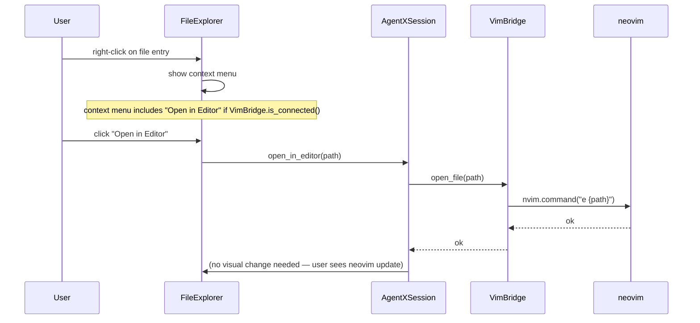

---

### UF-VC-06: Agent Runs Allowed Command (supervised mode)

**Trigger**: Agent plan step calls `terminal_run("python -m pytest tests/")` — command
matches the allow-list prefix `"python -m pytest"`.

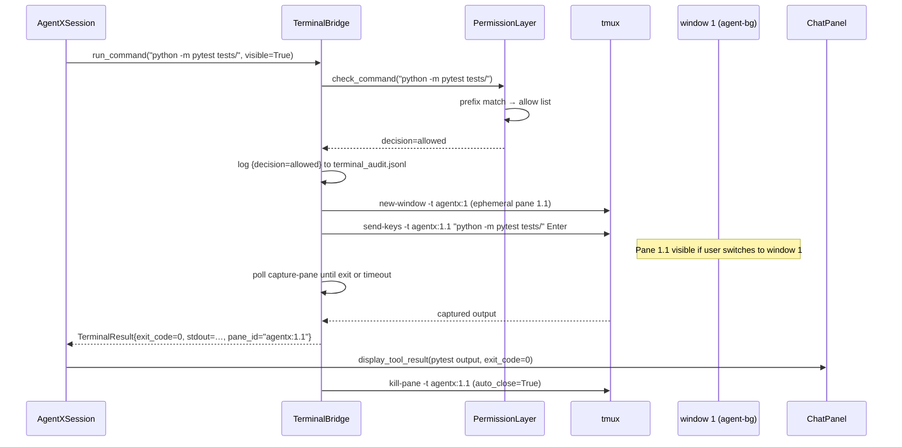

**Hidden mode** (`visible=False`): command runs in persistent pane 1.0 via `send-keys`.
No new pane is created. Output captured with `tmux capture-pane -p -t agentx:1.0`.

---

### UF-VC-06b: Agent Requests Confirmation-Required Command (supervised mode)

**Trigger**: Agent calls `terminal_run("git commit -m 'wip'")` — command matches
`confirm` list prefix `"git commit"`.

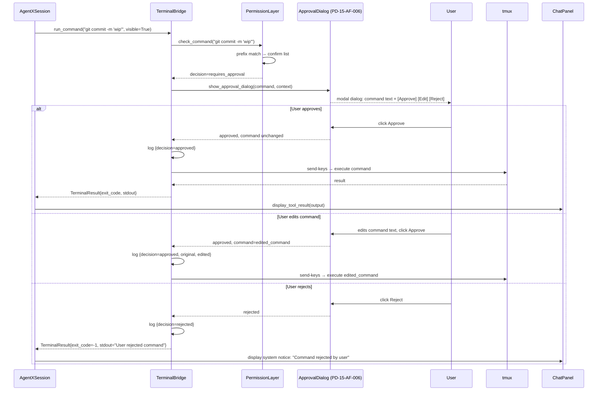

---

### UF-VC-06c: Agent Requests Denied Command

**Trigger**: Agent calls `terminal_run("rm -rf build/")` — matches deny list.

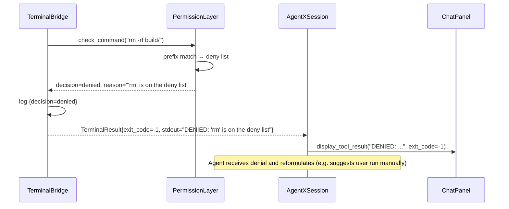

---

### UF-VC-06d: User Toggles Execution Mode

**Trigger**: User clicks the execution mode toggle in the status bar or Settings tab.

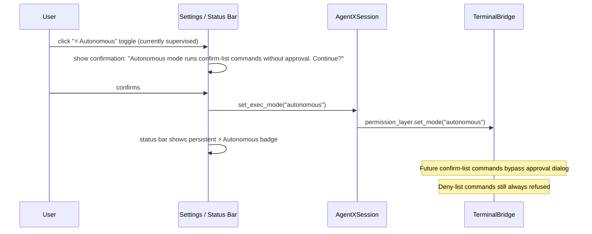

---

### UF-VC-07: Neovim Disconnects / Not Running

**Trigger**: Socket disappears (nvim crashed, user quit neovim, session not started with launcher).

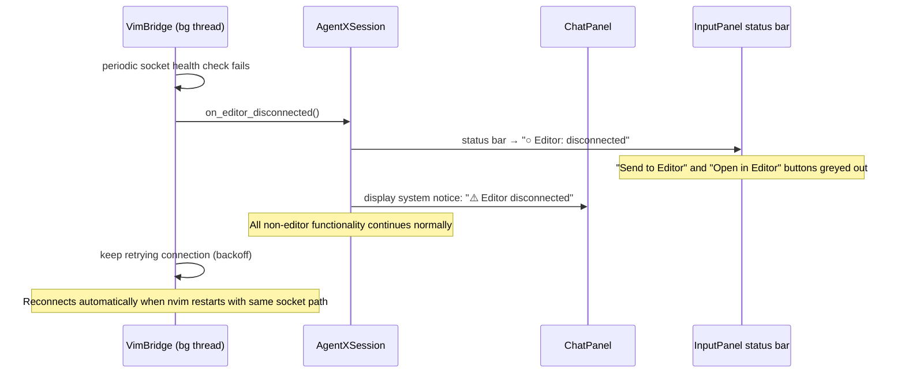

---

### UF-VC-08: Agent Jumps to Error Location in Neovim

**Trigger**: Agent identifies an error with a file:line reference and offers to navigate.

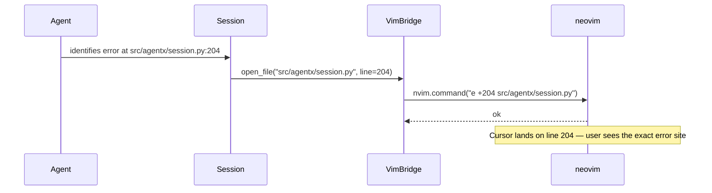

---

## 6. Panel Specifications

### PD-14: VimBridge GUI affordances

**New affordances added to existing panels** (not a standalone panel).

#### PD-14-AF-001: Editor Status Bar Strip

**Location**: Bottom of `InputPanel`, above the user text input.  
**Component**: Thin `tk.Frame` strip (~20px high).

| State | Visual | Colour |
|-------|--------|--------|
| Connected | `● Editor: connected  nvim@<socket_path>` + `[⏻ Disconnect]` button | Green dot |
| Disconnected | `○ Editor: disconnected` + `[Connect]` button | Grey dot |
| Connecting | `◌ Editor: connecting…` | Yellow dot |

**Interactions**:

| Control | Action | Callback |
|---------|--------|----------|
| `[⏻ Disconnect]` | Call `VimBridge.disconnect()` | `Session.disconnect_editor()` |
| `[Connect]` | Attempt `VimBridge.connect()` | `Session.connect_editor()` |
| Status label | — (read-only display) | — |

---

#### PD-14-AF-002: "Open in Editor" — FileExplorer Context Menu

**Location**: Right-click context menu on file entries in `FileExplorer`.  
**Visibility**: Menu item visible only when `VimBridge.is_connected()` is True.

| Control | Action | Condition |
|---------|--------|-----------|
| `Open in Editor` | `Session.open_in_editor(path)` | `VimBridge.is_connected()` |
| `Open in Editor (line N)` | `Session.open_in_editor(path, line)` | Same + line known |

---

#### PD-14-AF-003: "Send to Editor" — Code Block Button

**Location**: Toolbar of each code block in `ChatPanel` output entries.  
**Visibility**: Button always rendered; **disabled** (greyed) when `VimBridge.is_connected()` is False.

| Control | Action | Notes |
|---------|--------|-------|
| `[→ Editor]` | `Session.send_to_editor(code, filename_hint)` | filename_hint from ````python` fence lang hint or None |

---

#### PD-14-AF-004: Line Navigation from Error Display

**Location**: Tool result entries that contain `file:line` patterns.  
**Rendering**: `file.py:204` rendered as a clickable link.

| Control | Action |
|---------|--------|
| Click `file.py:204` link | `Session.open_in_editor(path, line=204)` |

---

#### PD-14-AF-005: File-Saved Notification

**Location**: `ChatPanel` — displayed as a system notice entry (no role icon, light styling).  
**Trigger**: `VimBridge.on_file_saved` callback fires.

| Notification | Content |
|-------------|---------|
| System notice | `📁 <filename> saved` |
| Offered action | "Review changes?" → inserts "Show me what changed in <filename>" into user input |

---

#### PD-14-AF-008: Recover Editor Command

**Location**: `launch_vibe.sh recover-editor` launcher command.  
**Purpose**: Restore neovim editing surface after accidental exit/window loss without restarting entire session.

| Step | Action |
|------|--------|
| 1 | Validate tmux session exists |
| 2 | Recreate `window 0` if missing |
| 3 | Rewrite `.nvimrc.agentx` to ensure save autocommand remains present |
| 4 | Relaunch neovim in pane `agentx:0.0` with `--listen` socket |
| 5 | Print operator hint for editor window (`Ctrl+B, 1` when TUI is enabled; `Ctrl+B, 0` otherwise) |

**Error path**: If session is missing, command fails with clear message and start hint.

---

### PD-15: TerminalPane GUI affordances

**New affordances for agent-controlled terminal execution via tmux.**

#### PD-15-AF-001: Terminal Visibility Preference

**Location**: Settings tab (`PD-07`), new section "Terminal Execution".

| Setting | Type | Default | Description |
|---------|------|---------|-------------|
| `terminal_visible` | `bool` | `true` | Agent terminal panes open in the `agent-bg` window visibly (Ctrl+B, 2 when TUI is enabled) |
| `terminal_auto_close` | `bool` | `true` | Kill ephemeral pane when command completes |
| `terminal_timeout_sec` | `int` | `60` | Max seconds to wait for command exit |

---

#### PD-15-AF-002: Terminal Output in Chat

**Location**: `ChatPanel` — tool result entries from `TerminalBridge` tool calls.  
**Content**: Captured stdout/stderr (truncated to last 200 lines if long), exit code badge.

| Exit Code | Badge Colour |
|-----------|-------------|
| 0 | Green `✓` |
| Non-zero | Red `✗ (exit N)` |
| -1 (denied/rejected/timeout) | Orange `⚠ denied` / `⚠ rejected` / `⚠ timed out` |

---

#### PD-15-AF-003: Active Terminal Pane Indicator

**Location**: `InputPanel` status bar (right side, beside Editor status).

| State | Visual |
|-------|--------|
| No active panes | (hidden) |
| N panes running | `⬛ N terminal(s) running` |
| Autonomous mode active | `⚡ Autonomous  ⬛ N terminal(s) running` |

---

#### PD-15-AF-004: Kill Terminal Pane Action

**Location**: Tool call entry in `ChatPanel` for `terminal_run` calls.  
**Affordance**: `[✗ Kill]` button visible while pane is running; disappears on completion.

| Control | Action |
|---------|--------|
| `[✗ Kill]` | `TerminalBridge.kill_pane(pane_id)` |

---

#### PD-15-AF-005: Execution Mode Toggle

**Location**: Settings tab `PD-07`, section "Terminal Execution" + mirrored as a button
in the `InputPanel` status bar.

| State | Visual | Behaviour |
|-------|--------|----------|
| `supervised` | Grey badge (default, no badge shown) | Confirm-list commands show approval dialog |
| `autonomous` | Persistent orange `⚡ Autonomous` badge | Confirm-list commands run without dialog |

**Switching to `autonomous`** requires a one-click confirmation prompt:
> _"Autonomous mode will execute git commits, installs, and other state-changing commands
> without asking. Continue?"_

**Switching back to `supervised`** requires no confirmation.

---

#### PD-15-AF-006: Command Approval Dialog

**Location**: Modal `Toplevel` dialog, centred over the AgentX GUI window.  
**Trigger**: `TerminalBridge.PermissionLayer` fires when exec_mode=`supervised` and
command matches the `confirm` list.

```
┌──────────────────────────────────────────────────────────────┐
│  ⚠  AgentX wants to run a command                           │
├──────────────────────────────────────────────────────────────┤
│                                                              │
│  Command:                                                    │
│  ┌────────────────────────────────────────────────────────┐  │
│  │  git commit -m 'Add VimBridge integration'             │  │  ← editable tk.Text
│  └────────────────────────────────────────────────────────┘  │
│                                                              │
│  Context: (reason the agent wants to run this)              │
│  "Committing completed step 3 of the plan"                  │
│                                                              │
│  [ Approve ]   [ Edit & Approve ]   [ Reject ]              │
└──────────────────────────────────────────────────────────────┘
```

| Control | Action | Keyboard |
|---------|--------|----------|
| `Approve` | Execute as-shown | `Enter` |
| `Edit & Approve` | Unlock text field for editing, then re-confirms | — |
| `Reject` | Return denial to agent | `Escape` |

---

#### PD-15-AF-007: Command Allow/Deny List Editor

**Location**: Settings tab (`PD-07`), section "Terminal Execution" → "Edit Permission Lists".

**Layout**: Three side-by-side `tk.Text` widgets labelled **Allow**, **Confirm**, **Deny**.
One entry per line (prefix string). Changes saved to `agentx.toml` on `[Save]`.

| Control | Action |
|---------|--------|
| `[Save]` | Writes lists to `agentx.toml`, reloads `TerminalBridge.PermissionLayer` |
| `[Reset to Defaults]` | Restores factory allow/confirm/deny lists |
| `[?]` | Opens inline help explaining prefix-match semantics |

---

#### PD-15-AF-008: Graceful Session Shutdown Command

**Location**: `launch_vibe.sh stop` launcher command.  
**Purpose**: Single deterministic shutdown path for full vibe-coding session lifecycle.

| Step | Action |
|------|--------|
| 1 | Detect active tmux session (`has-session`) |
| 2 | Send `Ctrl+C` to AgentX runtime pane (`agentx:2.0`) |
| 3 | Send `Ctrl+C` + `:qa!` to editor pane (`agentx:0.0`) |
| 4 | Kill tmux session (`kill-session -t agentx`) |
| 5 | Remove stale socket if present |

**No-op behaviour**: If no session exists, command exits `0` with a friendly notice.

---

#### PD-15-AF-009: Dispatch Defaults from Config

**Location**: `terminal_bridge.terminal_run()` wrapper function.  
**Purpose**: Callers need not pass `visible`, `auto_close`, or `timeout_sec` explicitly; the wrapper reads those values from `agentx.toml [terminal]` when any are omitted (`None`).

| Parameter | Config key | Fallback |
|-----------|-----------|---------|
| `visible` | `terminal_visible` | `True` |
| `auto_close` | `terminal_auto_close` | `True` |
| `timeout_sec` | `terminal_timeout_sec` | `60` |

Explicit call-site values override the config. Invalid config values silently fall back to the defaults above.

---

#### PD-15-AF-010: Tool-Result Decision Badge

**Location**: `StreamingController._display_tool_result()`.  
**Purpose**: Every streamed `terminal_run` tool-result row in the chat panel includes a visual badge indicating the permission decision and exit code.

| Decision | Badge |
|----------|-------|
| `allowed` / `approved` | `✅ {decision} (exit {code})` |
| `denied` | `⛔ denied` |
| `rejected` / `path_violation` | `🚫 {decision}` |
| Unknown | `⚠ {decision}` |

When `stdout` is available in the result payload, the first 100 characters are shown as a preview in the tool-result row.

---

## 7. Neovim Integration Contract

### `VimBridge` (`src/agentx/integration/vim_bridge.py`)

#### Public API

```python
class VimBridge:
    def connect(self, socket_path: str) -> bool: ...
    def disconnect(self) -> None: ...
    def is_connected(self) -> bool: ...
    def open_file(self, path: str, line: int | None = None) -> str: ...
    def write_buffer(self, path: str, lines: list[str]) -> str: ...
    def read_buffer(self, path: str) -> list[str]: ...
    def execute_command(self, ex_command: str) -> str: ...
    @property
    def on_file_saved(self) -> Callable[[str], None] | None: ...
    @on_file_saved.setter
    def on_file_saved(self, callback: Callable[[str], None]) -> None: ...
```

#### Socket Health Check

`VimBridge` runs a daemon thread that pings the nvim socket every 5 seconds using
`nvim.eval('1')`. On failure it fires `on_editor_disconnected` and starts a
reconnect backoff (1s → 2s → 4s → … → 30s max).

#### Thread Safety

All pynvim calls are marshalled onto the same thread that connected (pynvim is not
thread-safe). Callers invoke `VimBridge` methods from any thread; the bridge queues
operations and executes them on its dedicated connection thread.

---

### `TerminalBridge` (`src/agentx/integration/terminal_bridge.py`)

#### Public API

```python
class TerminalBridge:
    def __init__(self, config: AgentXConfig, session_id: str) -> None: ...

    # Availability
    def is_tmux_available(self) -> bool: ...
    def is_session_active(self) -> bool: ...   # tmux session exists and window 1 is ready

    # Command execution
    def run_command(
        self,
        command: str,
        context: str = "",        # reason string shown in approval dialog
        visible: bool = True,     # True → ephemeral pane in window 1; False → pane 1.0
        auto_close: bool = True,
        timeout_sec: int = 60,
    ) -> TerminalResult: ...

    # Pane control
    def kill_pane(self, pane_id: str) -> None: ...
    def list_active_panes(self) -> list[str]: ...

    # Permission layer
    @property
    def permission_layer(self) -> "PermissionLayer": ...
    def set_exec_mode(self, mode: str) -> None: ...    # "supervised" | "autonomous"
    def get_exec_mode(self) -> str: ...
```

#### `PermissionLayer`

```python
class PermissionLayer:
    """Classifies commands against allow/confirm/deny lists and path restrictions."""

    def check_command(self, command: str) -> PermissionDecision: ...
    def check_paths(self, command: str, project_roots: list[str]) -> bool: ...
    def reload_from_config(self, config: AgentXConfig) -> None: ...
    def set_mode(self, mode: str) -> None: ...

@dataclass
class PermissionDecision:
    verdict: str       # "allowed" | "requires_approval" | "denied"
    reason: str        # human-readable explanation (shown in dialog / tool result)
    list_name: str     # "allow" | "confirm" | "deny" | "default_confirm" | "path_violation"
```

#### `TerminalResult`

```python
@dataclass
class TerminalResult:
    pane_id: str
    exit_code: int          # -1 for denied / rejected / timed_out
    stdout: str             # captured via tmux capture-pane
    timed_out: bool
    decision: str           # "allowed" | "approved" | "rejected" | "denied" | "path_violation"
    original_command: str   # command as received from agent
    executed_command: str   # command as actually run (may differ if user edited)
```

#### Window 1 Pane Strategy

```
visible=True:
  tmux new-window -t {session}:1 -n "agent:{short_cmd}"
  tmux send-keys -t {session}:1.{new_pane} "{command}" Enter
  → poll with: tmux capture-pane -p -t {session}:1.{pane}
  → exit detection: tmux display-message -p -t {pane} '#{pane_dead}'

visible=False:
  tmux send-keys -t {session}:1.0 "{command}" Enter
  → capture: tmux capture-pane -p -t {session}:1.0 -S -500
  → exit detection via sentinel: append '&&echo __AGENTX_DONE__ || echo __AGENTX_FAIL__'
```

---

## 8. Agent Tool Schemas

New tools registered in `AgentixBridgeAdapter` when `VimBridge` / `TerminalBridge` are available:

| Tool Name | Description | Key Args |
|-----------|-------------|----------|
| `editor_open_file` | Open a file in neovim, optionally at a line | `path: str`, `line: int \| None` |
| `editor_write_buffer` | Write lines to a neovim buffer | `path: str`, `lines: list[str]` |
| `editor_read_buffer` | Read the current content of a neovim buffer | `path: str` |
| `editor_run_command` | Send an Ex command to neovim | `command: str` |
| `terminal_run` | Run a shell command in a tmux pane (subject to permission layer) | `command: str`, `context: str`, `visible: bool`, `timeout_sec: int` |
| `terminal_kill` | Kill a running tmux pane | `pane_id: str` |
| `terminal_list_panes` | List active agent pane IDs and their statuses | — |

> Tool schemas are generated via `extract_tool_schema()` from the function docstrings,
> following the existing pattern in `src/agentx/tools/schema.py`.

---

## 9. Error and Degradation Handling

| Scenario | Behaviour |
|----------|-----------|
| Neovim socket missing at startup | Status bar shows "disconnected"; vibe-coding tools not registered with bridge |
| Neovim socket disappears mid-session | Health-check fires `on_editor_disconnected`; tools unregistered; status updates; retries |
| `write_buffer` called while user is editing | pynvim write proceeds; neovim shows standard "file changed" conflict UI — intentional expected vim behaviour |
| `terminal_run` called, tmux not available | `TerminalBridge.is_tmux_available()` returns False; tool not registered; agent falls back to `subprocess` tools |
| tmux pane command times out | `TerminalResult.timed_out=True`, `decision="timed_out"`; pane killed if `auto_close`; exit_code=-1 |
| Named pipe full / blocked | Write in autocommand wrapped in `silent!`; blocks are non-fatal to neovim |
| Command matches deny list | `decision="denied"`, exit_code=-1, no pane created, reason returned to agent |
| Command matches neither allow nor confirm | Treated as confirmation-required; approval dialog shown in supervised mode |
| Path restriction violation | `decision="path_violation"`, message names the offending path and the configured roots |
| User rejects command in dialog | `decision="rejected"`; agent receives the rejection message and may reformulate |
| Window 1 pane 1.0 (persistent shell) not ready | `TerminalBridge` recreates it on next `run_command` call; logs warning |
| User kills window 1 manually (`Ctrl+B, &`) | All active pane tracking entries marked dead; status bar updates; no crash |

---

## 10. Test Scenarios

> Full Gherkin use-cases live in the test files. Summaries here for traceability.

### Unit Tests (hermetic — all external services mocked)

| Scenario | File | Gherkin Summary |
|----------|------|-----------------|
| VimBridge connects to mocked pynvim socket | `test_vim_bridge.py` | GIVEN a socket path WHEN connect() called THEN is_connected() is True |
| VimBridge open_file sends correct nvim command | `test_vim_bridge.py` | GIVEN connected bridge WHEN open_file(path, line=42) THEN nvim.command("e +42 path") called |
| VimBridge write_buffer sets buffer lines | `test_vim_bridge.py` | GIVEN connected bridge WHEN write_buffer(path, lines) THEN buffer[:] = lines |
| VimBridge health-check fires disconnect on failure | `test_vim_bridge.py` | GIVEN connected bridge WHEN ping raises OSError THEN on_editor_disconnected called |
| TerminalBridge run_command (visible=True) creates ephemeral pane in window 1 | `test_terminal_bridge.py` | GIVEN tmux available WHEN run_command(cmd, visible=True) THEN new-window in session:1 + send-keys called |
| TerminalBridge run_command (visible=False) uses persistent pane 1.0 | `test_terminal_bridge.py` | GIVEN tmux available WHEN run_command(cmd, visible=False) THEN send-keys to session:1.0 |
| TerminalBridge timeout kills pane, sets timed_out=True | `test_terminal_bridge.py` | GIVEN command runs past timeout THEN kill-pane called, timed_out=True, exit_code=-1 |
| PermissionLayer allow-list match → decision=allowed | `test_permission_layer.py` | GIVEN allow=["pytest"] WHEN check_command("pytest tests/") THEN verdict=allowed |
| PermissionLayer confirm-list match → decision=requires_approval | `test_permission_layer.py` | GIVEN confirm=["git commit"] WHEN check_command("git commit -m 'x'") THEN verdict=requires_approval |
| PermissionLayer deny-list match → decision=denied | `test_permission_layer.py` | GIVEN deny=["rm "] WHEN check_command("rm -rf .") THEN verdict=denied |
| PermissionLayer unknown command → default to requires_approval | `test_permission_layer.py` | GIVEN no match WHEN check_command("foobar") THEN verdict=requires_approval |
| PermissionLayer path restriction — in-bounds path passes | `test_permission_layer.py` | GIVEN roots=["/project"] WHEN check_paths("cat /project/file.py") THEN True |
| PermissionLayer path restriction — out-of-bounds path blocked | `test_permission_layer.py` | GIVEN roots=["/project"] WHEN check_paths("cat /etc/passwd") THEN False, verdict=path_violation |
| PermissionLayer autonomous mode skips approval for confirm-list | `test_permission_layer.py` | GIVEN mode=autonomous WHEN check_command("git commit") THEN verdict=allowed |
| PermissionLayer deny-list still enforced in autonomous mode | `test_permission_layer.py` | GIVEN mode=autonomous WHEN check_command("rm -rf .") THEN verdict=denied |
| TerminalBridge.run_command writes audit log entry | `test_terminal_bridge.py` | GIVEN any command WHEN run_command called THEN jsonl entry written to terminal_audit.jsonl |
| PD-15-AF-006 approval dialog shown for confirm-list command | `test_terminal_pane_gui.py` | GIVEN supervised mode WHEN confirm-list command dispatched THEN ApprovalDialog raised |
| PD-15-AF-006 approval dialog not shown in autonomous mode | `test_terminal_pane_gui.py` | GIVEN autonomous mode WHEN confirm-list command dispatched THEN no dialog, command runs |
| PD-15-AF-005 mode toggle requires confirmation to enter autonomous | `test_terminal_pane_gui.py` | GIVEN supervised WHEN user clicks autonomous toggle THEN confirmation prompt shown |
| PD-15-AF-003 status bar shows ⚡ badge in autonomous mode | `test_terminal_pane_gui.py` | GIVEN autonomous mode THEN status strip contains "Autonomous" |
| PD-14-AF-001 status bar shows connected state | `test_vim_bridge_gui.py` | GIVEN VimBridge connected THEN status label text contains "connected" |
| PD-14-AF-001 status bar shows disconnected state | `test_vim_bridge_gui.py` | GIVEN VimBridge disconnected THEN status label text contains "disconnected" |
| PD-14-AF-003 Send to Editor button disabled when disconnected | `test_vim_bridge_gui.py` | GIVEN disconnected WHEN code block rendered THEN button state is DISABLED |
| PD-14-AF-003 Send to Editor button enabled when connected | `test_vim_bridge_gui.py` | GIVEN connected WHEN code block rendered THEN button state is NORMAL |
| PD-15-AF-008 stop command gracefully tears down session | `test_launch_vibe_shutdown.py` | GIVEN running session WHEN `launch_vibe.sh stop` THEN AgentX and neovim receive stop signals before kill-session |
| PD-15-AF-008 stop command is safe when no session exists | `test_launch_vibe_shutdown.py` | GIVEN no session WHEN `launch_vibe.sh stop` THEN no-op success with no kill-session call |
| PD-14-AF-008 recover-editor restores editing surface | `test_launch_vibe_shutdown.py` | GIVEN missing editor window WHEN `recover-editor` runs THEN window 0 is recreated and neovim relaunched in pane 0.0 |
| PD-15-AF-008 start command installs GUI-exit teardown hook | `test_launch_vibe_shutdown.py` | GIVEN fresh start WHEN AgentX command is launched in window 2 THEN command string includes post-exit `tmux kill-session` hook |
| PD-15-AF-009 terminal_run wrapper reads visible/auto_close/timeout from config | `test_terminal_bridge.py` | GIVEN config terminal_visible=False, terminal_auto_close=False, terminal_timeout_sec=17 WHEN terminal_run("pytest tests/") called without options THEN run_command receives visible=False, auto_close=False, timeout_sec=17 |
| PD-15-AF-010 decision badge appears in tool-result row | `test_terminal_streaming_controller.py` | GIVEN terminal_run result with decision="approved", exit_code=0 WHEN _display_tool_result called THEN display_agent_response arg contains "approved" and "exit 0" |

### Integration Tests (two or more internal units)

| Scenario | Units | Gherkin Summary |
|----------|-------|-----------------|
| Session wires VimBridge into tool loop | Session + VimBridge | GIVEN vibe session WHEN editor_open_file tool called THEN VimBridge.open_file invoked |
| Session receives file-saved callback and notifies ChatPanel | VimBridge + Session + ChatPanel | GIVEN file saved WHEN FIFO fires THEN ChatPanel shows save notice |
| TerminalBridge result displayed in ChatPanel | TerminalBridge + Session + ChatPanel | GIVEN terminal_run completes THEN tool result entry shows captured output + exit badge |
| TerminalBridge deny blocks command before tmux is touched | TerminalBridge + PermissionLayer | GIVEN deny-list match WHEN run_command called THEN no tmux subprocess invoked |
| Session propagates exec_mode change to TerminalBridge | Session + TerminalBridge + GUI | GIVEN user toggles mode WHEN set_exec_mode called THEN permission_layer.mode updated + status bar updates |

### Functional Tests (external service involved)

| Scenario | Mocking |
|----------|---------|
| VimBridge open_file: real pynvim socket, mock filesystem | pynvim live, fs mocked |
| VimBridge write_buffer: mock pynvim, real temp file write | pynvim mocked, fs live |
| VimBridge write_buffer: real pynvim + real temp file | all live |

---

## 11. Open Design Questions

| ID | Question | Priority |
|----|----------|----------|
| OQ-01 | Should `write_buffer` save to disk automatically or leave it unsaved (user decides)? Current design: leave unsaved — user owns the `:w`. | Low |
| OQ-02 | Should `on_file_saved` offer to re-attach the saved file as a context attachment automatically? | Medium |
| OQ-03 | Should the launch script support neovim plugins (e.g. loading user's `~/.config/nvim`)? Current design: yes, nvim uses user config + appends `.nvimrc.agentx` via `--cmd`. | Resolved: yes |
| OQ-04 | Should `terminal_run` support interactive commands (e.g. `python -m agentx`)? Current design: no — `terminal_run` is for non-interactive commands only. | Low |
| OQ-05 | Clipboard integration: agent reads neovim's unnamed register via `nvim.eval('@"')`? | Future |
| OQ-06 | Should the audit log (`terminal_audit.jsonl`) be visible in the AgentX GUI (e.g. a new side-panel tab)? | Medium |
| OQ-07 | Should `project_roots` path restriction apply to neovim `editor_write_buffer` calls too? Current design: no, VimBridge trusts the path. Should be added for consistency. | Medium |
| OQ-08 | Credential question — **Resolved**: Agent runs as the user. A dedicated system user is not implemented. Safety is provided by the PermissionLayer (§4) which is user-configurable and toggleable. | Resolved |
| OQ-09 | Session shutdown consistency — **Resolved**: `launch_vibe.sh` now exposes first-class lifecycle commands (`stop`, `status`, `recover-editor`, `restart`) with deterministic behaviour and tests. | Resolved |
| OQ-10 | TUI mirror: surfacing the chat interface as a neovim split inside tmux — **Specced**: see [`06_TUI_MIRROR.md`](06_TUI_MIRROR.md) for the full plan. Config toggles: `tui.enable` (default `false`, opt-in) and `enable_gui_chat` (default `true`). | Resolved → Spec |
