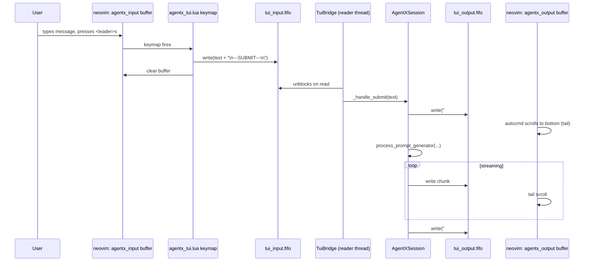
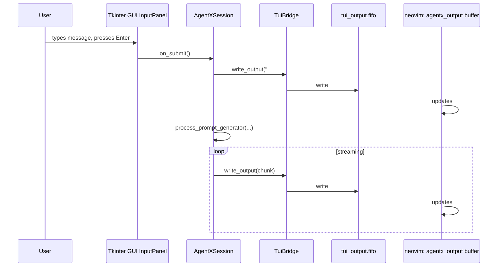

# AgentX — TUI Mirror: Neovim Chat Pane

_Last updated: 2026-05-28 (v1.0.1)_

> **Companion document to [`05_VIBE_CODING.md`](05_VIBE_CODING.md).**
> Specifies the optional TUI mirror that surfaces the AgentX chat interface as a
> horizontally-split neovim window inside the tmux environment.  The TUI mirror is
> the primary delivery focus until parity completion; GUI remains secondary/back-
> burnered during this phase.  Both surfaces may run simultaneously when needed.

---

## Table of Contents

1. [Concept and Goals](#1-concept-and-goals)
2. [Architecture](#2-architecture)
   - [2.1 IPC Channels](#21-ipc-channels)
   - [2.2 Neovim Window Layout](#22-neovim-window-layout)
   - [2.3 Component Map](#23-component-map)
3. [Configuration](#3-configuration)
   - [3.1 agentx.toml Keys](#31-agentxtoml-keys)
   - [3.2 enable_gui_chat Toggle](#32-enable_gui_chat-toggle)
4. [Launch Architecture Additions](#4-launch-architecture-additions)
5. [Affordance Specifications — PD-16](#5-affordance-specifications--pd-16)
6. [User Flows](#6-user-flows)
7. [Neovim Config Contract (agentx_tui.lua)](#7-neovim-config-contract-agentx_tuilua)
8. [Output Rendering Format](#8-output-rendering-format)
9. [Implementation Plan](#9-implementation-plan)
10. [Test Scenarios](#10-test-scenarios)
11. [Open Design Questions](#11-open-design-questions)
12. [TUI-First Migration Plan (Planned)](#12-tui-first-migration-plan-planned)

---

## 1. Concept and Goals

Many software developers work exclusively in terminal environments and prefer not to
context-switch to a GUI window for AI interactions.  The TUI mirror gives these users
a full-keyboard, neovim-native chat interface running inside the existing tmux session —
no separate window manager involvement required.

### Goals

| Goal | Description |
|------|-------------|
| **Parallel, not replacement** | GUI and TUI surfaces co-exist; disabling one does not affect the other |
| **Zero-friction for existing vibe-coding users** | TUI mirror is `opt-in`; launching `launch_vibe.sh` without config produces identical behaviour to today |
| **Keyboard-native** | All input is through normal neovim editing; submit is a single keymap |
| **Full output fidelity (text)** | Every agent response, tool call, and tool result that appears in the GUI Chat panel is also written to the TUI output buffer |
| **Shared session state** | TUI and GUI submit into the same `AgentXSession`; context, working memory, and attachments are shared |
| **Enable GUI Chat toggle** | GUI chat is togglable at config time, defaulting to `true`; advanced users can run headless (TUI-only) |

### Non-Goals

- Replicating collapsible GUI widgets in neovim (output is linear text)
- Rendering markdown with a neovim plugin (user may install `render-markdown.nvim` independently)
- Replacing the GUI as the canonical display surface for plans, context meters, or settings
- Supporting agents other than AgentX via the TUI

---

## 2. Architecture

### Authoritative Pane Titles

The hybrid core pane-title contract is authoritative and must remain synchronized with runtime code:

| Pane role | Required title |
|------|-------------|
| Output pane | `output` |
| System pane | `system` |
| Input pane | `input` |
| Logs pane | `logs` |

No additional pane titles may be introduced in the core runtime without first updating this document and its corresponding tests.

### Authoritative tmux Naming Contract (Hybrid Core)

The hybrid runtime owns tmux naming and is the source of truth for session and window identifiers.

| Entity | Required contract |
|------|-------------------|
| Session name | `agentx_<username>_<session_id>` with sanitized components (`[a-z0-9_-]`, invalid characters collapsed to `-`) |
| Primary window (`:0`) | `tui-chat` |
| Logs window (`:1`) | `logs` |
| Pane titles inside primary window | `output`, `system`, `input` |

Rules:

- AgentX must create required windows before any optional external layout tooling overlays pane topology.
- External layout tooling may split/rearrange panes but must not rename or duplicate AgentX-owned windows.
- Optional overlay entry point is CLI flag `--layout-file <tmuxp-yaml>`. Missing file, missing `tmuxp`, or load failure must degrade gracefully to default AgentX layout.
- Starter template generator entry point is CLI flag `--layout-template <file>`, which writes a `${SESSION}`-based tmuxp YAML scaffold.

### Hybrid Core Pane Content Contract

- `output` pane is the only pane that renders user/agent conversational turns.
- `input` pane is command-entry only (`agentx>` prompt, command guidance, and submit acknowledgement). It must not mirror agent response text.
- The `input` pane runtime is a native Go widget (`agentx-core --input-widget`) that submits prompts to core `/submit`, preserving the same command contract as before (`:clear`, `:q`).
- Input visual activity cues are advisory-only and must be driven by the core shared activity-state contract (`/activity`).
- `system` pane renders context visualization and prompt-cycle status only.
- Context visualization and input activity cues must remain semantically aligned to the same core prompt-cycle source.
- Startup bootstrap execution is core-owned and routes through the same submit pipeline as normal prompts.
- Startup lifecycle narration is emitted to the `logs` pane. If a custom tmuxp layout makes `logs` effectively headless or unavailable, startup must continue and fallback narration is written to core process logs.
- Default runtime behavior creates a `logs` window at `:1` and keeps it available for inspection; tmuxp overlays may change how or whether that surface is directly visible.
- Prompt-cycle response phase uses the robot emoji (`🤖`) to match TUI agent semantics.
- Session/history debug dumps are out of scope for the `system` pane UX surface.

### 2.1 IPC Channels

Two named pipes (FIFOs) power the TUI mirror.  Both are scoped by session ID to
match the existing `NVIM_SOCKET` and `SAVES_FIFO` convention in `launch_vibe.sh`.

| FIFO | Default path | Direction | Purpose |
|------|-------------|-----------|---------|
| **Output FIFO** | `/tmp/agentx_<SESSION_ID>.tui_output.fifo` | AgentX → neovim | Streams agent response text, role headers, and tool summaries |
| **Input FIFO** | `/tmp/agentx_<SESSION_ID>.tui_input.fifo` | neovim → AgentX | Carries submitted user messages |

Both paths are overridable via `agentx.toml` `[tui]` section or environment variables
(`AGENTX_TUI_OUTPUT_FIFO`, `AGENTX_TUI_INPUT_FIFO`).

#### FIFO Message Protocol

**Output FIFO** — each write is a UTF-8 newline-terminated record.  Role headers
use a distinguished prefix so neovim (or an external renderer) can apply syntax
highlighting:

```
###USER 14:32:01
write a function to parse JSON

###AGENT
I'll break this down into steps.

###TOOL_CALL read_file src/agentx/session.py
###TOOL_RESULT exit_code=0 (100 lines read)

The function signature should be...

###DONE
```

**Input FIFO** — the entire text of the user's input buffer is written as a single
chunk, terminated by `\n---SUBMIT---\n`.  Empty submissions (whitespace-only) are
silently discarded by the reader thread.

```
write a function to parse JSON
\n---SUBMIT---\n
```

### 2.2 Neovim Window Layout

When the TUI mirror is enabled, `launch_vibe.sh` creates **window 3: tui-chat** in
the tmux session.  The window contains a single neovim instance whose startup config
(`agentx_tui.lua`) creates two horizontal splits:

```
┌── window 3: tui-chat ────────────────────────────────────────────────────┐
│                                                                          │
│  ┌── TUI neovim: agentx_tui_<session>.nvim.sock ──────────────────────┐ │
│  │                                                                     │ │
│  │  ┌─ top split (~70% height): agentx_output  ─────────────────────┐ │ │
│  │  │  [read-only, nomodifiable, tail-follows output FIFO]           │ │ │
│  │  │                                                                │ │ │
│  │  │  ###USER 14:32:01                                             │ │ │
│  │  │  write a function to parse JSON                               │ │ │
│  │  │                                                                │ │ │
│  │  │  ###AGENT                                                      │ │ │
│  │  │  I'll break this down into steps.                             │ │ │
│  │  │                                                                │ │ │
│  │  │  ###TOOL_CALL read_file src/agentx/session.py                 │ │ │
│  │  │  ###TOOL_RESULT exit_code=0 (100 lines read)                  │ │ │
│  │  │                                                                │ │ │
│  │  │  The function signature should be...                          │ │ │
│  │  │  ~                                                             │ │ │
│  │  └────────────────────────────────────────────────────────────────┘ │ │
│  │                                                                     │ │
│  │  ┌─ bottom split (~30% height): agentx_input ─────────────────┐   │ │
│  │  │  [editable, <leader>s to submit, <leader>c to clear]       │   │ │
│  │  │                                                             │   │ │
│  │  │  write a function to parse JSON█                           │   │ │
│  │  │  ~                                                          │   │ │
│  │  │  ~                                                          │   │ │
│  │  └─────────────────────────────────────────────────────────────┘   │ │
│  │                                                                     │ │
│  └─────────────────────────────────────────────────────────────────────┘ │
│                                                                          │
│  tmux key: Ctrl+B, 3  ← window 3 (tui-chat)                            │
└──────────────────────────────────────────────────────────────────────────┘
```

The TUI neovim instance is completely independent of the editor neovim in window 0.
It uses a separate socket (`agentx_tui_<SESSION_ID>.nvim.sock`) so `VimBridge` can
target either instance independently.

### 2.3 Component Map

```
launch_vibe.sh (when tui.enable = true)
  │
  ├── mkfifo /tmp/agentx_<SESSION>.tui_output.fifo
  ├── mkfifo /tmp/agentx_<SESSION>.tui_input.fifo
  ├── drops agentx_tui.lua into project_dir
  └── window 3: nvim --listen agentx_tui_<SESSION>.nvim.sock
                     --cmd "luafile agentx_tui.lua"

AgentX (src/agentx/)
  │
  ├── integration/
  │     └── tui_bridge.py       TuiBridge — owns FIFO writer thread + reader thread
  │
  ├── session.py
  │     ├── self.tui_bridge       TuiBridge instance (None when tui.enable=false)
  │     └── _open_file_in_editor  already wired; TuiBridge can also use VimBridge
  │
  └── streaming_controller.py
        └── _display_*() methods  each writes to tui_bridge.write_output() in parallel
                                  with the existing GUI ChatPanel calls
```

---

## 3. Configuration

### 3.1 agentx.toml Keys

```toml
[agentx]
# Whether to launch the Tkinter GUI chat window.
# Default: true.  Set false to run in headless/TUI-only mode.
enable_gui_chat = true

[tui]
# Set true to enable the TUI mirror (neovim chat pane in tmux).
# Default: false (opt-in).
enable = false

# Socket path for the TUI neovim instance.
# Defaults to /tmp/agentx_tui_<AGENTX_TMUX_SESSION>.nvim.sock
socket = ""

# Output FIFO path. Defaults to /tmp/agentx_<AGENTX_TMUX_SESSION>.tui_output.fifo
output_fifo = ""

# Input FIFO path.  Defaults to /tmp/agentx_<AGENTX_TMUX_SESSION>.tui_input.fifo
input_fifo = ""

# Height ratio of the output split (0.0–1.0).  Default: 0.70
output_split_ratio = 0.70
```

Environment variable overrides (same scoping convention as existing variables):

| Variable | Config key | Purpose |
|----------|------------|---------|
| `AGENTX_TUI_ENABLE` | `tui.enable` | `"true"` / `"false"` |
| `AGENTX_TUI_OUTPUT_FIFO` | `tui.output_fifo` | Override output FIFO path |
| `AGENTX_TUI_INPUT_FIFO` | `tui.input_fifo` | Override input FIFO path |
| `AGENTX_TUI_SOCKET` | `tui.socket` | Override TUI neovim socket path |

### 3.2 enable_gui_chat Toggle

`enable_gui_chat = true` (default) — `AgentXSession.__init__` creates `GUIManager`
and the Tkinter root as today.

`enable_gui_chat = false` — `AgentXSession.__init__` skips `GUIManager` and uses a
`NullGUIManager` stub (implements `IGUIManager` protocol, all methods are no-ops).
This allows running AgentX headless without breaking any code that calls
`self.gui.*`.  The TUI mirror (`tui.enable = true`) is the intended replacement
surface.

> **Constraint**: `enable_gui_chat = false` + `tui.enable = false` is invalid and
> must be rejected at startup with a clear error message.

---

## 4. Launch Architecture Additions

### 4.1 UAT-Visible Startup Mode (Optional)

AgentX supports an opt-in startup mode for UAT and implementation review that
exposes the initial session as separate top-level applet windows before frame
layout is enabled.

Proposed switch contract:

```bash
agentx --startup-mode visible-windows
```

Environment override:

```bash
AGENTX_STARTUP_MODE=visible-windows
```

Behavioral contract:

- Core starts the session with one visible window per applet instead of nesting
  applets inside the final frame layout.
- Window and pane identities remain semantic and stable; the mode changes only
  presentation, not applet ownership or IPC contracts.
- UAT can use this mode to verify that each applet is present, alive, and
  functionally responsive before the frame-based layout is introduced.
- If the mode cannot be created or tmuxp overlaying is unavailable, core must
  fall back to the default runtime layout rather than failing startup.
- This mode is a validation surface only; it does not replace the canonical
  frame-based runtime described in [docs/architecture/runtime_split.md](../architecture/runtime_split.md).

When `tui.enable = true`, `launch_vibe.sh` performs these additional steps
(inserted between step 8 and step 9 of the existing launch sequence — see
[`05_VIBE_CODING.md §3`](05_VIBE_CODING.md#3-launch-architecture)):

```bash
# 8b. Create TUI FIFOs
[ -p "$TUI_OUTPUT_FIFO" ] || mkfifo "$TUI_OUTPUT_FIFO"
[ -p "$TUI_INPUT_FIFO"  ] || mkfifo "$TUI_INPUT_FIFO"

# 8c. Write agentx_tui.lua into project_dir
cat > "$project_dir/agentx_tui.lua" << 'EOF'
-- AgentX TUI mirror config — auto-generated by launch_vibe.sh, do not edit
<see §7 for full content>
EOF

# 8d. Launch TUI neovim in window 3
tmux new-window -t "$TMUX_SESSION":3 -n tui-chat -d -c "$project_dir"
tmux send-keys -t "$TMUX_SESSION":3 \
  "nvim --listen '$TUI_SOCKET' --cmd 'luafile agentx_tui.lua'" Enter
```

Updated `launch_vibe.sh` environment defaults:

```bash
TUI_OUTPUT_FIFO="${AGENTX_TUI_OUTPUT_FIFO:-/tmp/agentx_${SESSION_ID}.tui_output.fifo}"
TUI_INPUT_FIFO="${AGENTX_TUI_INPUT_FIFO:-/tmp/agentx_${SESSION_ID}.tui_input.fifo}"
TUI_SOCKET="${AGENTX_TUI_SOCKET:-/tmp/agentx_tui_${SESSION_ID}.nvim.sock}"
```

Updated tmux window key bindings:

```
Ctrl+B, 0  ← window 0 (neovim editor)
Ctrl+B, 1  ← window 1 (agent-bg terminals)
Ctrl+B, 2  ← window 2 (agentx-log)
Ctrl+B, 3  ← window 3 (tui-chat)   ← NEW (only when tui.enable=true)
```

`launch_vibe.sh stop` is updated to also send `:qa!` to the TUI neovim instance and
remove the TUI FIFOs alongside the existing cleanup.

---

## 5. Affordance Specifications — PD-16

**Panel ID**: PD-16 — TuiMirror  
**Source files** (planned):

- `src/agentx/integration/tui_bridge.py`
- `src/agentx/session.py`
- `src/agentx/integration/tui_event_subscriber.py`
- `src/agentx/config.py` (new `[tui]` section parsing)
- `launch_vibe.sh` (new TUI window steps)
- `agentx_tui.lua` (Lua config fragment, generated into project dir)

### 5.1 GUI/TUI Parity Matrix (Authoritative)

This matrix freezes the required semantic parity contract between the Tk GUI and
the TUI mirror. It is intentionally semantic rather than pixel- or widget-level.
The TUI may linearize or simplify the presentation, but it may not omit required
user-visible state.

| GUI surface / affordance | TUI representation | Required parity level | Contract |
|--------------------------|--------------------|-----------------------|----------|
| Startup notice / bootstrap guidance | `###SYSTEM Bootstrap` block at top of output | Full semantic | The first non-user-visible guidance emitted during startup must be visible in TUI before the first assistant turn. |
| User turn submission | `###USER <timestamp>` + body | Full semantic | Every submitted prompt visible in GUI must also appear in TUI in submission order. |
| Assistant turn start | `###AGENT` header | Full semantic | A new assistant turn must be visually distinct before streamed content begins. |
| Assistant streamed content | streamed body text under current assistant turn | Full semantic | Content order must match GUI stream order; no duplicate chunk rendering. |
| Thinking stream | `###THINKING` block when enabled | Full semantic, config-gated | If GUI/session config exposes thinking, TUI must show the same thinking phase in-order; if disabled, both may suppress it. |
| Tool call visibility | `###TOOL_CALL ...` line | Full semantic | Tool invocation must remain visible even when output is simplified to a single summary line. |
| Tool result visibility | `###TOOL_RESULT ...` line | Full semantic | Tool completion/result summary must remain visible in-order after the corresponding tool call. |
| Error state | `###ERROR ...` block | Full semantic | User-visible errors must appear in both surfaces and terminate or annotate the current turn consistently. |
| End of turn | `###DONE` marker | Full semantic | Every completed or terminal turn must produce one visible completion marker in TUI. |
| Context / history state | compact summary block or command-driven summary | Simplified but required | TUI does not need widget parity, but must expose current context/history state sufficient for operator awareness. |
| Attachments state | textual attachment summary in turn or system summary | Simplified but required | TUI must surface enabled/current attachment state even if it cannot render GUI chips or toggles. |
| Plan / status visibility | linear status/plan summaries | Simplified but required | TUI must expose plan progress / status phases needed to understand execution. |
| Interrupt affordance | terminal-native interrupt control + visible interruption outcome | Simplified but required | TUI need not use the GUI button model, but users must have a documented interrupt path and see a visible interrupted/terminated outcome. |

### 5.2 Canonical Turn Lifecycle Contract (Authoritative)

The hybrid runtime must present the same turn lifecycle in both GUI and TUI.
This is the canonical ordered contract for a normal assistant turn.

| Order | Lifecycle phase | Canonical event / trigger | GUI expectation | TUI expectation |
|-------|-----------------|---------------------------|-----------------|-----------------|
| 0 | Startup/bootstrap | session bootstrap / startup notice | startup notice displayed before first normal turn | `###SYSTEM Bootstrap` or equivalent system block before first normal turn |
| 1 | User submit | user message accepted into session | submitted prompt appended to chat | `###USER <timestamp>` block written in the same order |
| 2 | Turn start | assistant stream begins | assistant response section becomes active | `###AGENT` header emitted once |
| 3 | Thinking start | thinking phase begins (if enabled) | thinking area/header becomes visible | `###THINKING` emitted once when enabled |
| 4 | Thinking content | thinking chunks | content appended under thinking state | thinking content appended in-order |
| 5 | Assistant content | assistant chunks | assistant content appended in-order | assistant content appended in-order under current `###AGENT` block |
| 6 | Tool call | tool invocation announced | tool call row/line displayed | `###TOOL_CALL ...` line displayed |
| 7 | Tool result | tool output/result announced | tool result row/line displayed | `###TOOL_RESULT ...` line displayed |
| 8 | Error or interruption | terminal failure or user break | visible error/interruption state; streaming ends | `###ERROR ...` or equivalent visible interruption terminal state; streaming ends |
| 9 | Turn complete | stream end | current turn finalized | `###DONE` emitted once |

Lifecycle rules:

- Event ordering is authoritative: TUI may not reorder user, assistant, tool, error, or completion events.
- Header emission is once-per-turn: `###AGENT`, `###THINKING`, and `###DONE` must not duplicate within one turn.
- Tool events are bound to the active turn: a tool call/result may be simplified, but it may not move outside its owning assistant turn.
- Error and interruption paths are terminal for the active turn unless a future contract explicitly introduces resumable semantics.
- Coexistence mode is semantic mirror mode: when GUI and TUI are both enabled, both surfaces describe the same session turn, not parallel independent sessions.

### 5.3 Session-Mode Coexistence Contract (Authoritative)

This section defines authoritative behavior for GUI/TUI runtime combinations.

| Runtime mode | `enable_gui_chat` | `tui.enable` | Expected behavior |
|--------------|-------------------|--------------|-------------------|
| GUI-only | `true` | `false` | GUI is active chat surface; no TUI mirror channels are created. |
| TUI-only (headless) | `false` | `true` | Session uses `NullGUIManager`; TUI is the active surface; startup is valid. |
| Dual-surface coexistence | `true` | `true` | GUI and TUI mirror the same session semantics and ordering for each turn. |
| Disabled-both | `false` | `false` | Invalid configuration; startup must fail with clear `ConfigurationError`. |

Coexistence invariants:

- There is exactly one session authority; GUI and TUI are two views over that session.
- Prompt submission from either surface enters the same session pipeline.
- Visible lifecycle output must not be duplicated, reordered, or dropped between surfaces.
- Headless mode (`TUI-only`) must remain operational without invoking GUI-only setup paths.

### PD-16-AF-009: Context Bar and Top Contributors Visualization

**What it does**: Renders a horizontal context usage bar in the TUI output, with each segment colored according to its context band (using ANSI color codes). Below the bar, a Top Contributors section shows the four largest contributors, each with a color-matched bar and emoji. This mirrors the GUI context meter but is optimized for terminal display.

**Band Color & Emoji Mapping:**

| Band                | Color (ANSI)   | Emoji | ASCII | Example |
|---------------------|----------------|-------|-------|---------|
| User                | Blue (34)      | 👤    | U     | \033[34m████\033[0m |
| Agent               | Green (32)     | 🤖    | A     | \033[32m██\033[0m   |
| Thinking            | Magenta (35)   | 🤔    | T     | \033[35m█\033[0m    |
| Tools               | Yellow (33)    | 🔧    | L     | \033[33m█\033[0m    |
| System              | Cyan (36)      | 🧠    | S     | \033[36m█\033[0m    |
| Attachments         | Bright Yellow (93) | 📎 | P     | \033[93m█\033[0m    |
| Working Memory      | Bright Cyan (96)   | 💾 | M     | \033[96m██\033[0m   |
| Unused/Remaining    | Grey (90)      | ░     | ░     | \033[90m░░\033[0m   |

**Behavior:**

- The main bar is rendered as a sequence of colored blocks (e.g., `██████░░░░`), each segment's length proportional to its context share.
- The bar is always a fixed width (e.g., 40 chars), adapting to terminal width if possible.
- Below the bar, a line summarizes the percentage breakdown by band (e.g., `18% User | 14% Agent | ...`).
- The Top Contributors section lists up to four largest bands, each with a color-matched bar, emoji, and percent.
- If the terminal does not support color, an ASCII fallback is used (single-character symbols only, e.g., `MUUATLSP░░░`).

**Mockup:**

```
Context: 72% WARN  ━━━━━━━━━━━━━━━━
\033[34m██████\033[32m████\033[35m██\033[33m█\033[36m█\033[93m█\033[96m██████\033[90m░░░░░░░░░░\033[0m
18% User | 14% Agent | 6% Think | 2% Tool | 3% System | 1% Attach | 28% WM

Top Contributors:
  1. \033[96m💾 Working Memory   ████████████████████\033[0m 28%
  2. \033[34m👤 User Prompts     ███████████\033[0m 18%
  3. \033[32m🤖 Agent Response   ██████████\033[0m 14%
  4. \033[35m🤔 Thinking         ███\033[0m 6%
```

**Edge Cases:**

- If fewer than four bands are present, only those are shown in Top Contributors.
- If terminal width < 40, bar and contributor bars shrink proportionally.
- If color is not supported, all bars use ASCII fallback and no ANSI codes.

**Status:** ✅ Implemented and tested

---

### PD-16-AF-010: Input Activity-State Affordance

**What it does**: The Go input widget renders a non-blocking visual clue while core prompt processing is active and after completion/failure transitions.

**Source of truth**: Core shared activity-state endpoint (`GET /activity`) and synchronized prompt-cycle state.

**Behavior contract:**

- The affordance is advisory and does not own orchestration state transitions.
- Input command semantics are unchanged (`:clear`, `:q`, submit).
- The affordance must not clear output pane content.

**Status:** ✅ Implemented and tested

---

### PD-16-AF-001: Output FIFO Writer

**What it does**: Every chunk written to `ChatPanel` is also written to the output
FIFO so the TUI neovim `agentx_output` buffer updates in real time.

| Signal | Source method | FIFO record written |
|--------|--------------|---------------------|
| User message | `StreamingController._display_user_message()` | `###USER <timestamp>\n<content>\n` |
| Agent content chunk | `StreamingController._display_agent_response()` | `<chunk>\n` (no header per chunk) |
| Agent turn start | Role header emission | `###AGENT\n` |
| Tool call | `StreamingController._display_tool_call()` | `###TOOL_CALL <name> <args_summary>\n` |
| Tool result | `StreamingController._display_tool_result()` | `###TOOL_RESULT exit_code=<N> <summary>\n` |
| Turn done | `StreamingController._finalize()` | `###DONE\n` |

**Failure mode**: if the FIFO write blocks (no reader) for longer than a configurable
timeout (`tui.write_timeout_sec`, default `0.1 s`), the write is dropped with a
`DEBUG`-level log.  The GUI display is never blocked by FIFO backpressure.

**Status**: ✅ Implemented and tested

---

### PD-16-AF-002: Input FIFO Reader Thread

**What it does**: A daemon thread in `AgentXSession` blocks on the input FIFO.
When a `\n---SUBMIT---\n` sentinel is received, the accumulated text is passed to
`self._handle_submit(text)` — the same method called by the GUI's Send button.

**Thread lifecycle**: started in `AgentXSession.__init__` when `tui.enable = true`;
terminated (via a `threading.Event`) on session close.

**Edge cases**:

| Condition | Behaviour |
|-----------|-----------|
| Empty or whitespace-only buffer | Silently discarded, reader continues |
| Session is already streaming | Input is queued (same as GUI: submit is blocked during streaming) |
| FIFO removed while running | Thread catches `FileNotFoundError`, logs warning, exits cleanly |

**Status**: ✅ Implemented and tested

---

### PD-16-AF-003: TUI Neovim Window (`launch_vibe.sh`)

**What it does**: Adds window 3 (`tui-chat`) to the tmux session containing a neovim
instance pre-configured with `agentx_tui.lua`.

**Visibility**: Opt-in via `tui.enable = true` in `agentx.toml` or
`AGENTX_TUI_ENABLE=true` environment variable.  When disabled, window 3 is not
created; the rest of the session is identical to today.

**Status**: ✅ Implemented and tested

---

### PD-16-AF-004: `agentx_tui.lua` Config Fragment

**What it does**: Generated Lua file sourced at TUI neovim startup.  Creates the
horizontal split layout and configures both buffers.

Key responsibilities:

- Open `agentx_output` buffer in the top split as `nomodifiable`, `nobuflisted`,
  `filetype=markdown` (or `agentx_output` ft for custom highlighting).
- Open `agentx_input` buffer in the bottom split as a normal writable buffer.
- Set up an `autocmd` on `agentx_output` to `normal! G` (scroll to bottom) when
  the buffer changes (tail behaviour).
- Bind `<leader>s` in the input buffer to submit (write buffer content + sentinel
  to the input FIFO, then clear the buffer).
- Bind `<leader>c` to clear the input buffer without submitting.
- Bind `<leader>q` to request graceful application quit via input FIFO control sentinel.
- Bind `<leader>o` to switch focus to the output split.
- Bind `<leader>i` to switch focus back to the input split.

**Status**: ✅ Implemented and tested

---

### PD-16-AF-005: `<leader>s` Submit Keymap

**What it does**: In the `agentx_input` buffer, `<leader>s` (normal or insert mode)
collects all lines from the buffer, writes them to the input FIFO followed by
`\n---SUBMIT---\n`, then clears the buffer.

```lua
-- Lua implementation (inside agentx_tui.lua)
vim.keymap.set({'n', 'i'}, '<leader>s', function()
  local lines = vim.api.nvim_buf_get_lines(0, 0, -1, false)
  local text = table.concat(lines, "\n")
  if text:match("^%s*$") then return end   -- discard whitespace-only
  local fifo = vim.fn.expand("$AGENTX_TUI_INPUT_FIFO")
  local f = io.open(fifo, "a")
  if f then
    f:write(text .. "\n---SUBMIT---\n")
    f:close()
  end
  vim.api.nvim_buf_set_lines(0, 0, -1, false, {})  -- clear input buffer
end, { buffer = true, desc = "AgentX: Submit message" })
```

**Status**: ✅ Implemented and tested

---

### PD-16-AF-006: `enable_gui_chat` Config Toggle

**What it does**: When `enable_gui_chat = false`, `AgentXSession.__init__` skips
`GUIManager` construction and substitutes a `NullGUIManager` (all `IGUIManager`
methods are no-ops or return safe defaults).

**Design constraint**: `enable_gui_chat = false` requires `tui.enable = true` to
be set simultaneously.  The startup validation step raises `ConfigurationError` if
both are false.

**Status**: ✅ Implemented and tested

---

### PD-16-AF-007: `tui.enable` Config Toggle and `TuiBridge` Lifecycle

**What it does**: `AgentXSession.__init__` reads `config["tui"]["enable"]`.  When
`true`, it constructs a `TuiBridge` instance and starts its threads.  When `false`,
`self.tui_bridge` is `None` and all TuiBridge call-sites are guarded by
`if self.tui_bridge:`.

**Status**: ✅ Implemented and tested

---

### PD-16-AF-008: `<leader>q` Graceful Quit Keymap

**What it does**: In the `agentx_input` buffer, `<leader>q` (normal or insert mode)
writes a control sentinel (`\n---QUIT---\n`) to the input FIFO. `TuiBridge`
dispatches an `on_quit` callback, and `AgentXSession` schedules graceful shutdown on
the Tk event loop (`root.quit()`), allowing normal `finally` cleanup (`session.close()`
and service shutdown) to run.

```lua
vim.keymap.set({ "n", "i" }, "<leader>q", quit_app, {
  buffer = input_buf,
  desc = "AgentX: Quit application",
})
```

**Status**: ✅ Implemented and tested

---

## 6. User Flows

### UF-TUI-01: Submit Message via TUI

**Trigger**: User types in the `agentx_input` buffer and presses `<leader>s`.



---

### UF-TUI-02: GUI Submit Reflected in TUI Output

**Trigger**: User submits via the Tkinter GUI while TUI mirror is open.



Both surfaces stay in sync automatically because `StreamingController` drives both
sinks from the same streaming loop.

---

### UF-TUI-03: Headless Mode (GUI disabled)

**Trigger**: `enable_gui_chat = false`, `tui.enable = true` in `agentx.toml`.

```mermaid
sequenceDiagram
    participant Launch as launch_vibe.sh
    participant AgentX as AgentXSession
    participant NullGUI as NullGUIManager
    participant TuiBridge

    Launch->>AgentX: python -m agentx
    AgentX->>AgentX: reads config: enable_gui_chat=false, tui.enable=true
    AgentX->>NullGUI: construct NullGUIManager (all methods no-ops)
    AgentX->>TuiBridge: construct TuiBridge, start reader + writer threads
    Note over AgentX: No Tkinter root created; no GUI window appears
    AgentX->>AgentX: session.layout() → NullGUIManager.layout() → no-op
    Note over TuiBridge: All I/O flows through FIFOs ↔ TUI neovim
```

---

## 7. Neovim Config Contract (`agentx_tui.lua`)

Full content of the generated `agentx_tui.lua` file.  This is the authoritative
spec; `launch_vibe.sh` must write exactly this content.

```lua
-- agentx_tui.lua
-- Auto-generated by launch_vibe.sh — do not edit manually.
-- Source: AgentX TUI Mirror spec (docs/ux/06_TUI_MIRROR.md §7)

local output_fifo = vim.fn.expand("$AGENTX_TUI_OUTPUT_FIFO")
local input_fifo  = vim.fn.expand("$AGENTX_TUI_INPUT_FIFO")
local quit_sentinel = "\n---QUIT---\n"

-- ── Output buffer (top split, read-only) ─────────────────────────────────

local output_buf = vim.api.nvim_create_buf(false, true)   -- unlisted scratch
vim.api.nvim_buf_set_name(output_buf, "agentx_output")
vim.bo[output_buf].buftype     = "nofile"
vim.bo[output_buf].swapfile    = false
vim.bo[output_buf].modifiable  = true   -- writer sets this temporarily
vim.bo[output_buf].filetype    = "markdown"

-- ── Input buffer (bottom split, writable) ────────────────────────────────

local input_buf = vim.api.nvim_create_buf(false, true)
vim.api.nvim_buf_set_name(input_buf, "agentx_input")
vim.bo[input_buf].buftype  = "nofile"
vim.bo[input_buf].swapfile = false
vim.bo[input_buf].filetype = "markdown"

-- ── Layout: horizontal split ─────────────────────────────────────────────

local output_win = vim.api.nvim_get_current_win()
vim.api.nvim_win_set_buf(output_win, output_buf)

vim.cmd("split")
local input_win = vim.api.nvim_get_current_win()
vim.api.nvim_win_set_buf(input_win, input_buf)

-- Resize: output takes ~70% of height
local total = vim.o.lines - 2
vim.api.nvim_win_set_height(input_win, math.floor(total * 0.30))

-- ── Output tail: scroll to bottom on change ──────────────────────────────

vim.api.nvim_create_autocmd("BufModifiedSet", {
  buffer = output_buf,
  callback = function()
    local line_count = vim.api.nvim_buf_line_count(output_buf)
    vim.api.nvim_win_set_cursor(output_win, { line_count, 0 })
  end,
})

-- ── Submit keymap (<leader>s) ─────────────────────────────────────────────

vim.keymap.set({ "n", "i" }, "<leader>s", function()
  local lines = vim.api.nvim_buf_get_lines(input_buf, 0, -1, false)
  local text = table.concat(lines, "\n")
  if text:match("^%s*$") then return end
  local f = io.open(input_fifo, "a")
  if f then
    f:write(text .. "\n---SUBMIT---\n")
    f:close()
  end
  vim.api.nvim_buf_set_lines(input_buf, 0, -1, false, {})
  vim.api.nvim_set_current_win(input_win)
end, { buffer = input_buf, desc = "AgentX: Submit message" })

-- ── Clear keymap (<leader>c) ──────────────────────────────────────────────

vim.keymap.set({ "n", "i" }, "<leader>c", function()
  vim.api.nvim_buf_set_lines(input_buf, 0, -1, false, {})
end, { buffer = input_buf, desc = "AgentX: Clear input" })

-- ── Quit keymap (<leader>q) ───────────────────────────────────────────────

local function quit_app()
  local f = io.open(input_fifo, "a")
  if f then
    f:write(quit_sentinel)
    f:close()
  end
end

vim.keymap.set({ "n", "i" }, "<leader>q", quit_app, {
  buffer = input_buf,
  desc = "AgentX: Quit application",
})

-- ── Focus keymaps ─────────────────────────────────────────────────────────

vim.keymap.set("n", "<leader>o", function()
  vim.api.nvim_set_current_win(output_win)
end, { buffer = input_buf, desc = "AgentX: Focus output" })

vim.keymap.set("n", "<leader>i", function()
  vim.api.nvim_set_current_win(input_win)
  vim.cmd("startinsert")
end, { buffer = output_buf, desc = "AgentX: Focus input" })

-- ── Start cursor in input buffer ─────────────────────────────────────────

vim.api.nvim_set_current_win(input_win)
vim.cmd("startinsert")

-- ── Non-blocking startup guidance (avoid command-line ENTER prompt) ─────

append_output({
  "###SYSTEM",
  "AgentX TUI ready. Submit with <leader>s (usually \\s), quit with <leader>q (usually \\q), normal-mode Enter, or :AgentXSubmit.",
  "",
})
```

---

## 8. Output Rendering Format

The output FIFO carries plain UTF-8 text with distinguished role headers.  This is
intentionally simple so the neovim buffer remains readable without any plugin.
Optional enhancement: users with `render-markdown.nvim` will see markdown rendered
automatically because the buffer `filetype = "markdown"`.

### Role Header Reference

| Header | When emitted | Example |
|--------|-------------|---------|
| `###USER <HH:MM:SS>` | User message displayed | `###USER 14:32:01` |
| `###AGENT` | Agent response starts | `###AGENT` |
| `###THINKING` | Thinking block starts | `###THINKING` |
| `###TOOL_CALL <name> <args>` | Tool invoked | `###TOOL_CALL read_file path=src/` |
| `###TOOL_RESULT <summary>` | Tool result | `###TOOL_RESULT exit_code=0 (48 lines)` |
| `###SYSTEM <text>` | System notice | `###SYSTEM VimBridge connected` |
| `###DONE` | Turn finalized | `###DONE` |
| `###ERROR <text>` | Stream error | `###ERROR connection lost` |

### Thinking Block Suppression

By default, `###THINKING` blocks are suppressed from the TUI output (they can be
verbose).  A config key `tui.show_thinking = false` controls this; it mirrors the
GUI's thinking-block collapse default.

---

## 9. Implementation Plan

Work is divided into four phases, each independently mergeable and testable.

> **Status legend**: `[ ]` not started · `[/]` complete · `[X]` failed/blocked

---

### Phase 1 — Config and Stub Infrastructure

- [/] Add `[tui]` section parsing to `src/agentx/config.py`
  - Keys: `enable`, `socket`, `output_fifo`, `input_fifo`, `output_split_ratio`,
    `write_timeout_sec`, `show_thinking`
  - Env var overrides: `AGENTX_TUI_ENABLE`, `AGENTX_TUI_OUTPUT_FIFO`,
    `AGENTX_TUI_INPUT_FIFO`, `AGENTX_TUI_SOCKET`
  - Validation: reject `enable_gui_chat=false` + `tui.enable=false` combination
- [/] Add `enable_gui_chat` key to `[agentx]` section (default `true`)
- [/] Add `NullGUIManager` stub to `src/agentx/igui_manager.py` (or new file)
  - Implements `IGUIManager` protocol; all methods are no-ops
- [/] Wire `enable_gui_chat = false` path in `AgentXSession.__init__`
- [/] Unit tests for config parsing and `NullGUIManager` (hermetic)
  - Status: config parsing and NullGUIManager/headless wiring tests are implemented.

---

### Phase 2 — TuiBridge: Output FIFO Writer

- [/] Create `src/agentx/integration/tui_bridge.py` with `TuiBridge` class
  - `write_output(record: str)` — non-blocking write with `write_timeout_sec` guard
  - `start()` / `stop()` — thread lifecycle
  - `is_enabled` property
- [/] Hook `write_output()` into `StreamingController`:
  - `_display_user_message()` → `###USER` header + content
  - `_display_agent_response()` → `###AGENT` header (once per turn) + chunks
  - `_display_tool_call()` → `###TOOL_CALL` record
  - `_display_tool_result()` → `###TOOL_RESULT` record
  - `_finalize()` → `###DONE` record
- [/] Unit tests: writer emits correct records per signal type (hermetic, no real FIFO)

---

### Phase 3 — TuiBridge: Input FIFO Reader

- [/] Add input reader loop to `TuiBridge`:
  - Daemon thread blocking on input FIFO
  - Parses `\n---SUBMIT---\n` sentinel; accumulates preceding lines as message
  - Calls session submit callback; session dispatches on the Tk main thread via `root.after(0, ...)`
  - Stops cleanly on `_stop_event`
- [/] Wire `TuiBridge` into `AgentXSession`:
  - Construct when `tui.enable = true`
  - Call `tui_bridge.start()` after session init
  - Call `tui_bridge.stop()` in session cleanup
- [/] Unit tests: reader fires submit callback correctly; empty/whitespace discarded;
  FIFO disappears mid-read handled gracefully

---

### Phase 4 — launch_vibe.sh and Neovim Config

- [/] Add TUI FIFO / socket path variables to `launch_vibe.sh`
- [/] Add TUI window launch flow (creates window 3, writes `agentx_tui.lua`,
  launches TUI neovim) — implemented inline in `_start_session`
- [/] Gate behind `AGENTX_TUI_ENABLE` env var check in `start` / `stop` / `status`
- [/] Update `stop` to `:qa!` the TUI neovim and remove TUI FIFOs
- [/] Update `status` to report TUI socket and FIFO state
- [/] Integration tests for `launch_vibe.sh` TUI window lifecycle (hermetic fake tmux)

---

## 10. Test Scenarios

All unit and integration tests must be hermetic (no real FIFOs, no real neovim, no
real tmux).

| ID | Type | Scenario | Gherkin |
|----|------|----------|---------|
| TUI-UT-001 | Unit | Config parsing — tui.enable=true | GIVEN agentx.toml with `[tui] enable = true` WHEN config is loaded THEN `config["tui"]["enable"]` is True |
| TUI-UT-002 | Unit | Config validation — both disabled | GIVEN `enable_gui_chat=false` AND `tui.enable=false` WHEN session starts THEN ConfigurationError is raised |
| TUI-UT-003 | Unit | Output writer emits USER header | GIVEN TuiBridge with mock FIFO WHEN write_user_message(text, ts) called THEN FIFO receives `###USER <ts>\n<text>\n` |
| TUI-UT-004 | Unit | Output writer emits AGENT header once per turn | GIVEN TuiBridge WHEN write_agent_chunk called for first chunk of turn THEN `###AGENT\n` is prepended; subsequent chunks have no header |
| TUI-UT-005 | Unit | Output writer emits TOOL_CALL record | GIVEN TuiBridge WHEN write_tool_call(name, args) THEN `###TOOL_CALL <name> <args>\n` |
| TUI-UT-006 | Unit | Output writer emits TOOL_RESULT record | GIVEN TuiBridge WHEN write_tool_result(summary) THEN `###TOOL_RESULT <summary>\n` |
| TUI-UT-007 | Unit | Output writer emits DONE record | GIVEN TuiBridge WHEN finalize_turn() THEN `###DONE\n` |
| TUI-UT-008 | Unit | Output writer drops write on timeout | GIVEN FIFO has no reader WHEN write_output times out (mock) THEN record is dropped, no exception raised, GUI call not affected |
| TUI-UT-009 | Unit | Input reader parses submit sentinel | GIVEN reader thread on mock FIFO WHEN `"hello\n---SUBMIT---\n"` written THEN `_handle_submit("hello")` called once |
| TUI-UT-010 | Unit | Input reader discards whitespace | GIVEN reader WHEN `"   \n---SUBMIT---\n"` written THEN `_handle_submit` NOT called |
| TUI-UT-011 | Unit | Input reader survives FIFO removal | GIVEN reader running WHEN FIFO file removed THEN thread exits cleanly, no traceback |
| TUI-UT-012 | Unit | NullGUIManager satisfies IGUIManager | GIVEN NullGUIManager() WHEN all IGUIManager methods called THEN no exception raised |
| TUI-IT-001 | Integration | StreamingController → TuiBridge | GIVEN Session with mock TuiBridge WHEN prompt streamed THEN TuiBridge.write_output called in correct order per chunk type |
| TUI-IT-002 | Integration | TUI input → session submit | GIVEN Session with TuiBridge reader WHEN input FIFO receives submit sentinel THEN session._handle_submit called with correct text |
| TUI-FT-001 | Functional | launch_vibe.sh TUI window created | GIVEN fake tmux AND `AGENTX_TUI_ENABLE=true` WHEN `launch_vibe.sh start` runs THEN window 3 tui-chat is created, FIFOs are created, agentx_tui.lua written |
| TUI-FT-002 | Functional | launch_vibe.sh TUI disabled by default | GIVEN fake tmux AND no `AGENTX_TUI_ENABLE` WHEN `launch_vibe.sh start` runs THEN window 3 is NOT created |
| TUI-FT-003 | Functional | launch_vibe.sh TUI status/stop lifecycle | GIVEN fake tmux AND `AGENTX_TUI_ENABLE=true` WHEN `status` and `stop` run after start THEN TUI state is reported and TUI FIFOs are cleaned up |
| TUI-FT-004 | Functional | launch_vibe.sh status in default mode | GIVEN fake tmux AND no `AGENTX_TUI_ENABLE` WHEN `status` runs THEN launcher reports `TUI : disabled` without TUI path lines |
| TUI-FT-005 | Functional | launch_vibe.sh restart with TUI enabled | GIVEN fake tmux AND `AGENTX_TUI_ENABLE=true` WHEN `restart` runs THEN stop/start lifecycle re-creates TUI FIFOs and relaunches `tui-chat` with `agentx_tui.lua` |

---

## 11. Open Design Questions

| # | Question | Options | Recommendation |
|---|----------|---------|----------------|
| OD-1 | Should `<leader>s` also work from the **output** split? | A) No — confusing; B) Yes — convenience | B — add a second mapping on `output_buf` that jumps to input, clears, and waits for user to type |
| OD-2 | How should the output buffer handle very long sessions? | A) Never truncate; B) Rolling window (last N lines); C) User-triggered `:AgentXClear` | B with default 2000 lines — prevents neovim slowing down on long sessions |
| OD-3 | Should thinking blocks appear in TUI output? | A) Always; B) Never (default); C) Config toggle | C — `tui.show_thinking = false` default, matches GUI collapse behaviour |
| OD-4 | How should the TUI handle streaming interruption (Stop)? | A) Write `###INTERRUPTED\n` to output; B) Write `###DONE\n` | A — gives TUI user visible feedback |
| OD-5 | Should `NullGUIManager` log all calls at DEBUG? | A) Yes — useful for diagnosing headless issues; B) No — noise | A |
| OD-6 | Headless mode process signal handling (no Tk mainloop) | A) `signal.pause()` loop; B) Thread join on reader thread | B — cleaner and the reader thread is always present in headless mode |

---

## 12. TUI-First Migration Plan (Planned)

This section captures the planned change to make the TUI the default launch UX while
keeping GUI available behind an explicit launcher switch.

### 12.1 Target State

- Default launch behavior: TUI-first workflow (`tui-chat` attached window).
- GUI behavior: disabled by default, enabled only when launcher switch is passed.
- Session model: one shared `AgentXSession`; TUI and GUI remain interoperable.

### 12.2 Scope and Constraints

| Area | In Scope | Out of Scope (for this change) |
|------|----------|--------------------------------|
| Launcher behavior | Default inversion + explicit GUI switch | Replacing tmux session architecture |
| Runtime config | Optional env/config override for GUI enablement | Large config-schema redesign |
| TUI parity | Semantic parity for key chat/status affordances | Pixel-identical parity with Tk widgets |
| Docs/traceability | PD-16 updates across UX docs | Non-UX docs outside impacted file list |

### 12.3 Proposed Launcher Contract

| Invocation | Expected behavior |
|------------|-------------------|
| `./launch_vibe.sh` | Starts TUI-first session, GUI disabled |
| `./launch_vibe.sh --gui` | Starts same session plus GUI enabled |
| `./launch_vibe.sh start --gui` | Equivalent explicit form |

Implementation note (planned): preserve `AGENTX_TUI_ENABLE` and add a GUI override
switch/env bridge so launcher intent is authoritative for that run.

### 12.4 Visual Parity Plan (GUI -> TUI)

| GUI Element | TUI Representation | Parity Level |
|-------------|--------------------|--------------|
| User/assistant turns | `###USER` / `###AGENT` blocks with role icons | Full semantic |
| Thinking stream | `###THINKING` section (config-gated) | Full semantic |
| Tool call/result rows | `###TOOL_CALL` / `###TOOL_RESULT` lines | Full semantic |
| Status phases (PD-12) | Structured phase markers in output stream | Partial -> target full semantic |
| Context/history side panels | Command-driven summaries in TUI output | Planned minimal parity |
| Settings controls | Launcher/config-driven (not in-pane widgets) | Intentional non-parity |

### 12.5 Incremental Delivery Plan

| Phase | Deliverable | Exit Criteria |
|------|-------------|---------------|
| P1 | Launcher switch + default inversion | `launch_vibe.sh` starts TUI by default; `--gui` enables GUI |
| P2 | Config/env bridge for GUI enablement | Runtime respects launcher switch without manual config edits |
| P3 | Status/phase parity uplift in TUI | Phase progression visible for classify/think/tool/respond |
| P4 | UX docs reconciliation + UAT checklist | `docs/ux` matrix/index/issues updated and ready for UAT |

### 12.6 docs/ux Impact Checklist

The following files must be updated as part of implementation (same commit set per
lifecycle policy):

| File | Required Update |
|------|------------------|
| `docs/ux/00_INDEX.md` | Update status snapshot/priority queue with PD-16 migration progress |
| `docs/ux/02_USER_FLOWS.md` | Add/adjust flow diagrams for TUI-default launch path |
| `docs/ux/03_PANEL_DETAILS.md` | Add or update cut-sheet details for new PD-16 affordances |
| `docs/ux/05_VIBE_CODING.md` | Update launch sequence and window expectations (`--gui` branch) |
| `docs/ux/06_TUI_MIRROR.md` | Reconcile this plan section to as-built state |
| `docs/ux/UX_LIFECYCLE.md` | Add/modify PD-16 affordance rows and statuses |
| `docs/ux/UX_ISSUES.md` | Track fix candidate / UAT status wording per policy |

### 12.7 UAT and Closure Policy

All statements of completion for this migration must use "ready for UAT" language
until user confirmation is recorded. Keep issue wording as "attempted fix" or
"latest fix candidate" until UAT passes.
