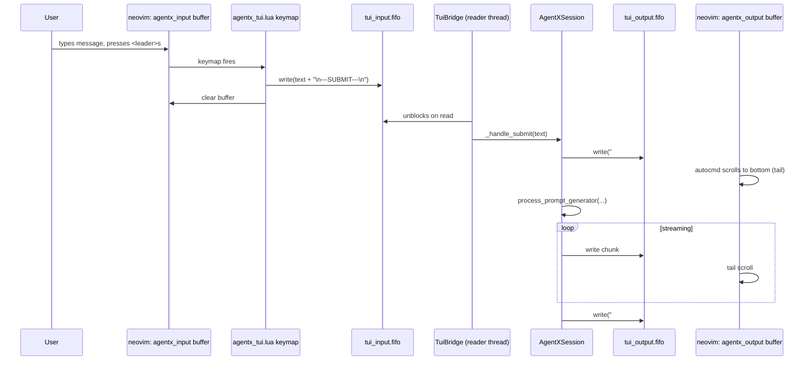
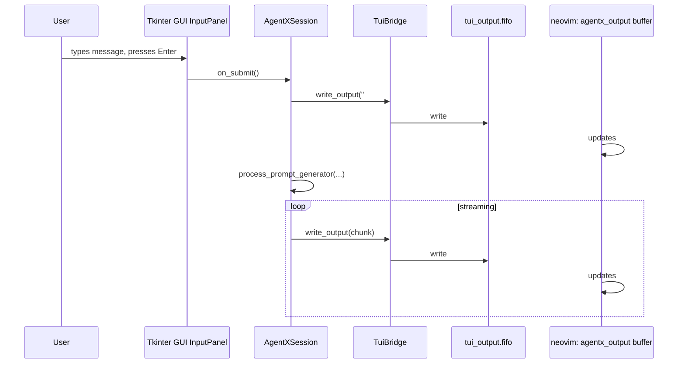

# AgentX — TUI Mirror: Neovim Chat Pane

_Last updated: 2026-05-09 (v0.37.0)_

> **Companion document to [`05_VIBE_CODING.md`](05_VIBE_CODING.md).**
> Specifies the optional TUI mirror that surfaces the AgentX chat interface as a
> horizontally-split neovim window inside the tmux environment.  The TUI mirror is
> **additive** — the Tkinter GUI remains the default and fully functional primary
> interface.  Both surfaces can run simultaneously.

---

## Table of Contents

1. [Concept and Goals](#1-concept-and-goals)
2. [Architecture](#2-architecture)
   - [2.1 IPC Channels](#21-ipc-channels)
   - [2.2 Neovim Window Layout](#22-neovim-window-layout)
   - [2.3 Component Map](#23-component-map)
3. [Configuration](#3-configuration)
   - [3.1 agentx.toml Keys](#31-agentxtoml-keys)
   - [3.2 enable_gui_chat Toggle](#32-enable_gui_chat-toggle)
4. [Launch Architecture Additions](#4-launch-architecture-additions)
5. [Affordance Specifications — PD-16](#5-affordance-specifications--pd-16)
6. [User Flows](#6-user-flows)
7. [Neovim Config Contract (agentx_tui.lua)](#7-neovim-config-contract-agentx_tuilua)
8. [Output Rendering Format](#8-output-rendering-format)
9. [Implementation Plan](#9-implementation-plan)
10. [Test Scenarios](#10-test-scenarios)
11. [Open Design Questions](#11-open-design-questions)

---

## 1. Concept and Goals

Many software developers work exclusively in terminal environments and prefer not to
context-switch to a GUI window for AI interactions.  The TUI mirror gives these users
a full-keyboard, neovim-native chat interface running inside the existing tmux session —
no separate window manager involvement required.

### Goals

| Goal | Description |
|------|-------------|
| **Parallel, not replacement** | GUI and TUI surfaces co-exist; disabling one does not affect the other |
| **Zero-friction for existing vibe-coding users** | TUI mirror is `opt-in`; launching `launch_vibe.sh` without config produces identical behaviour to today |
| **Keyboard-native** | All input is through normal neovim editing; submit is a single keymap |
| **Full output fidelity (text)** | Every agent response, tool call, and tool result that appears in the GUI Chat panel is also written to the TUI output buffer |
| **Shared session state** | TUI and GUI submit into the same `AgentXSession`; context, working memory, and attachments are shared |
| **Enable GUI Chat toggle** | GUI chat is togglable at config time, defaulting to `true`; advanced users can run headless (TUI-only) |

### Non-Goals

- Replicating collapsible GUI widgets in neovim (output is linear text)
- Rendering markdown with a neovim plugin (user may install `render-markdown.nvim` independently)
- Replacing the GUI as the canonical display surface for plans, context meters, or settings
- Supporting agents other than AgentX via the TUI

---

## 2. Architecture

### 2.1 IPC Channels

Two named pipes (FIFOs) power the TUI mirror.  Both are scoped by session ID to
match the existing `NVIM_SOCKET` and `SAVES_FIFO` convention in `launch_vibe.sh`.

| FIFO | Default path | Direction | Purpose |
|------|-------------|-----------|---------|
| **Output FIFO** | `/tmp/agentx_<SESSION_ID>.tui_output.fifo` | AgentX → neovim | Streams agent response text, role headers, and tool summaries |
| **Input FIFO** | `/tmp/agentx_<SESSION_ID>.tui_input.fifo` | neovim → AgentX | Carries submitted user messages |

Both paths are overridable via `agentx.toml` `[tui]` section or environment variables
(`AGENTX_TUI_OUTPUT_FIFO`, `AGENTX_TUI_INPUT_FIFO`).

#### FIFO Message Protocol

**Output FIFO** — each write is a UTF-8 newline-terminated record.  Role headers
use a distinguished prefix so neovim (or an external renderer) can apply syntax
highlighting:

```
###USER 14:32:01
write a function to parse JSON

###AGENT
I'll break this down into steps.

###TOOL_CALL read_file src/agentx/session.py
###TOOL_RESULT exit_code=0 (100 lines read)

The function signature should be...

###DONE
```

**Input FIFO** — the entire text of the user's input buffer is written as a single
chunk, terminated by `\n---SUBMIT---\n`.  Empty submissions (whitespace-only) are
silently discarded by the reader thread.

```
write a function to parse JSON
\n---SUBMIT---\n
```

### 2.2 Neovim Window Layout

When the TUI mirror is enabled, `launch_vibe.sh` creates **window 3: tui-chat** in
the tmux session.  The window contains a single neovim instance whose startup config
(`agentx_tui.lua`) creates two horizontal splits:

```
┌── window 3: tui-chat ────────────────────────────────────────────────────┐
│                                                                          │
│  ┌── TUI neovim: agentx_tui_<session>.nvim.sock ──────────────────────┐ │
│  │                                                                     │ │
│  │  ┌─ top split (~70% height): agentx_output  ─────────────────────┐ │ │
│  │  │  [read-only, nomodifiable, tail-follows output FIFO]           │ │ │
│  │  │                                                                │ │ │
│  │  │  ###USER 14:32:01                                             │ │ │
│  │  │  write a function to parse JSON                               │ │ │
│  │  │                                                                │ │ │
│  │  │  ###AGENT                                                      │ │ │
│  │  │  I'll break this down into steps.                             │ │ │
│  │  │                                                                │ │ │
│  │  │  ###TOOL_CALL read_file src/agentx/session.py                 │ │ │
│  │  │  ###TOOL_RESULT exit_code=0 (100 lines read)                  │ │ │
│  │  │                                                                │ │ │
│  │  │  The function signature should be...                          │ │ │
│  │  │  ~                                                             │ │ │
│  │  └────────────────────────────────────────────────────────────────┘ │ │
│  │                                                                     │ │
│  │  ┌─ bottom split (~30% height): agentx_input ─────────────────┐   │ │
│  │  │  [editable, <leader>s to submit, <leader>c to clear]       │   │ │
│  │  │                                                             │   │ │
│  │  │  write a function to parse JSON█                           │   │ │
│  │  │  ~                                                          │   │ │
│  │  │  ~                                                          │   │ │
│  │  └─────────────────────────────────────────────────────────────┘   │ │
│  │                                                                     │ │
│  └─────────────────────────────────────────────────────────────────────┘ │
│                                                                          │
│  tmux key: Ctrl+B, 3  ← window 3 (tui-chat)                            │
└──────────────────────────────────────────────────────────────────────────┘
```

The TUI neovim instance is completely independent of the editor neovim in window 0.
It uses a separate socket (`agentx_tui_<SESSION_ID>.nvim.sock`) so `VimBridge` can
target either instance independently.

### 2.3 Component Map

```
launch_vibe.sh (when tui.enable = true)
  │
  ├── mkfifo /tmp/agentx_<SESSION>.tui_output.fifo
  ├── mkfifo /tmp/agentx_<SESSION>.tui_input.fifo
  ├── drops agentx_tui.lua into project_dir
  └── window 3: nvim --listen agentx_tui_<SESSION>.nvim.sock
                     --cmd "luafile agentx_tui.lua"

AgentX (src/agentx/)
  │
  ├── integration/
  │     └── tui_bridge.py       TuiBridge — owns FIFO writer thread + reader thread
  │
  ├── session.py
  │     ├── self.tui_bridge       TuiBridge instance (None when tui.enable=false)
  │     └── _open_file_in_editor  already wired; TuiBridge can also use VimBridge
  │
  └── streaming_controller.py
        └── _display_*() methods  each writes to tui_bridge.write_output() in parallel
                                  with the existing GUI ChatPanel calls
```

---

## 3. Configuration

### 3.1 agentx.toml Keys

```toml
[agentx]
# Whether to launch the Tkinter GUI chat window.
# Default: true.  Set false to run in headless/TUI-only mode.
enable_gui_chat = true

[tui]
# Set true to enable the TUI mirror (neovim chat pane in tmux).
# Default: false (opt-in).
enable = false

# Socket path for the TUI neovim instance.
# Defaults to /tmp/agentx_tui_<AGENTX_TMUX_SESSION>.nvim.sock
socket = ""

# Output FIFO path. Defaults to /tmp/agentx_<AGENTX_TMUX_SESSION>.tui_output.fifo
output_fifo = ""

# Input FIFO path.  Defaults to /tmp/agentx_<AGENTX_TMUX_SESSION>.tui_input.fifo
input_fifo = ""

# Height ratio of the output split (0.0–1.0).  Default: 0.70
output_split_ratio = 0.70
```

Environment variable overrides (same scoping convention as existing variables):

| Variable | Config key | Purpose |
|----------|------------|---------|
| `AGENTX_TUI_ENABLE` | `tui.enable` | `"true"` / `"false"` |
| `AGENTX_TUI_OUTPUT_FIFO` | `tui.output_fifo` | Override output FIFO path |
| `AGENTX_TUI_INPUT_FIFO` | `tui.input_fifo` | Override input FIFO path |
| `AGENTX_TUI_SOCKET` | `tui.socket` | Override TUI neovim socket path |

### 3.2 enable_gui_chat Toggle

`enable_gui_chat = true` (default) — `AgentXSession.__init__` creates `GUIManager`
and the Tkinter root as today.

`enable_gui_chat = false` — `AgentXSession.__init__` skips `GUIManager` and uses a
`NullGUIManager` stub (implements `IGUIManager` protocol, all methods are no-ops).
This allows running AgentX headless without breaking any code that calls
`self.gui.*`.  The TUI mirror (`tui.enable = true`) is the intended replacement
surface.

> **Constraint**: `enable_gui_chat = false` + `tui.enable = false` is invalid and
> must be rejected at startup with a clear error message.

---

## 4. Launch Architecture Additions

When `tui.enable = true`, `launch_vibe.sh` performs these additional steps
(inserted between step 8 and step 9 of the existing launch sequence — see
[`05_VIBE_CODING.md §3`](05_VIBE_CODING.md#3-launch-architecture)):

```bash
# 8b. Create TUI FIFOs
[ -p "$TUI_OUTPUT_FIFO" ] || mkfifo "$TUI_OUTPUT_FIFO"
[ -p "$TUI_INPUT_FIFO"  ] || mkfifo "$TUI_INPUT_FIFO"

# 8c. Write agentx_tui.lua into project_dir
cat > "$project_dir/agentx_tui.lua" << 'EOF'
-- AgentX TUI mirror config — auto-generated by launch_vibe.sh, do not edit
<see §7 for full content>
EOF

# 8d. Launch TUI neovim in window 3
tmux new-window -t "$TMUX_SESSION":3 -n tui-chat -d -c "$project_dir"
tmux send-keys -t "$TMUX_SESSION":3 \
  "nvim --listen '$TUI_SOCKET' --cmd 'luafile agentx_tui.lua'" Enter
```

Updated `launch_vibe.sh` environment defaults:

```bash
TUI_OUTPUT_FIFO="${AGENTX_TUI_OUTPUT_FIFO:-/tmp/agentx_${SESSION_ID}.tui_output.fifo}"
TUI_INPUT_FIFO="${AGENTX_TUI_INPUT_FIFO:-/tmp/agentx_${SESSION_ID}.tui_input.fifo}"
TUI_SOCKET="${AGENTX_TUI_SOCKET:-/tmp/agentx_tui_${SESSION_ID}.nvim.sock}"
```

Updated tmux window key bindings:

```
Ctrl+B, 0  ← window 0 (neovim editor)
Ctrl+B, 1  ← window 1 (agent-bg terminals)
Ctrl+B, 2  ← window 2 (agentx-log)
Ctrl+B, 3  ← window 3 (tui-chat)   ← NEW (only when tui.enable=true)
```

`launch_vibe.sh stop` is updated to also send `:qa!` to the TUI neovim instance and
remove the TUI FIFOs alongside the existing cleanup.

---

## 5. Affordance Specifications — PD-16

**Panel ID**: PD-16 — TuiMirror  
**Source files** (planned):

- `src/agentx/integration/tui_bridge.py`
- `src/agentx/config.py` (new `[tui]` section parsing)
- `launch_vibe.sh` (new TUI window steps)
- `agentx_tui.lua` (Lua config fragment, generated into project dir)

---

### PD-16-AF-001: Output FIFO Writer

**What it does**: Every chunk written to `ChatPanel` is also written to the output
FIFO so the TUI neovim `agentx_output` buffer updates in real time.

| Signal | Source method | FIFO record written |
|--------|--------------|---------------------|
| User message | `StreamingController._display_user_message()` | `###USER <timestamp>\n<content>\n` |
| Agent content chunk | `StreamingController._display_agent_response()` | `<chunk>\n` (no header per chunk) |
| Agent turn start | Role header emission | `###AGENT\n` |
| Tool call | `StreamingController._display_tool_call()` | `###TOOL_CALL <name> <args_summary>\n` |
| Tool result | `StreamingController._display_tool_result()` | `###TOOL_RESULT exit_code=<N> <summary>\n` |
| Turn done | `StreamingController._finalize()` | `###DONE\n` |

**Failure mode**: if the FIFO write blocks (no reader) for longer than a configurable
timeout (`tui.write_timeout_sec`, default `0.1 s`), the write is dropped with a
`DEBUG`-level log.  The GUI display is never blocked by FIFO backpressure.

**Status**: ✅ Implemented and tested

---

### PD-16-AF-002: Input FIFO Reader Thread

**What it does**: A daemon thread in `AgentXSession` blocks on the input FIFO.
When a `\n---SUBMIT---\n` sentinel is received, the accumulated text is passed to
`self._handle_submit(text)` — the same method called by the GUI's Send button.

**Thread lifecycle**: started in `AgentXSession.__init__` when `tui.enable = true`;
terminated (via a `threading.Event`) on session close.

**Edge cases**:

| Condition | Behaviour |
|-----------|-----------|
| Empty or whitespace-only buffer | Silently discarded, reader continues |
| Session is already streaming | Input is queued (same as GUI: submit is blocked during streaming) |
| FIFO removed while running | Thread catches `FileNotFoundError`, logs warning, exits cleanly |

**Status**: ✅ Implemented and tested

---

### PD-16-AF-003: TUI Neovim Window (`launch_vibe.sh`)

**What it does**: Adds window 3 (`tui-chat`) to the tmux session containing a neovim
instance pre-configured with `agentx_tui.lua`.

**Visibility**: Opt-in via `tui.enable = true` in `agentx.toml` or
`AGENTX_TUI_ENABLE=true` environment variable.  When disabled, window 3 is not
created; the rest of the session is identical to today.

**Status**: ⚠️ Partially implemented (window + env wiring done; full split-layout Lua config pending)

---

### PD-16-AF-004: `agentx_tui.lua` Config Fragment

**What it does**: Generated Lua file sourced at TUI neovim startup.  Creates the
horizontal split layout and configures both buffers.

Key responsibilities:

- Open `agentx_output` buffer in the top split as `nomodifiable`, `nobuflisted`,
  `filetype=markdown` (or `agentx_output` ft for custom highlighting).
- Open `agentx_input` buffer in the bottom split as a normal writable buffer.
- Set up an `autocmd` on `agentx_output` to `normal! G` (scroll to bottom) when
  the buffer changes (tail behaviour).
- Bind `<leader>s` in the input buffer to submit (write buffer content + sentinel
  to the input FIFO, then clear the buffer).
- Bind `<leader>c` to clear the input buffer without submitting.
- Bind `<leader>o` to switch focus to the output split.
- Bind `<leader>i` to switch focus back to the input split.

**Status**: 📝 Spec only

---

### PD-16-AF-005: `<leader>s` Submit Keymap

**What it does**: In the `agentx_input` buffer, `<leader>s` (normal or insert mode)
collects all lines from the buffer, writes them to the input FIFO followed by
`\n---SUBMIT---\n`, then clears the buffer.

```lua
-- Lua implementation (inside agentx_tui.lua)
vim.keymap.set({'n', 'i'}, '<leader>s', function()
  local lines = vim.api.nvim_buf_get_lines(0, 0, -1, false)
  local text = table.concat(lines, "\n")
  if text:match("^%s*$") then return end   -- discard whitespace-only
  local fifo = vim.fn.expand("$AGENTX_TUI_INPUT_FIFO")
  local f = io.open(fifo, "a")
  if f then
    f:write(text .. "\n---SUBMIT---\n")
    f:close()
  end
  vim.api.nvim_buf_set_lines(0, 0, -1, false, {})  -- clear input buffer
end, { buffer = true, desc = "AgentX: Submit message" })
```

**Status**: 📝 Spec only

---

### PD-16-AF-006: `enable_gui_chat` Config Toggle

**What it does**: When `enable_gui_chat = false`, `AgentXSession.__init__` skips
`GUIManager` construction and substitutes a `NullGUIManager` (all `IGUIManager`
methods are no-ops or return safe defaults).

**Design constraint**: `enable_gui_chat = false` requires `tui.enable = true` to
be set simultaneously.  The startup validation step raises `ConfigurationError` if
both are false.

**Status**: 📝 Spec only

---

### PD-16-AF-007: `tui.enable` Config Toggle and `TuiBridge` Lifecycle

**What it does**: `AgentXSession.__init__` reads `config["tui"]["enable"]`.  When
`true`, it constructs a `TuiBridge` instance and starts its threads.  When `false`,
`self.tui_bridge` is `None` and all TuiBridge call-sites are guarded by
`if self.tui_bridge:`.

**Status**: ✅ Implemented and tested

---

## 6. User Flows

### UF-TUI-01: Submit Message via TUI

**Trigger**: User types in the `agentx_input` buffer and presses `<leader>s`.



---

### UF-TUI-02: GUI Submit Reflected in TUI Output

**Trigger**: User submits via the Tkinter GUI while TUI mirror is open.



Both surfaces stay in sync automatically because `StreamingController` drives both
sinks from the same streaming loop.

---

### UF-TUI-03: Headless Mode (GUI disabled)

**Trigger**: `enable_gui_chat = false`, `tui.enable = true` in `agentx.toml`.

```mermaid
sequenceDiagram
    participant Launch as launch_vibe.sh
    participant AgentX as AgentXSession
    participant NullGUI as NullGUIManager
    participant TuiBridge

    Launch->>AgentX: python -m agentx
    AgentX->>AgentX: reads config: enable_gui_chat=false, tui.enable=true
    AgentX->>NullGUI: construct NullGUIManager (all methods no-ops)
    AgentX->>TuiBridge: construct TuiBridge, start reader + writer threads
    Note over AgentX: No Tkinter root created; no GUI window appears
    AgentX->>AgentX: session.layout() → NullGUIManager.layout() → no-op
    Note over TuiBridge: All I/O flows through FIFOs ↔ TUI neovim
```

---

## 7. Neovim Config Contract (`agentx_tui.lua`)

Full content of the generated `agentx_tui.lua` file.  This is the authoritative
spec; `launch_vibe.sh` must write exactly this content.

```lua
-- agentx_tui.lua
-- Auto-generated by launch_vibe.sh — do not edit manually.
-- Source: AgentX TUI Mirror spec (docs/ux/06_TUI_MIRROR.md §7)

local output_fifo = vim.fn.expand("$AGENTX_TUI_OUTPUT_FIFO")
local input_fifo  = vim.fn.expand("$AGENTX_TUI_INPUT_FIFO")

-- ── Output buffer (top split, read-only) ─────────────────────────────────

local output_buf = vim.api.nvim_create_buf(false, true)   -- unlisted scratch
vim.api.nvim_buf_set_name(output_buf, "agentx_output")
vim.bo[output_buf].buftype     = "nofile"
vim.bo[output_buf].swapfile    = false
vim.bo[output_buf].modifiable  = true   -- writer sets this temporarily
vim.bo[output_buf].filetype    = "markdown"

-- ── Input buffer (bottom split, writable) ────────────────────────────────

local input_buf = vim.api.nvim_create_buf(false, true)
vim.api.nvim_buf_set_name(input_buf, "agentx_input")
vim.bo[input_buf].buftype  = "nofile"
vim.bo[input_buf].swapfile = false
vim.bo[input_buf].filetype = "markdown"

-- ── Layout: horizontal split ─────────────────────────────────────────────

local output_win = vim.api.nvim_get_current_win()
vim.api.nvim_win_set_buf(output_win, output_buf)

vim.cmd("split")
local input_win = vim.api.nvim_get_current_win()
vim.api.nvim_win_set_buf(input_win, input_buf)

-- Resize: output takes ~70% of height
local total = vim.o.lines - 2
vim.api.nvim_win_set_height(input_win, math.floor(total * 0.30))

-- ── Output tail: scroll to bottom on change ──────────────────────────────

vim.api.nvim_create_autocmd("BufModifiedSet", {
  buffer = output_buf,
  callback = function()
    local line_count = vim.api.nvim_buf_line_count(output_buf)
    vim.api.nvim_win_set_cursor(output_win, { line_count, 0 })
  end,
})

-- ── Submit keymap (<leader>s) ─────────────────────────────────────────────

vim.keymap.set({ "n", "i" }, "<leader>s", function()
  local lines = vim.api.nvim_buf_get_lines(input_buf, 0, -1, false)
  local text = table.concat(lines, "\n")
  if text:match("^%s*$") then return end
  local f = io.open(input_fifo, "a")
  if f then
    f:write(text .. "\n---SUBMIT---\n")
    f:close()
  end
  vim.api.nvim_buf_set_lines(input_buf, 0, -1, false, {})
  vim.api.nvim_set_current_win(input_win)
end, { buffer = input_buf, desc = "AgentX: Submit message" })

-- ── Clear keymap (<leader>c) ──────────────────────────────────────────────

vim.keymap.set({ "n", "i" }, "<leader>c", function()
  vim.api.nvim_buf_set_lines(input_buf, 0, -1, false, {})
end, { buffer = input_buf, desc = "AgentX: Clear input" })

-- ── Focus keymaps ─────────────────────────────────────────────────────────

vim.keymap.set("n", "<leader>o", function()
  vim.api.nvim_set_current_win(output_win)
end, { buffer = input_buf, desc = "AgentX: Focus output" })

vim.keymap.set("n", "<leader>i", function()
  vim.api.nvim_set_current_win(input_win)
  vim.cmd("startinsert")
end, { buffer = output_buf, desc = "AgentX: Focus input" })

-- ── Start cursor in input buffer ─────────────────────────────────────────

vim.api.nvim_set_current_win(input_win)
vim.cmd("startinsert")
```

---

## 8. Output Rendering Format

The output FIFO carries plain UTF-8 text with distinguished role headers.  This is
intentionally simple so the neovim buffer remains readable without any plugin.
Optional enhancement: users with `render-markdown.nvim` will see markdown rendered
automatically because the buffer `filetype = "markdown"`.

### Role Header Reference

| Header | When emitted | Example |
|--------|-------------|---------|
| `###USER <HH:MM:SS>` | User message displayed | `###USER 14:32:01` |
| `###AGENT` | Agent response starts | `###AGENT` |
| `###THINKING` | Thinking block starts | `###THINKING` |
| `###TOOL_CALL <name> <args>` | Tool invoked | `###TOOL_CALL read_file path=src/` |
| `###TOOL_RESULT <summary>` | Tool result | `###TOOL_RESULT exit_code=0 (48 lines)` |
| `###SYSTEM <text>` | System notice | `###SYSTEM VimBridge connected` |
| `###DONE` | Turn finalized | `###DONE` |
| `###ERROR <text>` | Stream error | `###ERROR connection lost` |

### Thinking Block Suppression

By default, `###THINKING` blocks are suppressed from the TUI output (they can be
verbose).  A config key `tui.show_thinking = false` controls this; it mirrors the
GUI's thinking-block collapse default.

---

## 9. Implementation Plan

Work is divided into four phases, each independently mergeable and testable.

> **Status legend**: `[ ]` not started · `[/]` complete · `[X]` failed/blocked

---

### Phase 1 — Config and Stub Infrastructure

- [/] Add `[tui]` section parsing to `src/agentx/config.py`
  - Keys: `enable`, `socket`, `output_fifo`, `input_fifo`, `output_split_ratio`,
    `write_timeout_sec`, `show_thinking`
  - Env var overrides: `AGENTX_TUI_ENABLE`, `AGENTX_TUI_OUTPUT_FIFO`,
    `AGENTX_TUI_INPUT_FIFO`, `AGENTX_TUI_SOCKET`
  - Validation: reject `enable_gui_chat=false` + `tui.enable=false` combination
- [/] Add `enable_gui_chat` key to `[agentx]` section (default `true`)
- [/] Add `NullGUIManager` stub to `src/agentx/igui_manager.py` (or new file)
  - Implements `IGUIManager` protocol; all methods are no-ops
- [/] Wire `enable_gui_chat = false` path in `AgentXSession.__init__`
- [/] Unit tests for config parsing and `NullGUIManager` (hermetic)
  - Status: config parsing and NullGUIManager/headless wiring tests are implemented.

---

### Phase 2 — TuiBridge: Output FIFO Writer

- [/] Create `src/agentx/integration/tui_bridge.py` with `TuiBridge` class
  - `write_output(record: str)` — non-blocking write with `write_timeout_sec` guard
  - `start()` / `stop()` — thread lifecycle
  - `is_enabled` property
- [/] Hook `write_output()` into `StreamingController`:
  - `_display_user_message()` → `###USER` header + content
  - `_display_agent_response()` → `###AGENT` header (once per turn) + chunks
  - `_display_tool_call()` → `###TOOL_CALL` record
  - `_display_tool_result()` → `###TOOL_RESULT` record
  - `_finalize()` → `###DONE` record
- [/] Unit tests: writer emits correct records per signal type (hermetic, no real FIFO)

---

### Phase 3 — TuiBridge: Input FIFO Reader

- [/] Add input reader loop to `TuiBridge`:
  - Daemon thread blocking on input FIFO
  - Parses `\n---SUBMIT---\n` sentinel; accumulates preceding lines as message
  - Calls session submit callback; session dispatches on the Tk main thread via `root.after(0, ...)`
  - Stops cleanly on `_stop_event`
- [/] Wire `TuiBridge` into `AgentXSession`:
  - Construct when `tui.enable = true`
  - Call `tui_bridge.start()` after session init
  - Call `tui_bridge.stop()` in session cleanup
- [/] Unit tests: reader fires submit callback correctly; empty/whitespace discarded;
  FIFO disappears mid-read handled gracefully

---

### Phase 4 — launch_vibe.sh and Neovim Config

- [/] Add TUI FIFO / socket path variables to `launch_vibe.sh`
- [X] Add `_launch_tui_window()` function (creates window 3, writes `agentx_tui.lua`,
  launches TUI neovim) — deferred; current implementation launches TUI neovim directly in `tui-chat`
- [/] Gate behind `AGENTX_TUI_ENABLE` env var check in `start` / `stop` / `status`
- [/] Update `stop` to `:qa!` the TUI neovim and remove TUI FIFOs
- [/] Update `status` to report TUI socket and FIFO state
- [/] Integration tests for `launch_vibe.sh` TUI window lifecycle (hermetic fake tmux)

---

## 10. Test Scenarios

All unit and integration tests must be hermetic (no real FIFOs, no real neovim, no
real tmux).

| ID | Type | Scenario | Gherkin |
|----|------|----------|---------|
| TUI-UT-001 | Unit | Config parsing — tui.enable=true | GIVEN agentx.toml with `[tui] enable = true` WHEN config is loaded THEN `config["tui"]["enable"]` is True |
| TUI-UT-002 | Unit | Config validation — both disabled | GIVEN `enable_gui_chat=false` AND `tui.enable=false` WHEN session starts THEN ConfigurationError is raised |
| TUI-UT-003 | Unit | Output writer emits USER header | GIVEN TuiBridge with mock FIFO WHEN write_user_message(text, ts) called THEN FIFO receives `###USER <ts>\n<text>\n` |
| TUI-UT-004 | Unit | Output writer emits AGENT header once per turn | GIVEN TuiBridge WHEN write_agent_chunk called for first chunk of turn THEN `###AGENT\n` is prepended; subsequent chunks have no header |
| TUI-UT-005 | Unit | Output writer emits TOOL_CALL record | GIVEN TuiBridge WHEN write_tool_call(name, args) THEN `###TOOL_CALL <name> <args>\n` |
| TUI-UT-006 | Unit | Output writer emits TOOL_RESULT record | GIVEN TuiBridge WHEN write_tool_result(summary) THEN `###TOOL_RESULT <summary>\n` |
| TUI-UT-007 | Unit | Output writer emits DONE record | GIVEN TuiBridge WHEN finalize_turn() THEN `###DONE\n` |
| TUI-UT-008 | Unit | Output writer drops write on timeout | GIVEN FIFO has no reader WHEN write_output times out (mock) THEN record is dropped, no exception raised, GUI call not affected |
| TUI-UT-009 | Unit | Input reader parses submit sentinel | GIVEN reader thread on mock FIFO WHEN `"hello\n---SUBMIT---\n"` written THEN `_handle_submit("hello")` called once |
| TUI-UT-010 | Unit | Input reader discards whitespace | GIVEN reader WHEN `"   \n---SUBMIT---\n"` written THEN `_handle_submit` NOT called |
| TUI-UT-011 | Unit | Input reader survives FIFO removal | GIVEN reader running WHEN FIFO file removed THEN thread exits cleanly, no traceback |
| TUI-UT-012 | Unit | NullGUIManager satisfies IGUIManager | GIVEN NullGUIManager() WHEN all IGUIManager methods called THEN no exception raised |
| TUI-IT-001 | Integration | StreamingController → TuiBridge | GIVEN Session with mock TuiBridge WHEN prompt streamed THEN TuiBridge.write_output called in correct order per chunk type |
| TUI-IT-002 | Integration | TUI input → session submit | GIVEN Session with TuiBridge reader WHEN input FIFO receives submit sentinel THEN session._handle_submit called with correct text |
| TUI-FT-001 | Functional | launch_vibe.sh TUI window created | GIVEN fake tmux AND `AGENTX_TUI_ENABLE=true` WHEN `launch_vibe.sh start` runs THEN window 3 tui-chat is created, FIFOs are created, agentx_tui.lua written |
| TUI-FT-002 | Functional | launch_vibe.sh TUI disabled by default | GIVEN fake tmux AND no `AGENTX_TUI_ENABLE` WHEN `launch_vibe.sh start` runs THEN window 3 is NOT created |

---

## 11. Open Design Questions

| # | Question | Options | Recommendation |
|---|----------|---------|----------------|
| OD-1 | Should `<leader>s` also work from the **output** split? | A) No — confusing; B) Yes — convenience | B — add a second mapping on `output_buf` that jumps to input, clears, and waits for user to type |
| OD-2 | How should the output buffer handle very long sessions? | A) Never truncate; B) Rolling window (last N lines); C) User-triggered `:AgentXClear` | B with default 2000 lines — prevents neovim slowing down on long sessions |
| OD-3 | Should thinking blocks appear in TUI output? | A) Always; B) Never (default); C) Config toggle | C — `tui.show_thinking = false` default, matches GUI collapse behaviour |
| OD-4 | How should the TUI handle streaming interruption (Stop)? | A) Write `###INTERRUPTED\n` to output; B) Write `###DONE\n` | A — gives TUI user visible feedback |
| OD-5 | Should `NullGUIManager` log all calls at DEBUG? | A) Yes — useful for diagnosing headless issues; B) No — noise | A |
| OD-6 | Headless mode process signal handling (no Tk mainloop) | A) `signal.pause()` loop; B) Thread join on reader thread | B — cleaner and the reader thread is always present in headless mode |
